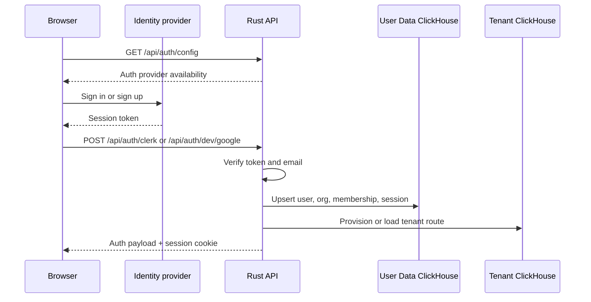
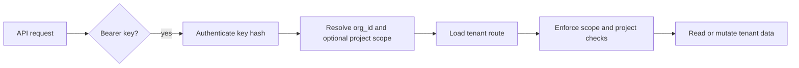

# Auth and tenancy

InstantML uses different credentials for humans and training jobs.

| Credential | Transport | Main use |
| --- | --- | --- |
| Browser session | `instantml_session` HttpOnly cookie | Dashboard after hosted sign-in. |
| SDK API key | `Authorization: Bearer instantml_...` | SDK, uploader, imports, exports, and automation. |
| Bootstrap token | `X-InstantML-Bootstrap-Token` | Operator-only bootstrap routes. |

The Clerk session token never becomes the SDK credential. The SDK API key never
depends on Clerk. Both browser sessions and API keys resolve to one
organization before product data is read or written.

## Browser sign-in flow

Cookie-authenticated mutating requests validate `Origin` against allowed
frontend origins. Bearer-token SDK requests are not origin-gated because they
are not browser-cookie requests.

## API-key flow

Project-scoped API keys can only read or mutate their project. Org-scoped keys
can access every project allowed by their scopes.

## Permission matrix

| Route class | API key | Owner/admin session | Write/read (`member`) session | Read only (`viewer`) session |
| --- | --- | --- | --- | --- |
| Dashboard reads | Scope and org/project checks | Allowed | Allowed | Allowed |
| Run/project mutations | `sdk:ingest` | Allowed | Allowed | Denied |
| Artifact mutations | `artifacts:write` | Allowed | Allowed | Denied |
| Imports | `imports:write` | Allowed | Denied | Denied |
| Usage reads | Unrestricted org key with `usage:read` | Allowed | Denied | Denied |
| API-key admin | `api_keys:write` org key | Allowed | Denied | Denied |
| Seat and invitation admin | Not a public SDK flow | Allowed | Denied | Denied |

## Shared demo sessions

The shared demo organization is read-only. Demo browser sessions can browse and
export sample data, but they cannot create runs, mutate artifacts, import data,
administer API keys, change seats, or write control-plane records.

## Tenant boundaries

Every tenant-owned product row carries `org_id`. Run and project helpers reject
rows from a different org. Project-scoped keys add a second boundary around one
project.

## Sign-out and revocation

`POST /api/auth/logout` revokes the current browser session and clears the
cookie. Revoked or expired sessions are rejected on the next request.

Removing a user from an organization invalidates their effective access because
session payload creation requires an active membership.
