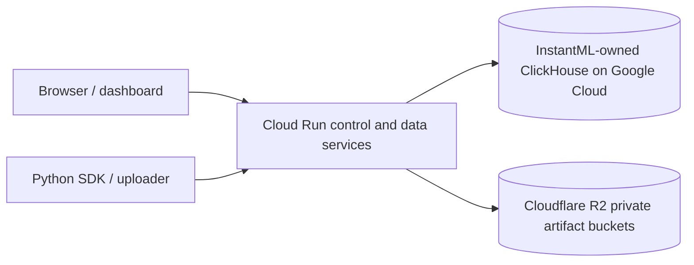

# Google Cloud ClickHouse

InstantML-hosted workspaces currently store control records, run metadata, and
metrics in an InstantML-owned ClickHouse deployment on Google Cloud. This
replaces the earlier InstantML-owned ClickHouse Cloud path for the default
hosted service.

Customer-owned ClickHouse remains a separate Premium storage option.

## Hosted topology

The control service stores account, session, billing, API-key, and tenant-route
records. The data service stores projects, runs, metrics, logs, artifacts,
imports, usage snapshots, and dashboard data for the authenticated org.

## Tenant isolation

InstantML-hosted tenant databases are routed by organization. Each tenant
database owns its product tables and metric tables, while User Data control
records remain separate from tenant product data.

Hosted artifact bytes are not stored in ClickHouse. They are stored in private
Cloudflare R2 buckets, and ClickHouse stores the artifact metadata, byte count,
hash, MIME type, and storage reference. Downloads stream through the InstantML
API rather than exposing raw bucket URLs.

Usage accounting follows the same boundary. Metric-point counts bind the
resolved `org_id` for scalar and rank metric tables. Exact warehouse-storage
bytes are used only when the ClickHouse database is scoped to one org. Shared
cells and customer-owned ClickHouse routes do not expose database-wide bytes as
org-exact InstantML-hosted storage; they use org-local artifact/metadata
accounting instead.

## Staging and production

Production and staging use separate Cloud Run services and separate User Data
databases. They may share the same underlying Google Cloud ClickHouse
deployment, but staging routes should never write production User Data records.

This is why readiness checks matter: `/readyz` should fail until ClickHouse is
reachable and the service has replayed the control projection.

The beta operating shape is intentionally cost-conscious. Production keeps one
manual Cloud Run control instance and one manual data instance warm. Staging
uses automatic scaling with min `0` and max `1`, so it can scale to zero while
remaining single-writer. The ClickHouse VM stays on `n2-standard-2` with a 100
GB `pd-ssd` disk until sustained CPU, memory, storage, or dashboard latency
measurements justify resizing.

## What users need to know

- SDK and dashboard APIs stay the same.
- Run-list and chart endpoints remain bounded; raw metric history is fetched
  through dedicated series endpoints.
- Artifact uploads and downloads continue through InstantML API routes.
- Customer-owned ClickHouse setup is still available for Premium teams that
  want their product data in their own warehouse.

## Current benchmark signal

The current GCP ClickHouse path has been benchmarked through the production
Cloud Run data service against the `normal-runs-50k` showcase project: 50,000
runs and 522,000,000 metric points. On 2026-05-23, project newest-100 was
`236 ms` p95, metric-best sort was `307 ms` p95, project overview was
`418 ms` p95, and a 1,000-point chart read from a 20,000-step source series was
`224 ms` p95.

The benchmark supports self-hosted GCP ClickHouse as InstantML's beta hosted
path forward. Operational maturity still matters: backups, disk and memory
alerts, and high-availability planning are required before stronger production
uptime claims.
