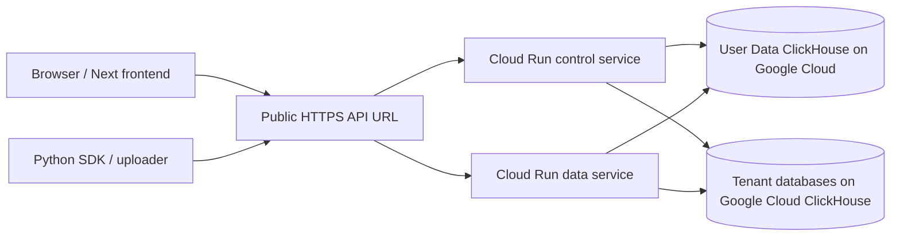

# Service planes

The hosted InstantML API is split into control-plane and data-plane
responsibilities behind one public API URL.

| Mode | Routes | Typical use |
| --- | --- | --- |
| `control` | Auth, sessions, orgs, seats, billing, API keys, tenant routes, dashboard preference state. | Hosted control service. |
| `data` | Projects, runs, metrics, logs, artifacts, objects, imports, export, usage. | Hosted tenant product service. |

Platform routes exist on every service:

- `GET /health`
- `GET /healthz`
- `GET /readyz`
- `GET /metrics`
- `GET /openapi.json`
- `GET /api/auth/config`

`/openapi.json` and `/api/auth/config` report the active service plane so
operators can verify which role is serving a request.

## Split Cloud Run topology

Path-based routing is enough for a single data cell. Many cells require a
discovery step or app-level router because a plain load balancer cannot inspect
an org hidden inside a bearer token before authentication.

The current InstantML-hosted data store is self-hosted ClickHouse on Google
Cloud. Control and data services use routed databases on that deployment for
InstantML-owned workspaces, while Premium customer-owned ClickHouse remains a
separate storage option.

## Readiness

`/readyz` fails until ClickHouse is reachable and the process-local control
projection has loaded. Data-plane auth misses force one control-record refresh
and retry, so fresh API keys and browser sessions can become usable without
waiting for the next background refresh tick.

## Scaling posture

Control and data services are scaled conservatively to preserve tenant
isolation, predictable routing, and consistent control-record replay. Serious
customers can use dedicated cells when they need stronger isolation,
noisy-neighbor protection, or custom retention.
