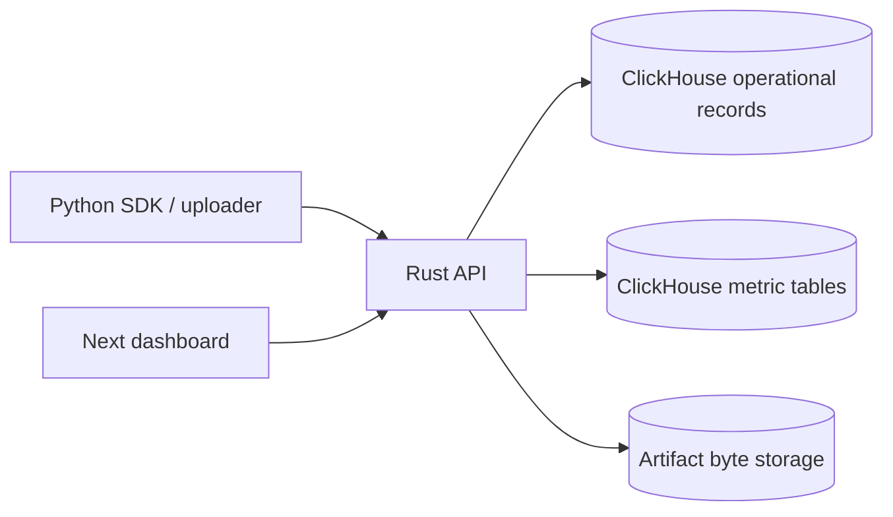
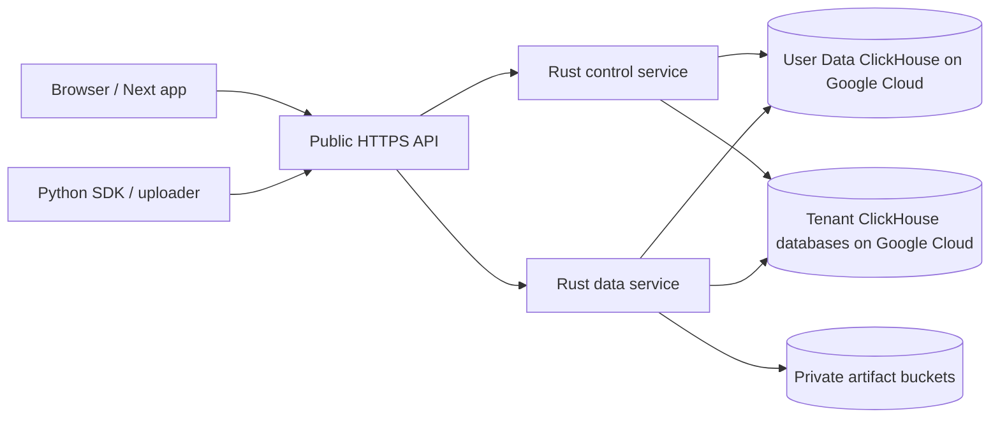

# System overview

InstantML is a training observability system: SDKs write training-loop events,
the API stores bounded and queryable records, and the dashboard turns those
records into run comparison workflows.

## Primary product path

The Rust API is the primary backend. It owns the product route contract for SDK
ingestion, dashboard reads, imports, exports, usage, billing gates, and artifact
metadata.

## Component responsibilities

| Component | Responsibility |
| --- | --- |
| Python SDK | Create runs, log metrics, logs, attributes, artifacts, rich objects, checkpoints, and source context. |
| Uploader | Drain process-isolated spool events from disk and replay them through the API. |
| Rust API | Validate requests, enforce auth/scopes/limits, store records, stream artifact downloads, and expose dashboard/API routes. |
| ClickHouse operational layer | Store low-volume append-only product and control records. |
| ClickHouse metric layer | Store raw scalar/rank metrics and maintained metric summaries. |
| Artifact store | Store hosted private object-storage bytes for uploaded artifacts. |
| Next dashboard and docs | Browse, chart, compare, annotate, export, administer workspaces, and serve public `/docs` documentation. |

## Hosted topology

The control service handles auth, orgs, sessions, API keys, billing, seats, and
tenant route metadata. The data service handles projects, runs, metrics, logs,
attributes, rich objects, imports, export, usage, and artifact data paths.
InstantML-hosted production and staging currently use InstantML-owned
self-hosted ClickHouse on Google Cloud for these User Data and tenant
databases.

## Design constraints users can rely on

- List endpoints are bounded.
- Raw metric history is fetched through dedicated series endpoints.
- Metric summaries are maintained during ingestion, so run tables do not scan
  full metric history.
- Artifact byte paths are separate from scalar metric ingestion.
- API keys resolve to one organization and optional project scope.
- Exports are explicit and bounded.
