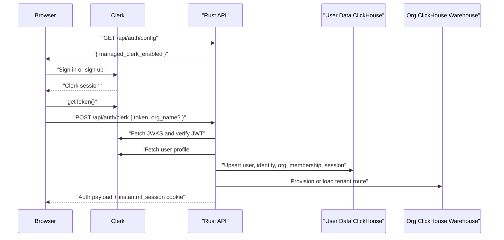
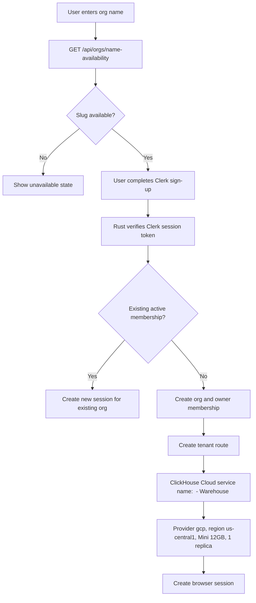
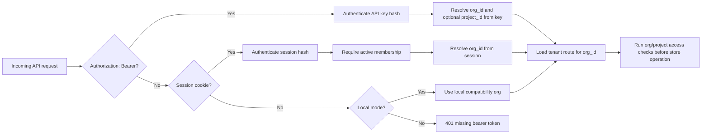
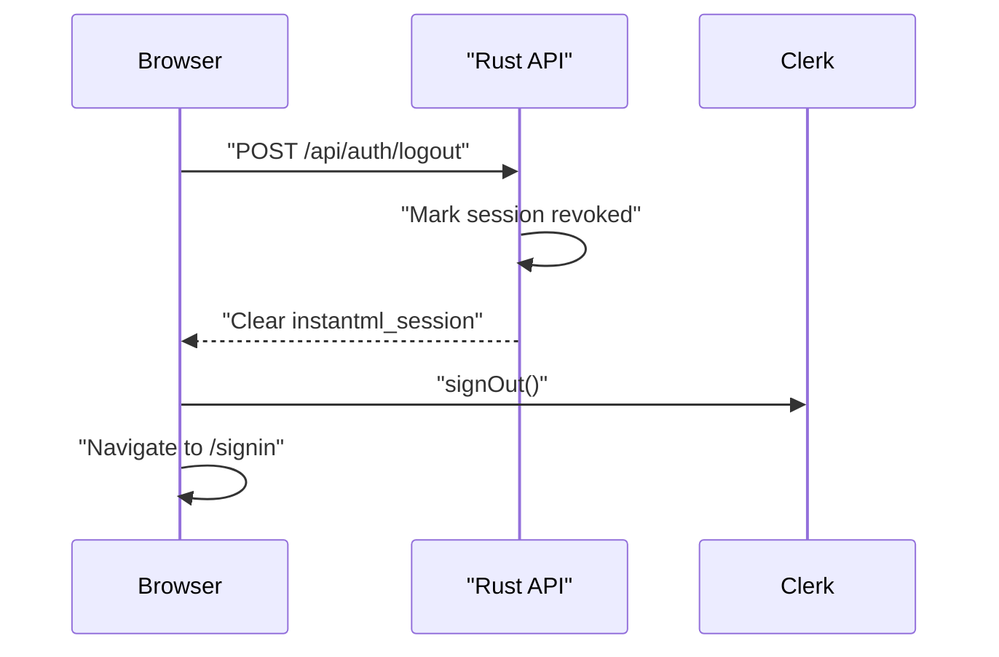

# Auth And Tenant Flow

Date: 2026-05-16

Status: Current hosted-auth architecture after the Clerk first slice

## Purpose

This document explains how Clerk identity, InstantML browser sessions, SDK API keys, organization isolation, and hosted ClickHouse tenant routing fit together. The accepted design is `docs/design/2026-05-16-clerk-hosted-auth.md`.

InstantML uses two different credentials on purpose:

- Browser users sign in with Clerk and then receive an InstantML `HttpOnly` session cookie.
- SDKs and uploaders use InstantML API keys created from onboarding or admin settings.

The Clerk token never becomes the SDK credential. The API key never depends on Clerk. Both browser sessions and SDK keys resolve to an organization before product data is read or mutated.

## Human Sign-In

The Rust API verifies the Clerk token before trusting it. It checks the signature against Clerk JWKS using `CLERK_SECRET_KEY`, requires an HTTPS Clerk issuer or the exact configured `CLERK_JWT_ISSUER`, rejects expired or stale tokens, fetches the Clerk user profile server-side, and requires the primary email to be verified. Clerk user id is stored as the stable identity key.

## Signup And Warehouse Provisioning

The availability check is a UX hint. The signup transaction still enforces the duplicate-slug check so races fail closed.

ClickHouse Cloud service-mode defaults match the hosted first slice:

| Field | Value |
| --- | --- |
| Service name | `<Org Name> - Warehouse <org-id-prefix>` |
| Cloud provider | `gcp` |
| Region | `us-central1` |
| Memory | `12 GiB` min and max replica memory |
| Replicas | `1` |

Cloud-service mode can create paid external services, so automated tests use local/database-mode provisioning. Operators must explicitly configure ClickHouse Cloud credentials and the stored-tenant-password guard until a secret manager replaces that temporary storage path.

## API Authorization

Every product row that belongs to a tenant carries `org_id`. Run and project helpers reject rows from a different org. Project-scoped API keys add a second boundary: the key can only read or mutate the project recorded on the key.

Session-backed mutating browser requests also validate `Origin` against the configured frontend origins or local loopback. Bearer-token SDK requests are not origin-gated because they are not browser-cookie requests.

## Permission Matrix

| Route class | API key | Owner/admin session | Member session | Viewer session |
| --- | --- | --- | --- | --- |
| Dashboard reads | Scope and org/project checks | Allowed | Allowed | Allowed |
| Run/project mutations | `sdk:ingest` | Allowed | Allowed | Denied |
| Artifact mutations | `artifacts:write` | Allowed | Allowed | Denied |
| Imports | `imports:write` | Allowed | Denied | Denied |
| Usage reads | `usage:read` | Allowed | Denied | Denied |
| API-key admin | `api_keys:write` org key | Allowed | Denied | Denied |
| Seat reservation | Not public SDK flow | Allowed | Denied | Denied |

Shared demo credentials are a special case: any key for the canonical `InstantML Demo` organization is treated as `export:read` at authorization time, even if an older stored key row still contains write scopes, and demo browser sessions are denied mutation permissions. That means demo users can browse/export demo data but cannot write runs, artifacts, imports, API-key records, service-account records, seats, or other User Data control-plane mutations.

The browser session role is intentionally coarse in this slice. More granular permissions can be added when the settings/admin surface grows.

## Sign-Out

Revoked or expired sessions are rejected on the next request. Session payload creation also requires an active membership, so removing a user from an org invalidates their effective access even if their cookie has not expired.

## Operational Notes

- Do not log Clerk session tokens, InstantML session tokens, API key plaintext, ClickHouse passwords, or tenant endpoints.
- `NEXT_PUBLIC_CLERK_PUBLISHABLE_KEY` is public and used by the Next app.
- `CLERK_SECRET_KEY` stays server-side and is used by Rust to verify session tokens and fetch Clerk user profiles.
- `CLERK_JWT_ISSUER`, when set, pins accepted Clerk session tokens to one exact issuer.
- The browser does not receive ClickHouse tenant credentials.
- The SDK does not receive Clerk tokens or browser cookies.
- Cloud-service provisioning is opt-in and can incur cost; use local/database-mode tests for CI.
