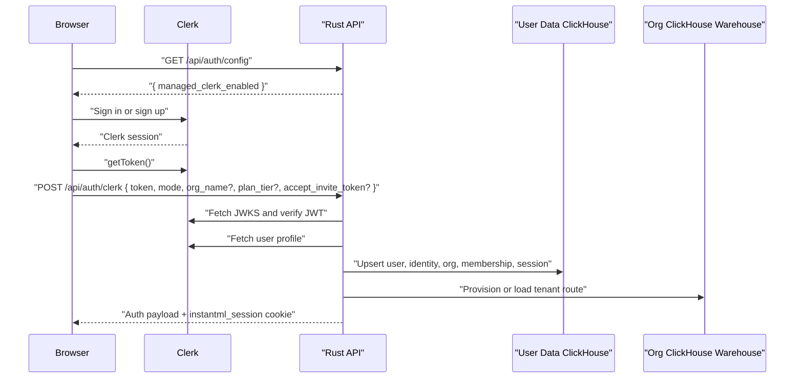
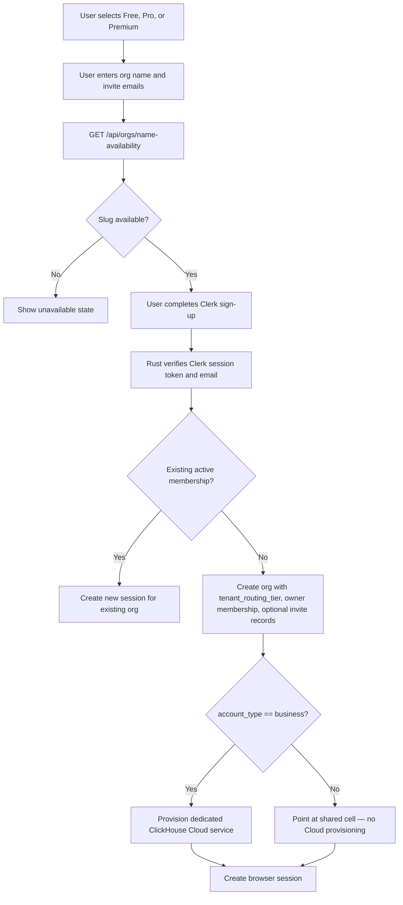
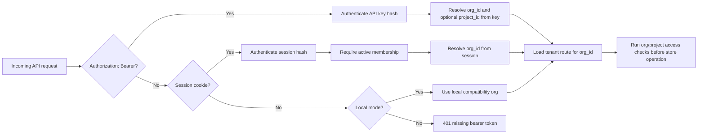
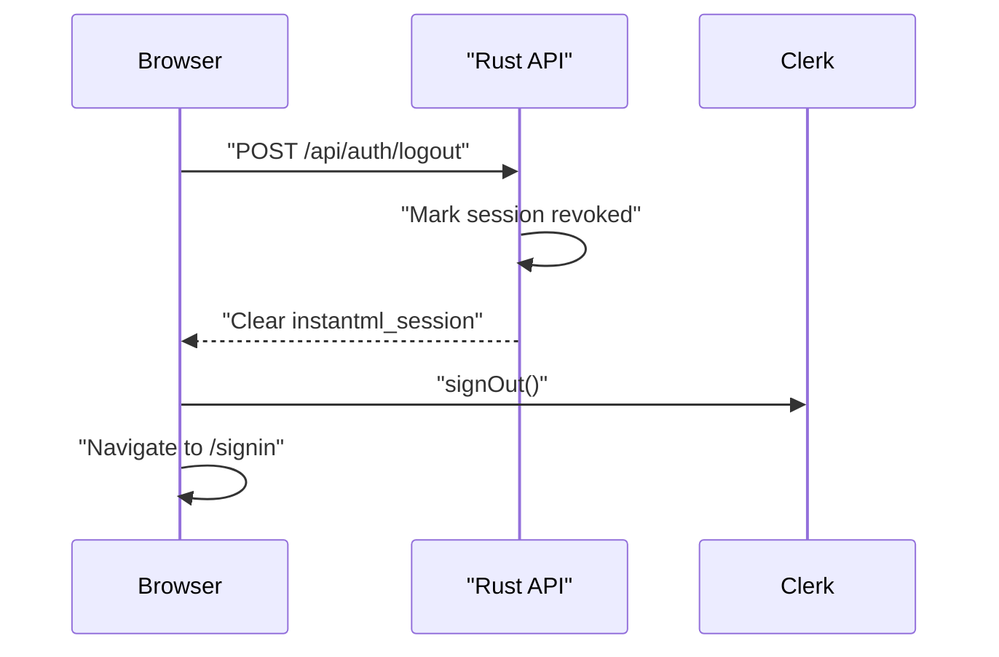

# Auth And Tenant Flow

Date: 2026-05-16

Status: Current hosted-auth architecture after the Clerk, pricing/signup admin, and shared-cell tenant routing slices

## Purpose

This document explains how Clerk identity, InstantML browser sessions, SDK API keys, organization isolation, Free/Pro/Premium signup, invited seats, and hosted ClickHouse tenant routing fit together. The accepted designs are `docs/design/2026-05-16-clerk-hosted-auth.md`, `docs/design/2026-05-16-pricing-signup-org-admin.md`, and `docs/design/2026-05-16-shared-cell-tenant-routing.md`.

InstantML uses two different credentials on purpose:

- Browser users sign in with Clerk and then receive an InstantML `HttpOnly` session cookie.
- SDKs and uploaders use InstantML API keys created from onboarding or admin settings.

The Clerk token never becomes the SDK credential. The API key never depends on Clerk. Both browser sessions and SDK keys resolve to an organization before product data is read or mutated.

## Human Sign-In

The Rust API verifies the Clerk token before trusting it. It checks the signature against Clerk JWKS using `CLERK_SECRET_KEY`, requires an HTTPS Clerk issuer or the exact configured `CLERK_JWT_ISSUER`, rejects expired or stale tokens, fetches the Clerk user profile server-side, and requires the primary email to be verified. Clerk user id is stored as the stable identity key.

## Signup, Invites, And Warehouse Provisioning

The availability check is a UX hint. The signup transaction still enforces the duplicate-slug check so races fail closed.

New signups use the selected plan and `account_type` to set
`organization.plan_tier`, `organization.seat_limit`,
`organization.tenant_routing_tier`, and tenant-route warehouse profile metadata.
Currently implemented plans:

| Plan | Price | Seats | Storage warning limit | Requested warehouse | Routing tier |
| --- | ---: | ---: | ---: | --- | --- |
| Free (personal) | `$0/org/mo` | 2 | 2 GiB | Shared cell | `shared` |
| Pro | `$199/org/mo` | 3 | 1 TiB | Standard, 12 GiB, 1 replica | `dedicated` |
| Premium | `$699/org/mo` | 10 | 5 TiB | Dedicated, 16 GiB, 2 replicas | `dedicated` |

When `account_type=personal` (or absent, which defaults to personal), the signup
path sets `tenant_routing_tier="shared"` on the new org and writes a
`tenant_route` record pointing at the env-configured shared ClickHouse cell
(`INSTANTML_SHARED_CELL_URL`). No ClickHouse Cloud provisioning call is made.
When `account_type=business`, the existing per-org dedicated provisioning path
is used unchanged.

ClickHouse Cloud service-mode operator defaults still apply unless
`INSTANTML_CLICKHOUSE_CLOUD_ALLOW_PLAN_SIZING=true`:

| Field | Value |
| --- | --- |
| Service name | `<Org Name> - Warehouse <org-id-prefix>` |
| Cloud provider | `INSTANTML_CLICKHOUSE_CLOUD_PROVIDER` |
| Region | `INSTANTML_CLICKHOUSE_CLOUD_REGION` |
| Applied memory | `INSTANTML_CLICKHOUSE_CLOUD_MIN_REPLICA_MEMORY_GB` and `INSTANTML_CLICKHOUSE_CLOUD_MAX_REPLICA_MEMORY_GB` |
| Applied replicas | `INSTANTML_CLICKHOUSE_CLOUD_NUM_REPLICAS` |

Cloud-service mode can create paid external services, so automated tests use local/database-mode provisioning. Operators must explicitly configure ClickHouse Cloud credentials and the stored-tenant-password guard until a secret manager replaces that temporary storage path.

Existing tenant routes and warehouses are preserved. The signup path creates a
route only when an org has no route; it does not delete or recreate an existing
warehouse to match a changed plan.

New organization invitations are `org_invitation` control records with a
seven-day token, delivery status, expiry, and invited email. The pending
invitation reserves a seat, but no `MembershipRow` is created until accept.
Hosted Clerk accept requires `accept_invite_token`; tokenless
`accept_invite_org_id` and single-pending-invite activation remain only as
legacy local/dev compatibility for old reserved-seat rows. On accept, Rust
uses the current provider-verified primary email, re-checks billing and seat
capacity, creates an active membership, and issues a fresh browser session for
the invited org so dashboard run reads are scoped through that org.

## API Authorization

Every product row that belongs to a tenant carries `org_id`. Run and project helpers reject rows from a different org. Project-scoped API keys add a second boundary: the key can only read or mutate the project recorded on the key.

Session-backed mutating browser requests also validate `Origin` against the configured frontend origins or local loopback. Bearer-token SDK requests are not origin-gated because they are not browser-cookie requests.

## Permission Matrix

| Route class | API key | Owner/admin session | Member session | Viewer session |
| --- | --- | --- | --- | --- |
| Dashboard reads | Scope and org/project checks | Allowed | Allowed | Allowed |
| Run/project mutations | `sdk:ingest` | Allowed | Allowed | Denied |
| Artifact mutations | `artifacts:write` | Allowed | Allowed | Denied |
| Imports | `imports:write` | Allowed | Denied | Denied |
| Usage reads | `usage:read` | Allowed | Denied | Denied |
| API-key admin | `api_keys:write` org key | Allowed | Denied | Denied |
| Seat reservation | Not public SDK flow | Allowed | Denied | Denied |

Shared demo credentials are a special case: the canonical `InstantML Demo` organization is normalized to Premium tier for the seeded demo dataset, any key for it is treated as `export:read` at authorization time even if an older stored key row still contains write scopes, and demo browser sessions are denied mutation permissions. That means demo users can browse/export demo data but cannot write runs, artifacts, imports, API-key records, service-account records, seats, or other User Data control-plane mutations.

The browser session role is intentionally coarse in this slice. More granular permissions can be added when the settings/admin surface grows.

## Sign-Out

Revoked or expired sessions are rejected on the next request. Session payload creation also requires an active membership, so removing a user from an org invalidates their effective access even if their cookie has not expired.

## Operational Notes

- Do not log Clerk session tokens, InstantML session tokens, API key plaintext, ClickHouse passwords, or tenant endpoints.
- `NEXT_PUBLIC_CLERK_PUBLISHABLE_KEY` is public and used by the Next app.
- `CLERK_SECRET_KEY` stays server-side and is used by Rust to verify session tokens and fetch Clerk user profiles.
- `CLERK_JWT_ISSUER` pins accepted Clerk session tokens to one exact issuer. Cloud Run deploys derive it from `NEXT_PUBLIC_CLERK_PUBLISHABLE_KEY` when unset, validate `CLERK_SECRET_KEY` against Clerk Backend API domain metadata, and reject a configured issuer that points at a different Clerk instance. `/api/auth/config` returns this issuer so the frontend can block a broken staging/prod Clerk key mix before token exchange.
- The browser does not receive ClickHouse tenant credentials.
- The SDK does not receive Clerk tokens or browser cookies.
- Cloud-service provisioning is opt-in and can incur cost; use local/database-mode tests for CI.
