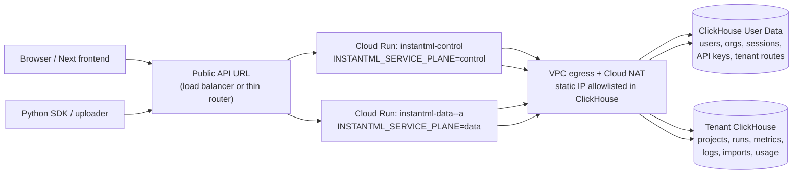
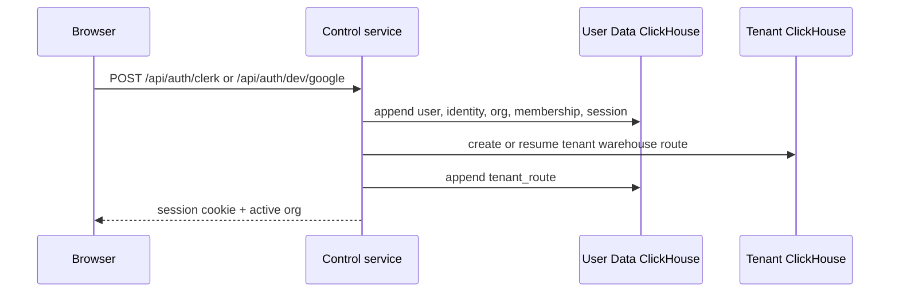
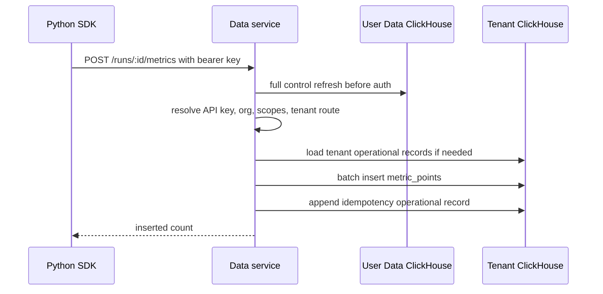
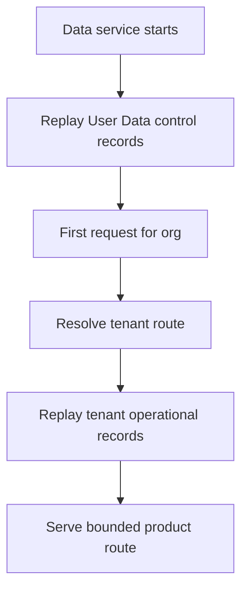

# Multi-Instance Cloud Run Architecture

Date: 2026-05-16

Status: Current launch wiring and deployment overview

## Summary

InstantML's hosted Rust backend can now be deployed in two Cloud Run shapes:

- **Single combined service** for the internal hosted slice.
- **Split control/data services** for the launch-ready multi-instance topology.

The split topology is the one we should use when we want operational separation:
control-plane routes and data-plane routes run as separate Cloud Run services,
but both are built from the same Rust image. The data service remains a
single-writer cell by default until durable multi-writer gates are complete.

## Topology



The public API URL can be a load balancer, API gateway, or thin router. A plain
load balancer can route by host/path, but it cannot inspect an org hidden inside
a bearer token before the app authenticates. For a single data cell, path-based
routing is enough. For many cells, use a discovery step or a thin app router.

## Service Responsibilities

| Service | Routes | Durable source | Default scale |
| --- | --- | --- | --- |
| `combined` | control and data | User Data plus tenant ClickHouse | automatic max 1 in legacy deploy |
| `control` | auth, sessions, users, orgs, seats, API keys, service accounts | User Data ClickHouse | automatic max 5 |
| `data` | projects, runs, metrics, logs, artifacts, objects, imports, usage, export | tenant ClickHouse plus User Data refresh before auth | manual 1 |

Platform routes exist on every service:

- `GET /health`
- `GET /healthz`
- `GET /readyz`
- `GET /metrics`
- `GET /openapi.json`
- `GET /api/auth/config`

`/api/auth/config` and `/openapi.json` report the active service plane so
operators can confirm the deployed service shape.

## Request Flow

### Browser Sign-In And Tenant Creation



### SDK Metric Write Through Data Plane



### Data-Plane Restart



## Deployment Commands

Single combined service:

```bash
npm run deploy:cloud-run
npm run deploy:cloud-run:single
```

Split control/data services:

```bash
npm run deploy:cloud-run:multi
```

The split command builds one image and deploys:

- `instantml-control` with `INSTANTML_SERVICE_PLANE=control`
- `instantml-data-<region>-a` with `INSTANTML_SERVICE_PLANE=data`

Set `INSTANTML_PUBLIC_API_BASE` when a load balancer or router URL exists. The
deploy helper writes local frontend env files only when there is a single
service URL or an explicit public API base.

## Key Environment Variables

| Variable | Purpose |
| --- | --- |
| `INSTANTML_CLOUD_RUN_TOPOLOGY` | `single` or `split` |
| `INSTANTML_CLOUD_RUN_SERVICE_PREFIX` | Prefix for split service names |
| `INSTANTML_CLOUD_RUN_CONTROL_SERVICE` | Override control service name |
| `INSTANTML_CLOUD_RUN_DATA_SERVICE` | Override data service name |
| `INSTANTML_CLOUD_RUN_DATA_CELL` | Operator label for the data cell |
| `INSTANTML_CLOUD_RUN_CONTROL_SCALING` | `auto` or `manual` |
| `INSTANTML_CLOUD_RUN_DATA_SCALING` | `auto` or `manual`; default `manual` |
| `INSTANTML_CLOUD_RUN_DATA_INSTANCES` | Manual data instances; default `1` |
| `INSTANTML_PUBLIC_API_BASE` | Public LB/router URL for frontend env |
| `INSTANTML_CLOUD_RUN_STATIC_EGRESS` | Set `0` to skip NAT/static egress setup |

## Local Docker Shape

Combined local stack:

```bash
docker compose up --build
```

Split local stack:

```bash
docker compose --profile split up --build instantml-control instantml-data
```

The split profile runs:

- `instantml-control` on host port `8001`
- `instantml-data` on host port `8002`
- one shared ClickHouse container

Use this for local understanding of service-plane wiring. The stronger
end-to-end split verification remains:

```bash
npm run test:hosted-clickhouse
```

## Scaling Rules

Control can scale horizontally earlier because it owns lower-volume account and
auth routes. Data cells stay manual single-instance by default.

Do not switch a shared data cell to automatic multi-instance writes until these
gates are closed:

- durable API-key/session freshness or short-lived cell tokens,
- durable uniqueness for project and run-adjacent creates,
- durable per-org ids or deterministic ids for attributes/imports,
- atomic metric/log idempotency or ClickHouse dedupe keys,
- two-process integration tests for concurrent writes and stale reads.

Cloud Run maximum instance settings are not a correctness mechanism. Cloud Run
can briefly exceed max instance limits during rapid spikes, and deployments can
temporarily run old and new revisions at the same time. The app/storage layer
must provide correctness.

## ClickHouse Allowlisting

Both services use the same regional static egress path:

```text
Cloud Run service -> Direct VPC egress -> subnet -> Cloud NAT -> static IP -> ClickHouse Cloud
```

ClickHouse Cloud services and ClickHouse Cloud API keys should allowlist the
Cloud NAT IP in CIDR form, for example `136.115.243.188/32`. New tenant
ClickHouse services created by the Rust cloud-service provisioner receive
`INSTANTML_CLICKHOUSE_CLOUD_IP_ACCESS_LIST`, which should contain the same NAT
CIDR.

If we add more regions, each region needs its own NAT IP and every relevant
ClickHouse allowlist must include those CIDRs.

## Launch Checklist

1. Confirm PR checks pass: `npm run rust:verify`.
2. Confirm Cloud Run secrets exist or are present in local `.env`.
3. Run `npm run deploy:cloud-run:multi` in the target GCP project.
4. Confirm deploy output lists both services and the static egress IP.
5. Confirm ClickHouse Cloud service and API-key access lists include the NAT IP.
6. Put a load balancer, gateway, or thin router in front of control/data.
7. Set `INSTANTML_PUBLIC_API_BASE` to that public URL and rerun deploy or update
   local frontend env manually.
8. Verify:
   - control `/api/auth/config` reports `control`
   - data `/api/auth/config` reports `data`
   - both `/readyz` endpoints are healthy
   - hosted login creates/reuses the expected org and tenant route
   - SDK ingestion lands in the routed tenant ClickHouse service

## Related Docs

- `docs/design/2026-05-16-cloud-run-multi-instance-launch.md`
- `docs/design/2026-05-16-multi-instance-control-data-plane.md`
- `docs/design/2026-05-16-gcp-cloud-run-rust-api.md`
- `apps/rust-server/README.md`
- `tools/deploy-cloud-run.mjs`
