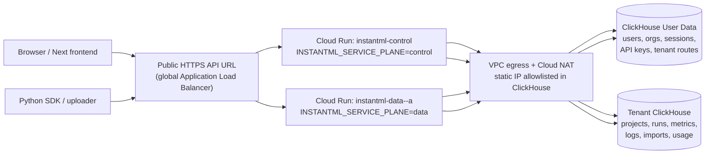
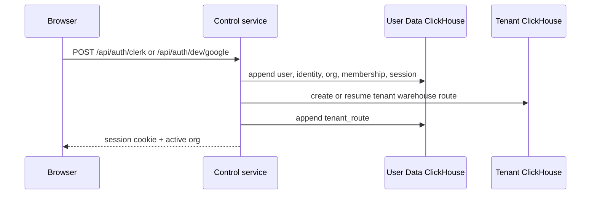
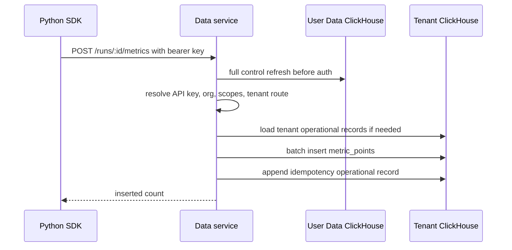
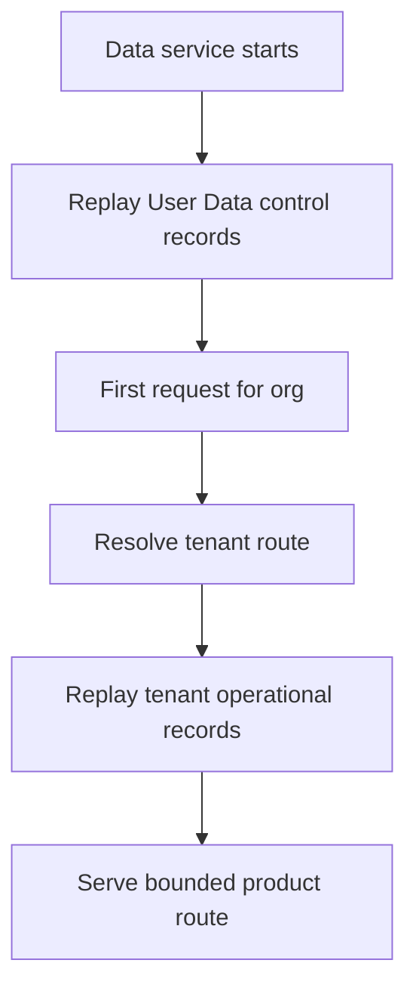

# Multi-Instance Cloud Run Architecture

Date: 2026-05-16

Status: Current launch wiring and deployment overview

## Summary

InstantML's hosted Rust backend can now be deployed in two Cloud Run shapes:

- **Single combined service** for the internal hosted slice.
- **Split control/data services** for the launch-ready multi-instance topology.

The split topology is the one we should use when we want operational separation:
control-plane routes and data-plane routes run as separate Cloud Run services,
but both are built from the same Rust image. The data service remains a
single-writer cell by default until durable multi-writer gates are complete.
The deploy helper can also create a managed HTTPS external Application Load
Balancer so local frontend and SDK clients can use one public API origin.

## Topology



The current public API URL should be the managed HTTPS load balancer created by
`tools/deploy-cloud-run.mjs` after an API DNS name is configured. It routes
control paths by host/path and defaults product traffic to the data service. A
plain load balancer cannot inspect an org hidden inside a bearer token before
the app authenticates. For a single data cell, path-based routing is enough. For
many cells, use a discovery step or a thin app router with durable tenant-cell
assignment.

## Service Responsibilities

| Service | Routes | Durable source | Default scale |
| --- | --- | --- | --- |
| `combined` | control and data | User Data plus tenant ClickHouse | automatic max 1 in legacy deploy |
| `control` | auth, sessions, users, orgs, seats, API keys, service accounts | User Data ClickHouse | manual 1 |
| `data` | projects, runs, metrics, logs, artifacts, objects, imports, usage, export | tenant ClickHouse plus User Data refresh before auth | manual 1 |

Platform routes exist on every service:

- `GET /health`
- `GET /healthz`
- `GET /readyz`
- `GET /metrics`
- `GET /openapi.json`
- `GET /api/auth/config`

`/api/auth/config` and `/openapi.json` report the active service plane so
operators can confirm the deployed service shape.

## Observability

Both control and data services emit structured Rust logs to Cloud Run
stdout/stderr. Hosted deploys should keep `INSTANTML_LOG_FORMAT=json`,
`RUST_LOG=instantml_rust_server=info,tower_http=info`, and
`INSTANTML_SLOW_REQUEST_MS=1000` unless an incident needs a temporary override.

Request completion logs include the service plane, method, path without query
string, status, latency, generated/propagated `x-request-id`, and observed
`cf-ray` when Cloudflare sends one. First-slice workflow logs cover readiness,
metric/log ingestion, artifacts, imports, startup, and worker cleanup. They use
stable product IDs only and do not include tokens, cookies, session IDs,
project/run names, metric values or keys, console messages, artifact filenames,
object-storage keys, signed URLs, or raw request bodies.

When the public API URL is behind Cloudflare, use Cloudflare Log Explorer or
Logpush for edge/request logs and join them to Cloud Run origin logs with
`x-request-id` where custom response-header fields are configured. Observed
`cf-ray` is useful for narrowing an incident but must be paired with timestamp,
host, path, and status. Prefer path-only Cloudflare fields such as
`ClientRequestPath`; full URI fields can contain user query strings and should
only be enabled with restricted retention/access or a separately reviewed debug
job.

## Request Flow

### Browser Sign-In And Tenant Creation



### SDK Metric Write Through Data Plane



### Data-Plane Restart



## Deployment Commands

Default split control/data services:

```bash
npm run deploy:cloud-run
npm run deploy:cloud-run:multi
```

Legacy combined service:

```bash
npm run deploy:cloud-run:single
```

The default split command builds one image and deploys:

- `instantml-control` with `INSTANTML_SERVICE_PLANE=control`
- `instantml-data-<region>-a` with `INSTANTML_SERVICE_PLANE=data`

Set `INSTANTML_PUBLIC_API_BASE` when a load balancer or router URL exists. The
deploy helper writes local frontend env files only when there is a single
service URL or an explicit public API base.

Create/update the managed HTTPS public router:

```bash
INSTANTML_CLOUD_RUN_PUBLIC_ROUTER=1 \
INSTANTML_CLOUD_RUN_PUBLIC_ROUTER_DOMAIN=api.instantml.ai \
npm run deploy:cloud-run
```

The helper reserves a global IP, creates serverless NEGs, reconciles control and
data backend services, imports a path-based URL map, creates a Google-managed
SSL certificate, and exposes only port `443`. The first run can finish with
`pending-dns` or `pending-certificate`; point the DNS `A` record for the router
domain at the emitted IP, wait for certificate activation, and rerun deploy to
verify the public URL and write it into local frontend env.

## Key Environment Variables

| Variable | Purpose |
| --- | --- |
| `INSTANTML_CLOUD_RUN_TOPOLOGY` | `single` or `split`; default `split` |
| `INSTANTML_CLOUD_RUN_SERVICE_PREFIX` | Prefix for split service names |
| `INSTANTML_CLOUD_RUN_CONTROL_SERVICE` | Override control service name |
| `INSTANTML_CLOUD_RUN_DATA_SERVICE` | Override data service name |
| `INSTANTML_CLOUD_RUN_DATA_CELL` | Operator label for the data cell |
| `INSTANTML_CLOUD_RUN_CONTROL_SCALING` | `auto` or `manual` |
| `INSTANTML_CLOUD_RUN_DATA_SCALING` | `auto` or `manual`; default `manual` |
| `INSTANTML_CLOUD_RUN_DATA_INSTANCES` | Manual data instances; default `1` |
| `INSTANTML_CLOUD_RUN_UNSAFE_CONTROL_MULTI_INSTANCE` | Set `1` only for controlled tests above one control instance |
| `INSTANTML_CLOUD_RUN_UNSAFE_DATA_MULTI_WRITER` | Set `1` only for controlled tests above one data writer |
| `INSTANTML_CLOUD_RUN_PUBLIC_ROUTER` | Set `1` to create/update the HTTPS public router |
| `INSTANTML_CLOUD_RUN_PUBLIC_ROUTER_DOMAIN` | Required DNS host for router HTTPS certificate |
| `INSTANTML_CLOUD_RUN_PUBLIC_ROUTER_CERTIFICATE` | Optional managed SSL certificate resource name |
| `INSTANTML_PUBLIC_API_BASE` | Public LB/router URL for frontend env |
| `INSTANTML_CLOUD_RUN_STATIC_EGRESS` | Set `0` to skip NAT/static egress setup |

## Local Docker Shape

Combined local stack:

```bash
docker compose up --build
```

Split local stack:

```bash
docker compose --profile split up --build instantml-control instantml-data
```

The split profile runs:

- `instantml-control` on host port `8001`
- `instantml-data` on host port `8002`
- one shared ClickHouse container

Use this for local understanding of service-plane wiring. The stronger
end-to-end split verification remains:

```bash
npm run test:hosted-clickhouse
```

## Scaling Rules

Control and data cells stay manual single-instance by default. Control owns
lower-volume account/auth routes, but it still depends on a process-local
projection for logout, revocation, signup, org, and API-key state. The deploy
helper refuses control or data scaling above one active instance unless the
matching unsafe test flag is set.

Do not switch a shared data cell to automatic multi-instance writes until these
gates are closed:

- durable API-key/session freshness or short-lived cell tokens,
- durable uniqueness for project and run-adjacent creates,
- durable per-org ids or deterministic ids for attributes/imports,
- atomic metric/log idempotency or ClickHouse dedupe keys,
- two-process integration tests for concurrent writes and stale reads.

Cloud Run maximum instance settings are not a correctness mechanism. Cloud Run
can briefly exceed max instance limits during rapid spikes, and deployments can
temporarily run old and new revisions at the same time. The app/storage layer
must provide correctness.

Cloud Run session affinity is also not a correctness mechanism. It is
best-effort, browser-oriented stickiness; SDK traffic may not preserve the
affinity cookie. Treat it only as a latency/cache optimization after data-plane
correctness is durable without stickiness.

### About "Three Instances"

The reviewed production-safe layout today is not three active writers for one
data cell. It is:

- one public HTTPS router,
- one active control instance,
- one active writer for each data cell.

To make three data cells production-ready, add durable tenant-to-cell assignment
to User Data, route browser/API-key traffic to the assigned cell, and add
multi-process integration tests for stale reads and duplicate writes. Until
then, `--data-instances=3` is blocked by default.

## ClickHouse Allowlisting

Both services use the same regional static egress path:

```text
Cloud Run service -> Direct VPC egress -> subnet -> Cloud NAT -> static IP -> ClickHouse Cloud
```

ClickHouse Cloud services and ClickHouse Cloud API keys should allowlist the
Cloud NAT IP in CIDR form, for example `136.115.243.188/32`. New tenant
ClickHouse services created by the Rust cloud-service provisioner receive
`INSTANTML_CLICKHOUSE_CLOUD_IP_ACCESS_LIST`, which should contain the same NAT
CIDR.

If we add more regions, each region needs its own NAT IP and every relevant
ClickHouse allowlist must include those CIDRs.

## Launch Checklist

1. Confirm PR checks pass: `npm run rust:verify`.
2. Confirm Cloud Run secrets exist or are present in local `.env`.
3. Run `npm run deploy:cloud-run` in the target GCP project.
4. Confirm deploy output lists both services and the static egress IP.
5. Confirm ClickHouse Cloud service and API-key access lists include the NAT IP.
6. For one public API origin, set `INSTANTML_CLOUD_RUN_PUBLIC_ROUTER=1` and
   `INSTANTML_CLOUD_RUN_PUBLIC_ROUTER_DOMAIN=<api-domain>`, then rerun deploy.
7. Point the API domain DNS `A` record at the emitted global load-balancer IP.
8. Verify:
   - control `/api/auth/config` reports `control`
   - data `/api/auth/config` reports `data`
   - router `https://<api-domain>/api/auth/config` reports `control`
   - router `https://<api-domain>/openapi.json` reports `data`
   - both `/readyz` endpoints are healthy
   - hosted login creates/reuses the expected org and tenant route
   - SDK ingestion lands in the routed tenant ClickHouse service

## Related Docs

- `docs/design/2026-05-16-cloud-run-multi-instance-launch.md`
- `docs/design/2026-05-16-multi-instance-control-data-plane.md`
- `docs/design/2026-05-16-gcp-cloud-run-rust-api.md`
- `apps/rust-server/README.md`
- `tools/deploy-cloud-run.mjs`
