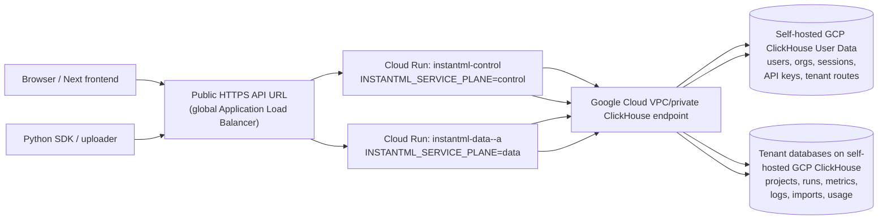
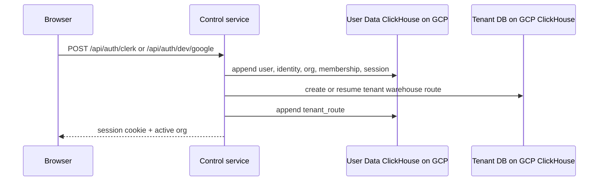
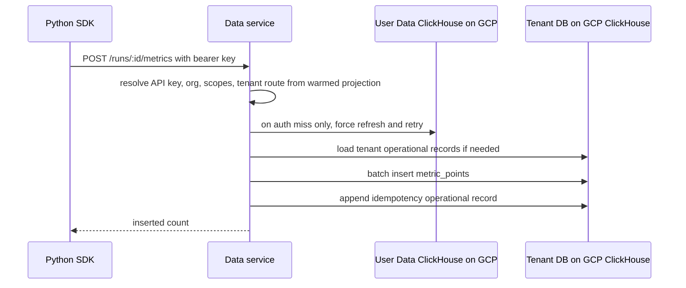
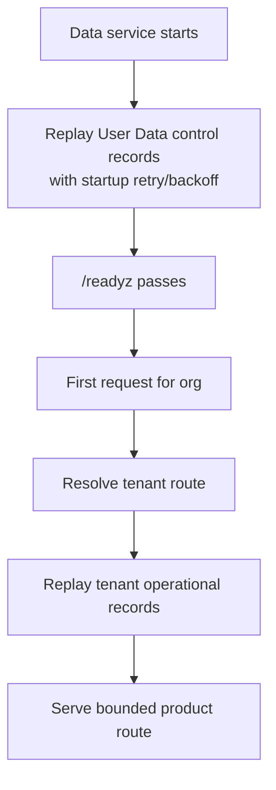

# Multi-Instance Cloud Run Architecture

Date: 2026-05-16

Status: Current launch wiring and deployment overview

## Summary

InstantML's hosted Rust backend can now be deployed in two Cloud Run shapes:

- **Single combined service** for the internal hosted slice.
- **Split control/data services** for the launch-ready multi-instance topology.

The split topology is the one we should use when we want operational separation:
control-plane routes and data-plane routes run as separate Cloud Run services,
but both are built from the same Rust image. The data service remains a
single-writer cell by default until durable multi-writer gates are complete.
Control also stays at one active instance by default because auth/org/API-key
state is still a process-local projection of User Data records. The deploy
helper can also create a managed HTTPS external Application Load Balancer so
local frontend and SDK clients can use one public API origin.

## Topology



The current public API URL should be the managed HTTPS load balancer created by
`tools/deploy-cloud-run.mjs` after an API DNS name is configured. It routes
control paths by host/path and defaults product traffic to the data service. A
plain load balancer cannot inspect an org hidden inside a bearer token before
the app authenticates. For a single data cell, path-based routing is enough. For
many cells, use a discovery step or a thin app router with durable tenant-cell
assignment.

The current production and staging hosted data stores are InstantML-owned
self-hosted ClickHouse databases on Google Cloud. The older provider-backed
ClickHouse Cloud service provisioning path is legacy/optional and should not be
treated as the default hosted deployment.

## Service Responsibilities

| Service | Routes | Durable source | Default scale |
| --- | --- | --- | --- |
| `combined` | control and data | User Data plus tenant ClickHouse | prod manual 1; staging auto min 0 max 1 |
| `control` | auth, sessions, users, orgs, seats, API keys, service accounts | User Data ClickHouse | prod manual 1; staging auto min 0 max 1 |
| `data` | projects, runs, metrics, logs, artifacts, objects, imports, usage, export | tenant ClickHouse plus warmed User Data projection | prod manual 1; staging auto min 0 max 1 |

Platform routes exist on every service:

- `GET /health`
- `GET /healthz`
- `GET /readyz`
- `GET /metrics`
- `GET /openapi.json`
- `GET /api/auth/config`

`/api/auth/config` and `/openapi.json` report the active service plane so
operators can confirm the deployed service shape.
`/readyz` fails until ClickHouse is reachable and the process-local control
projection has loaded. Once loaded, later refresh failures keep the last good
projection available and mark `control_refresh_degraded=true` in `/readyz` plus
the `instantml_control_refresh_degraded` gauge in `/metrics`. Fresh API keys
and browser sessions do not have to wait for the next background tick: the data
plane forces one User Data refresh and retries auth when a key/session misses
the warmed projection.

## Observability

Both control and data services emit structured Rust logs to Cloud Run
stdout/stderr. Hosted deploys should keep `INSTANTML_LOG_FORMAT=json`,
`RUST_LOG=instantml_rust_server=info,tower_http=info`, and
`INSTANTML_SLOW_REQUEST_MS=1000` unless an incident needs a temporary override.

Request completion logs include the service plane, method, path without query
string, status, latency, generated/propagated `x-request-id`, matching
`trace_id`, route-plane tag, and observed `cf-ray` when Cloudflare sends one.
First-slice workflow logs cover readiness, project/run mutations, metric/log
ingestion, artifacts, imports, startup, and worker cleanup. They use stable
product IDs only and do not include tokens, cookies, session IDs, project/run
names, metric values or keys, console messages, artifact filenames,
object-storage keys, signed URLs, or raw request bodies.

When the public API URL is behind Cloudflare, use Cloudflare Log Explorer or
Logpush for edge/request logs and join them to Cloud Run origin logs with the
request `x-request-id` header first. Custom response-header capture is useful
when available but can be absent when Cloudflare rejects or fails a request
before origin response. Observed `cf-ray` is useful for narrowing an incident
but must be paired with timestamp, host, path, and status. Prefer path-only
Cloudflare fields such as `ClientRequestPath`; full URI fields can contain user
query strings and should only be enabled with restricted retention/access or a
separately reviewed debug job.

## Request Flow

### Browser Sign-In And Tenant Creation



### SDK Metric Write Through Data Plane



### Data-Plane Restart



## Deployment Commands

Default split control/data services:

```bash
npm run deploy:cloud-run
npm run deploy:cloud-run:multi
```

Legacy combined service:

```bash
npm run deploy:cloud-run:single
```

The default split command builds one image and deploys:

- `instantml-control` with `INSTANTML_SERVICE_PLANE=control`
- `instantml-data-<region>-a` with `INSTANTML_SERVICE_PLANE=data`

Set `INSTANTML_PUBLIC_API_BASE` when a load balancer or router URL exists. The
deploy helper writes local frontend env files only when there is a single
service URL or an explicit public API base.

Create/update the managed HTTPS public router:

```bash
INSTANTML_CLOUD_RUN_PUBLIC_ROUTER=1 \
INSTANTML_CLOUD_RUN_PUBLIC_ROUTER_DOMAIN=api.instantml.ai \
npm run deploy:cloud-run
```

Deploy/update the isolated staging services and router:

```bash
npm run deploy:cloud-run:staging
```

Hosted deploys are intentionally long-running. Plan for 10-30 minutes on a
normal run while Cloud Build uploads/builds the Rust image, Cloud Run creates
ready revisions, managed certificates settle, and the helper runs live smoke
checks. Quiet `gcloud` output during a build or rollout does not mean the
command has timed out.

Staging defaults to `instantml-staging-control`,
`instantml-staging-data-us-central1-a`, router resources prefixed
`instantml-staging-public-api`, and domain `staging.api.instantml.ai`. Staging
uses separate Secret Manager names and binds a staging Cloud SQL control
database.

Default local frontend development should use the staging router instead of
direct Cloud Run service URLs:

```bash
INSTANTML_WEB_API_ENV=staging npm run web:dev
```

This keeps the browser on `http://127.0.0.1:3000` while the Next rewrite proxy
targets `https://staging.api.instantml.ai`. Use direct
`INSTANTML_CONTROL_API_BASE` and `INSTANTML_DATA_API_BASE` values only for
router-bypass smoke tests, and set `INSTANTML_WEB_EXPLICIT_API_BASES=1` in
those sessions so the staging-router default does not override them.

The helper reserves a global IP, creates serverless NEGs, reconciles control and
data backend services, imports a path-based URL map, creates a Google-managed
SSL certificate, and exposes only port `443`. The first run can finish with
`pending-dns` or `pending-certificate`; point the DNS `A` record for the router
domain at the emitted IP, wait for certificate activation, and rerun deploy to
verify the public URL and write it into local frontend env.

## Key Environment Variables

| Variable | Purpose |
| --- | --- |
| `INSTANTML_DEPLOY_ENV` | `prod` or `staging`; staging changes default service/router/secret names |
| `INSTANTML_CLOUD_RUN_TOPOLOGY` | `single` or `split`; default `split` |
| `INSTANTML_CLOUD_RUN_SCALING` | `auto` or `manual` for combined service; default `manual` in prod and `auto` in staging |
| `INSTANTML_CLOUD_RUN_INSTANCES` | Manual combined instances; default `1` |
| `INSTANTML_CLOUD_RUN_MIN_INSTANCES`, `INSTANTML_CLOUD_RUN_MAX_INSTANCES` | Auto-scaling bounds for combined service; defaults `0` and `1` |
| `INSTANTML_CLOUD_RUN_SERVICE_PREFIX` | Prefix for split service names |
| `INSTANTML_CLOUD_RUN_CONTROL_SERVICE` | Override control service name |
| `INSTANTML_CLOUD_RUN_DATA_SERVICE` | Override data service name |
| `INSTANTML_CLOUD_RUN_DATA_CELL` | Operator label for the data cell |
| `INSTANTML_CLOUD_RUN_CONTROL_SCALING` | `auto` or `manual`; default `manual` in prod and `auto` in staging |
| `INSTANTML_CLOUD_RUN_DATA_SCALING` | `auto` or `manual`; default `manual` in prod and `auto` in staging |
| `INSTANTML_CLOUD_RUN_CONTROL_INSTANCES` | Manual control instances; default `1` |
| `INSTANTML_CLOUD_RUN_DATA_INSTANCES` | Manual data instances; default `1` |
| `INSTANTML_CLOUD_RUN_CONTROL_MIN_INSTANCES`, `INSTANTML_CLOUD_RUN_CONTROL_MAX_INSTANCES` | Auto-scaling bounds for control; defaults `0` and `1` |
| `INSTANTML_CLOUD_RUN_DATA_MIN_INSTANCES`, `INSTANTML_CLOUD_RUN_DATA_MAX_INSTANCES` | Auto-scaling bounds for data; defaults `0` and `1` |
| `INSTANTML_CLOUD_RUN_STARTUP_PROBE` | Raw Cloud Run startup probe override; defaults to HTTP `/readyz` |
| `INSTANTML_CLOUD_RUN_BACKEND_TIMEOUT_SECONDS` | HTTPS router backend timeout; defaults to Cloud Run/Rust request timeout, then `900` |
| `INSTANTML_CLOUD_RUN_UNSAFE_CONTROL_MULTI_INSTANCE` | Set `1` only for controlled tests above one control instance |
| `INSTANTML_CLOUD_RUN_UNSAFE_DATA_MULTI_WRITER` | Set `1` only for controlled tests above one data writer |
| `INSTANTML_CLOUD_RUN_PUBLIC_ROUTER` | Set `1` to create/update the HTTPS public router |
| `INSTANTML_CLOUD_RUN_PUBLIC_ROUTER_DOMAIN` | Required DNS host for router HTTPS certificate |
| `INSTANTML_CLOUD_RUN_PUBLIC_ROUTER_CERTIFICATE` | Optional managed SSL certificate resource name |
| `INSTANTML_CLOUD_RUN_SECRET_PREFIX` | Secret Manager prefix for non-prod deploys |
| `INSTANTML_PUBLIC_API_BASE` | Public LB/router URL for frontend env |
| `INSTANTML_CLOUD_RUN_STATIC_EGRESS` | Set `0` to skip NAT/static egress setup |
| `INSTANTML_CLOUD_RUN_VPC_EGRESS` | `all-traffic` or `private-ranges-only`; default `all-traffic` for static egress |
| `INSTANTML_CLOUD_RUN_NAT_LOGGING` | Set `1` to enable Cloud NAT logging for newly created NATs; default off for cost |
| `CLERK_SECRET_KEY` | Server-side Clerk key synced into Secret Manager when managed Clerk is enabled |
| `NEXT_PUBLIC_CLERK_PUBLISHABLE_KEY` or `CLERK_PUBLISHABLE_KEY` | Public Clerk key from the same application as `CLERK_SECRET_KEY`; required for managed Clerk deploys so the helper can derive `CLERK_JWT_ISSUER` |
| `CLERK_JWT_ISSUER` | Optional explicit Clerk issuer; when set it must match the issuer decoded from the publishable key |

## Local Docker Shape

Combined local stack:

```bash
docker compose up --build
```

Split local stack:

```bash
docker compose --profile split up --build instantml-control instantml-data
```

The split profile runs:

- `instantml-control` on host port `8001`
- `instantml-data` on host port `8002`
- one shared ClickHouse container

Use this for local understanding of service-plane wiring. The stronger
end-to-end split verification remains:

```bash
npm run test:hosted-clickhouse
```

## Scaling Rules

Control and data cells stay bounded to one active instance by default. Prod
uses manual one-instance scaling so the API stays warm. Staging uses automatic
scaling with min `0` and max `1` so local staging tests can scale to zero when
idle without allowing multiple writers. Control owns lower-volume account/auth
routes, but it still depends on a process-local projection for logout,
revocation, signup, org, and API-key state. The deploy helper refuses control
or data scaling above one active instance unless the matching unsafe test flag
is set.

Do not switch a shared data cell to automatic multi-instance writes until these
gates are closed:

- durable API-key/session freshness or short-lived cell tokens,
- durable uniqueness for project and run-adjacent creates,
- durable per-org ids or deterministic ids for attributes/imports,
- atomic metric/log idempotency or ClickHouse dedupe keys,
- two-process integration tests for concurrent writes and stale reads.

Cloud Run maximum instance settings are not a correctness mechanism. Cloud Run
can briefly exceed max instance limits during rapid spikes, and deployments can
temporarily run old and new revisions at the same time. The app/storage layer
must provide correctness.

Cloud Run session affinity is also not a correctness mechanism. It is
best-effort, browser-oriented stickiness; SDK traffic may not preserve the
affinity cookie. Treat it only as a latency/cache optimization after data-plane
correctness is durable without stickiness.

### About "Three Instances"

The reviewed production-safe layout today is not three active writers for one
data cell. It is:

- one public HTTPS router,
- one active control instance,
- one active writer for each data cell.

To make three data cells production-ready, add durable tenant-to-cell assignment
to User Data, route browser/API-key traffic to the assigned cell, and add
multi-process integration tests for stale reads and duplicate writes. Until
then, `--data-instances=3` is blocked by default.

## ClickHouse Network Access

InstantML-owned production and staging storage use private Google Cloud network
access to the self-hosted ClickHouse VM:

```text
Cloud Run service -> Direct VPC egress -> subnet -> self-hosted ClickHouse VM
```

The ClickHouse VM should not have a public address. Firewall rules should allow
Cloud Run's VPC path to reach the ClickHouse HTTP/native ports and should avoid
opening ClickHouse directly to the public internet.

Customer-owned ClickHouse and any explicitly enabled legacy provider-backed
`cloud-service` routes still use public HTTPS endpoints. Those paths should use
the configured InstantML egress CIDRs shown in onboarding or operator config.
If we add more regions, each region needs its own egress set for those public
customer/provider endpoints.

## Launch Checklist

1. Confirm PR checks pass: `npm run rust:verify`.
2. Confirm Cloud Run secrets exist or are present in local `.env`.
3. Run `npm run deploy:cloud-run` in the target GCP project.
4. Confirm deploy output lists both services and the static egress IP.
5. Confirm Cloud Run services can reach the self-hosted GCP ClickHouse endpoint
   and that prod/staging User Data databases are separate.
6. For one public API origin, set `INSTANTML_CLOUD_RUN_PUBLIC_ROUTER=1` and
   `INSTANTML_CLOUD_RUN_PUBLIC_ROUTER_DOMAIN=<api-domain>`, then rerun deploy.
7. Point the API domain DNS `A` record at the emitted global load-balancer IP.
8. Verify:
   - control `/api/auth/config` reports `control`
   - data `/api/auth/config` reports `data`
   - router `https://<api-domain>/api/auth/config` reports `control`
   - router `https://<api-domain>/api/workspace-views` returns `401`, not `404`
   - router `https://<api-domain>/api/reports` returns `401`, not `404`
   - router `https://<api-domain>/openapi.json` reports `data`
   - both `/readyz` endpoints are healthy
   - hosted login creates/reuses the expected org and tenant route
   - SDK ingestion lands in the routed tenant ClickHouse database

## Related Docs

- `docs/design/2026-05-16-cloud-run-multi-instance-launch.md`
- `docs/design/2026-05-16-multi-instance-control-data-plane.md`
- `docs/design/2026-05-16-gcp-cloud-run-rust-api.md`
- `apps/rust-server/README.md`
- `tools/deploy-cloud-run.mjs`
