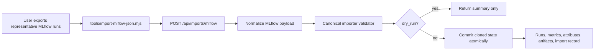

# Design: MLflow Import And W&B Dual-Logging Exploration

Date: 2026-05-09

Status: Accepted for narrow implementation after review

Owner: Codex

## Summary

This second P4 slice adds an MLflow JSON import path and records the W&B dual-logging decision. The implementation should stay narrow: accept a transformed MLflow JSON file, normalize it through the existing canonical importer, add a small CLI wrapper, and keep direct MLflow/W&B SDK dependencies out of the core repo.

The W&B work remains import-first for now. Dual logging is useful, but it should be implemented later as an optional SDK adapter only after the SDK hot path, error semantics, and user-facing naming are stable.

## Research Notes

MLflow exposes runs through `Get Run` and `Search Runs`; run payloads contain `info`, `data.metrics`, `data.params`, and `data.tags`. Metric history is fetched separately through `Get Metric History`, which returns metric values plus pagination tokens. Artifacts are listed separately through `List Artifacts`, which returns a root URI, file entries, and pagination tokens. The transformed JSON must say whether metric history is complete and must provide flattened file artifact entries if artifacts should be imported as file references. Sources: [MLflow REST API](https://mlflow.org/docs/latest/api_reference/rest-api.html), [MLflow tracking overview](https://mlflow.github.io/mlflow-website/docs/latest/ml/tracking/).

W&B's integration guidance recommends treating W&B as an optional dependency for libraries and allows disabled/offline modes. That supports deferring first-party dual logging until this SDK has a small optional adapter boundary instead of importing `wandb` in core code. Source: [W&B add W&B to any library](https://docs.wandb.ai/models/integrations/add-wandb-to-any-library).

## Goals

- Add `POST /api/imports/mlflow` for transformed MLflow JSON.
- Reuse the canonical importer path so dry-run and real import validation stay identical.
- Preserve MLflow run IDs, experiment IDs, params, tags, latest metrics, metric history, artifact roots, and artifact references.
- Add a dependency-free `tools/import-mlflow-json.mjs` wrapper.
- Keep malformed fixture coverage at parity with Neptune and W&B.
- Document the W&B dual-logging recommendation without adding a dependency yet.

## Non-Goals

- Crawling a live MLflow tracking server from the Node server.
- Adding `mlflow`, `wandb`, pandas, pyarrow, or cloud SDK dependencies.
- Downloading or uploading MLflow artifact bytes.
- MLflow model registry, datasets, traces, prompts, scorers, or gateway support.
- Deduplicating re-imported MLflow runs.
- A frontend importer wizard.

## Proposed Flow



## Request Shape

The route accepts an explicit transformed schema. It is not a native MLflow export contract.

```json
{
  "schema_version": 1,
  "project": "mlflow-import",
  "dry_run": false,
  "runs": [
    {
      "info": {
        "run_id": "mlflow-run-1",
        "run_name": "seed-1",
        "experiment_id": "12",
        "status": "FINISHED",
        "start_time": 1760000000000,
        "end_time": 1760000100000,
        "artifact_uri": "s3://bucket/mlruns/12/mlflow-run-1/artifacts"
      },
      "data": {
        "params": [{"key": "seed", "value": "1"}],
        "tags": [{"key": "mlflow.user", "value": "researcher"}],
        "metrics": [{"key": "reward", "value": 4, "step": 3, "timestamp": 1760000090000}]
      },
      "metric_history_complete": true,
      "metric_history": [
        {"key": "reward", "value": 1, "step": 1, "timestamp": 1760000010000},
        {"key": "reward", "value": 4, "step": 3, "timestamp": 1760000090000}
      ],
      "artifacts": [
        {"path": "checkpoints/policy.pt", "file_size": 12345, "is_dir": false}
      ]
    }
  ]
}
```

## Mapping

- `project` -> local project name.
- `info.run_id` or `info.run_uuid` -> external run ID.
- `info.run_name`, `tags["mlflow.runName"]`, or external run ID -> local run name.
- MLflow status `RUNNING` or `SCHEDULED` -> `running`; `FAILED` or `KILLED` -> `failed`; `FINISHED` -> `finished`; unknown statuses reject the import. Raw status is preserved under `metadata.mlflow.status`.
- `info.start_time` and `info.end_time` are converted from finite epoch milliseconds or ISO strings to local `started_at` and `finished_at` for imported run table accuracy. They are also preserved in `metadata.mlflow`.
- `data.params` -> run config object. The transformed schema must provide an array of `{key, value}` pairs, duplicate keys reject the whole import, and values stay strings because MLflow params are string-valued.
- `data.tags` -> `metadata.mlflow.tags`; selected run identity fields stay under `metadata.mlflow`. Duplicate tag keys reject the whole import except duplicate `mlflow.runName`, which is already represented by the final accepted tag map.
- Raw MLflow latest metrics from `data.metrics` are preserved under `metadata.mlflow.latest_metrics`.
- `metric_history` -> scalar metrics. Each item needs a non-empty key and finite numeric value. Missing steps default to row index. Timestamps are converted from finite epoch milliseconds or ISO strings to ISO before canonical validation.
- Per-key metric merge rule: full `metric_history` values win for each key; `data.metrics` fills only keys missing from `metric_history`. If `metric_history_complete` is false or absent, the summary includes a warning that latest-only fallback may be lossy.
- `artifacts` -> artifact metadata references only. The transformed schema must provide recursively flattened file entries to import artifact files. Directory entries are skipped and counted under `summary.skipped.artifact_directories`.
- File artifact paths must be relative, non-empty, and must not contain `..`. Absolute paths and traversal reject the whole import. Files map to a provided `uri` first; otherwise they use URI-aware joining against `info.artifact_uri` or explicit `artifact_root_uri`.
- External artifact type is preserved in metadata when provided; internal type uses the existing checkpoint/rollout/file heuristic.

## API Contracts

- `POST /api/imports/mlflow`
- `?dry_run=true` overrides body `dry_run`.
- Hosted mode requires `imports:write`.
- `schema_version` is optional and defaults to `1`; any value other than `1` rejects the import.
- Summary shape includes the base `{project, runs, metrics, attributes, artifacts}` fields and may include `warnings` and `skipped` for MLflow completeness/directory information. A real import response must have the same `summary` as dry-run for the same payload.
- Import records use `source_type: "mlflow_json"`.
- Re-import policy is append-only, matching Neptune and W&B.
- Because re-import is append-only and there is no import idempotency key yet, retrying after a timeout can create duplicate local runs. The imported metadata preserves `mlflow.run_id`, `mlflow.run_uuid`, and `mlflow.experiment_id` so the UI can expose duplicates later.
- Current Node import payload size remains the existing 1 MB JSON limit.

## W&B Dual-Logging Decision

Recommendation: defer first-party dual logging.

Reasons:

- W&B should remain an optional dependency.
- Dual logging doubles training-loop failure surfaces unless the SDK has a clear best-effort adapter boundary.
- The current W&B JSON import path is enough for representative evaluation.
- A future adapter should run after local logging succeeds, never block `log_metrics`, and surface W&B failures as warnings or adapter telemetry.

Future adapter shape:

```python
run = instantml.init(..., adapters=[instantml.adapters.wandb(project="existing-wandb-project")])
run.log_metrics({"reward": 1}, step=1)
```

## Testing Plan

- Unit tests for representative MLflow run import, dry-run parity, params/tags mapping, full metric history, per-key latest-metric fallback, lower-step/later-timestamp latest preservation, status mapping including `SCHEDULED`, run start/end timestamp conversion, schema-version rejection, artifact URI construction, directory artifact skip counts, traversal rejection, and malformed fixture rejection.
- Server route tests for dry-run import, missing bearer `401`, usage-only `403`, successful org scoping, import visibility, and malformed payload returning 400.
- Contract smoke coverage for `POST /api/imports/mlflow`.
- Existing `python3 -m pytest`, `npm run test:node`, `npm run test:contract`, `npm run web:build`, and `npm run test:ui` must pass.

## Documentation Plan

- Update `apps/server/README.md`, `tools/README.md`, `docs/architecture/current-system.md`, `PRODUCT_STRATEGY.md`, and `TODO.md`.
- Keep the older P4 design linked as the first slice and this document as the MLflow follow-up.

## Implementation Notes

- Implemented `POST /api/imports/mlflow` and `tools/import-mlflow-json.mjs`.
- Implemented strict request-body numeric validation for SDK writes and importer metrics/steps, while keeping query-parameter parsing for read filters.
- Implemented canonical import support for optional imported `started_at` and `finished_at` timestamps.
- Implemented MLflow schema-version validation, status mapping, per-key metric-history/latest fallback, raw latest-metric preservation, artifact directory skip counts, safe relative artifact paths, and URI-root joining.
- W&B dual logging remains deferred. The accepted next step is to validate import usefulness with real teams before adding a live dual-logging adapter.

## Review Notes

Fresh reviewer 1:

- Finding: MLflow latest metrics are timestamp-based while current summaries are step-based; partial history can drop keys.
- Decision: Preserve raw latest metrics in metadata and use per-key fallback from `data.metrics` only when a key is absent from `metric_history`.
- Finding: Numeric MLflow timestamps need conversion before canonical validation.
- Decision: MLflow normalizer converts finite epoch milliseconds and ISO strings to ISO for metric, start, and end timestamps.
- Finding: Artifact URI construction and directory handling are underspecified.
- Decision: Require flattened file entries, skip and count directory entries, reject unsafe paths, and use URI-aware root joining.
- Finding: Status, duplicate params/tags, schema version, and retry semantics need explicit rules.
- Decision: `SCHEDULED` maps to `running`, unknown status rejects, duplicate params/tags reject, optional `schema_version` must be `1`, and append-only duplicate risk is documented.

Fresh reviewer 2:

- Finding: Run start/end times would otherwise display as import time.
- Decision: Canonical import accepts optional imported run timestamps for MLflow.
- Finding: Metric-history completeness should be represented.
- Decision: `metric_history_complete` drives warning text when fallback latest metrics may be lossy.
- Finding: Auth tests should cover missing bearer, usage-only denial, org scoping, and import visibility.
- Decision: Added these cases to the testing plan.
- Finding: W&B dual logging should remain deferred.
- Decision: Accepted; no SDK adapter in this slice.

## Coverage Exceptions

None planned.
