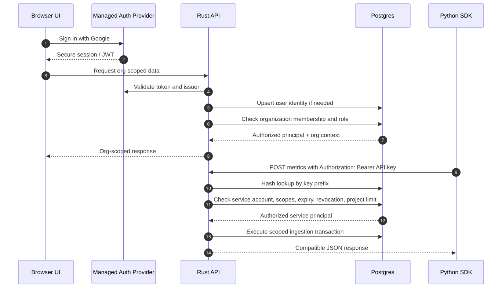
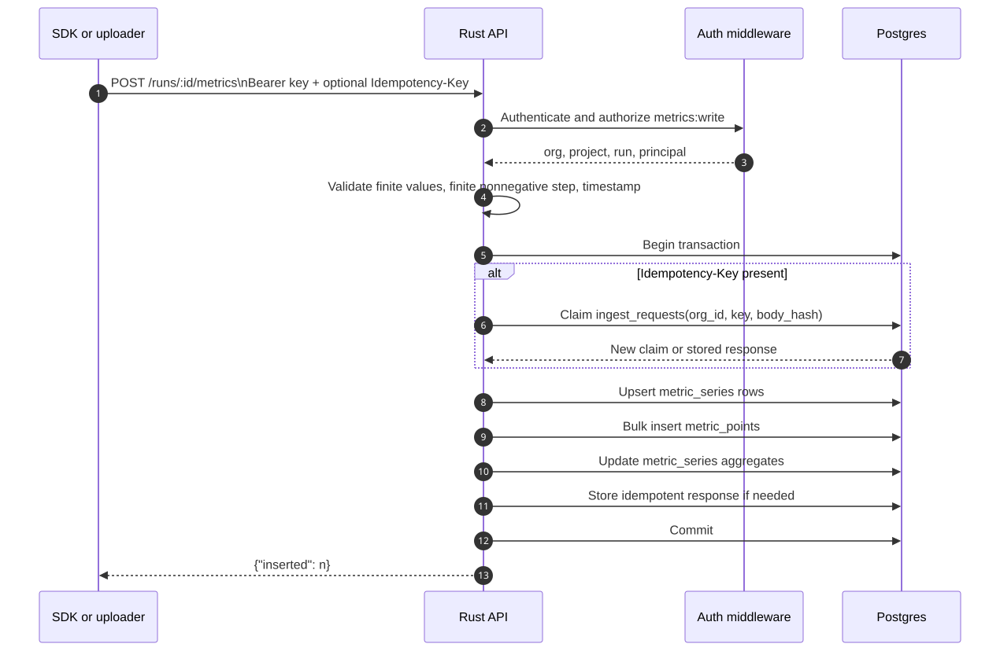

# Design: Rust and Postgres Hosted Backend

Date: 2026-05-09

Status: Accepted and promoted. P0-P3 Rust/Postgres slices are implemented, parity checks passed against Node, and Rust/Postgres is now the primary backend. The Node server is deprecated compatibility support.

Supersession note: the current implemented metric plane has since moved high-volume `metric_points` and aggregated `metric_series` storage to ClickHouse, as summarized in `PRODUCT_STRATEGY.md` and `docs/architecture/current-system.md`. This design remains the accepted Rust API, Postgres metadata, auth/tenancy, artifact, and compatibility foundation.

Owner: Codex

## Summary

Training Observability is moving toward a hosted SaaS-first product strategy: a W&B-style training observability competitor for smaller startups, research labs, and lean ML teams. The product should win on speed, UI quality, and predictable pricing while preserving trust through exportability, clear data ownership, and future self-host/VPC options.

This design proposes the durable backend architecture for that strategy:

```text
Next/React frontend -> Rust API -> managed Postgres -> artifact storage
Python SDK/uploader -> Rust API -> managed Postgres -> artifact storage
```

The Rust service is now the default backend after passing the shared contract, SDK, and frontend parity checks. The Node server remains as a deprecated compatibility oracle, JSON migration source, and legacy fallback. Rust preserves the existing SDK and frontend routes, introduces hosted SaaS tenancy and auth primitives, moves metadata and metric queries into Postgres, and keeps artifact bytes in local filesystem storage behind an abstraction that can later support S3-compatible storage.

The design explicitly supersedes earlier durable-backend language that assumed Node plus Postgres would remain the production service. Rust is chosen for the hosted API because it gives a fast, typed, single-binary service layer with explicit request handling, low runtime overhead, and strong fit for high-volume ingestion paths. Postgres is chosen for the metadata/query plane because the product needs indexed filtering, bounded chart queries, maintained summaries, transactions, migrations, and portable data.

## Goals

- Build a hosted SaaS-ready backend foundation for a W&B competitor focused on speed, UI, and pricing.
- Preserve the current API wire contracts while the frontend and Python SDK use Rust/Postgres by default.
- Add organizations, users, memberships, managed-auth identity, service accounts, API keys, and audit events.
- Store tenant-owned data with `org_id` on every table.
- Use Postgres for projects, runs, metric series, metric points, typed attributes, artifacts metadata, imports, idempotency, and usage summaries.
- Keep scalar metric ingestion narrow and fast.
- Maintain run/metric summaries at write time so dashboards do not scan full metric history.
- Add idempotency for SDK process-spool replay and future importer retries.
- Keep artifact upload/download separate from scalar metric hot paths.
- Provide diagrams and enough schema/API detail for implementation without guessing.

## Non-Goals

- Do not delete the Node server until P4 JSON-to-Postgres migration and legacy fallback needs are resolved.
- Do not break Node compatibility intentionally without a design doc and migration note.
- Do not implement billing collection or Stripe integration yet.
- Do not implement full S3 storage in the first Rust slice; local filesystem storage remains first.
- Do not add Kafka, Redis, or a separate event bus before Postgres-backed jobs are proven insufficient.
- Do not build a full W&B API shim in this slice.
- Do not publish final public pricing from this document; prices here are planning assumptions.

## Architecture Diagrams

Editable Mermaid sources live beside the rendered SVGs under `docs/design/assets/2026-05-09-rust-postgres-backend/`.

### System Context



### Auth, Organizations, And API Keys



### Metric Ingestion



### Postgres Entity Map



### Artifact Upload



### Migration Rollout


## Users and Use Cases

Primary buyer:

- Founder, research lead, or ML infrastructure owner at a smaller AI startup or lab.

Primary daily users:

- Research engineers comparing many runs.
- Fine-tuning engineers tracking metrics, configs, checkpoints, and evals.
- RL, robotics, or simulation engineers debugging stochastic runs and artifacts.
- ML platform engineers trying to reduce tracker cost, lock-in, or workflow friction.

Core hosted workflow:

1. User signs in with Google through the managed auth provider.
2. User creates or joins an organization.
3. User creates a project and an SDK API key.
4. Python SDK uses the API key to create runs and log metrics.
5. Rust API authenticates the key, authorizes the org/project, and writes to Postgres.
6. UI fetches page-scoped run summaries and bounded metric series.
7. User compares runs, artifacts, configs, and metrics in a fast dashboard.

## Proposed Design

### Service Stack

Use:

- `axum` for HTTP routing and extractors.
- `tokio` for async runtime.
- `tower-http` for tracing, request IDs, CORS, timeouts, compression, and body limits.
- `SQLx` for Postgres queries and migrations.
- `serde` and `serde_json` for request/response DTOs.
- `uuid`, `chrono`, `sha2`, `base64`, and `mime_guess`.
- `tracing` and `tracing-subscriber` for structured logs.
- Prometheus-compatible `/metrics`.
- Optional OpenTelemetry export after local tracing is stable.
- `utoipa` and `utoipa-axum` for `/openapi.json`.

Rejected for the first slice:

- Actix: production-capable, but its more framework-specific model is not needed.
- SeaORM: better for CRUD-heavy admin domains than explicit ingestion/query paths.
- Diesel: strong, but adds schema/DSL ceremony and is less natural for async ingestion.
- Rocket, Poem, Salvo, Dropshot: viable but do not beat `axum + SQLx` for this repo's simple, explicit style.
- Kafka/Redis: unnecessary until Postgres-backed jobs and idempotent ingestion are insufficient.

### Repo Shape

Keep the Rust service beside the deprecated Node server so legacy compatibility and migration work can compare behavior:

```text
apps/
  server/       # deprecated Node compatibility backend
  rust-server/  # future hosted API and worker service
```

The Rust binary should expose subcommands:

- `serve`: run the HTTP API.
- `worker`: run background jobs.
- `migrate`: run SQLx migrations.
- `all`: local/dev process that runs API and workers together.

Route handlers must not call SQL directly. Use these module boundaries:

- `http`: routers, DTOs, extractors, OpenAPI annotations.
- `domain`: validated types, statuses, roles, metric validation.
- `services`: use cases and transaction orchestration.
- `store`: SQLx queries and transaction helpers.
- `artifact_store`: local filesystem implementation and future S3-compatible trait.
- `auth`: managed-provider JWT/session validation, memberships, API-key auth.
- `jobs`: Postgres-backed jobs with `FOR UPDATE SKIP LOCKED`.
- `config`: environment and optional local TOML config.
- `telemetry`: logs, traces, request IDs, Prometheus metrics.
- `errors`: `AppError` and stable JSON error responses.

### Error Shape

Preserve the current compatibility shape:

```json
{"error": "message"}
```

The Rust API may add `code` and `request_id` later only after clients tolerate the extra fields. Map:

- Validation errors to `400`.
- Auth failures to `401`.
- Authorization failures to `403`.
- Missing rows to `404`.
- Idempotency body mismatch to `409`.
- Body too large to `413`.
- Storage or unexpected errors to `500` with a generic message.

## Component Impact

Backend:

- Rust/Postgres is the primary local and hosted backend.
- Node remains active only as deprecated compatibility support and a JSON migration source.
- Rust is the hosted SaaS API and worker runtime.

Frontend:

- Next/React calls current REST endpoints through the Rust API by default.
- Hosted org-aware routes are added alongside compatibility routes.
- UI will need managed-auth session handling and org context after the hosted auth provider is chosen.

Python SDK:

- `api_key` support and `RLOBS_API_KEY` are implemented in the Python SDK.
- The SDK sends `Authorization: Bearer <api_key>` when configured.
- Process-spooled metric events send `Idempotency-Key` using their event IDs.
- Keep unauthenticated local Rust flow for development while API-key mode covers hosted-compatible ingestion.

Storage:

- Postgres becomes the durable metadata/query plane.
- Local artifact files remain the first artifact byte backend.
- S3-compatible storage is supported by the interface, not implemented in the first slice.

Docs:

- Product strategy, architecture docs, TODO, root README, server README, and design index must reflect that Rust/Postgres is primary and Node is deprecated compatibility support.

## Data Model

Use UUID public IDs. Prefer time-ordered UUIDv7 for new Rust-generated IDs if the chosen crate is stable enough; otherwise use `gen_random_uuid()` and document the switch later. Keep IDs opaque to clients.

Every tenant-owned table includes `org_id`, even if it can be derived through project or run. This intentionally duplicates tenant context for authorization, indexes, RLS, deletes, exports, and incident review.

### Identity And Tenant Tables

`users`

- `id uuid primary key`
- `primary_email citext not null unique`
- `display_name text`
- `avatar_url text`
- `created_at timestamptz not null`
- `last_seen_at timestamptz`

`user_identities`

- `id uuid primary key`
- `user_id uuid not null references users(id)`
- `provider text not null`
- `provider_subject text not null`
- `email citext not null`
- `email_verified boolean not null`
- `created_at timestamptz not null`
- Unique: `(provider, provider_subject)`

`organizations`

- `id uuid primary key`
- `slug citext not null unique`
- `name text not null`
- `plan_tier text not null default 'free' check in ('free', 'lab', 'startup', 'growth')`
- `created_by_user_id uuid references users(id)`
- `created_at timestamptz not null`

`memberships`

- `id uuid primary key`
- `org_id uuid not null references organizations(id)`
- `user_id uuid not null references users(id)`
- `role text not null check (role in ('owner', 'admin', 'member', 'viewer'))`
- `created_at timestamptz not null`
- Unique: `(org_id, user_id)`

`service_accounts`

- `id uuid primary key`
- `org_id uuid not null references organizations(id)`
- `name text not null`
- `created_by_user_id uuid references users(id)`
- `created_at timestamptz not null`
- `disabled_at timestamptz`
- Unique: `(org_id, id)`

`api_keys`

- `id uuid primary key`
- `org_id uuid not null references organizations(id)`
- `service_account_id uuid not null`
- `name text not null`
- `key_prefix text not null`
- `key_hash bytea not null unique`
- `scopes text[] not null`
- `project_id uuid`
- `created_at timestamptz not null`
- `expires_at timestamptz`
- `last_used_at timestamptz`
- `revoked_at timestamptz`
- Foreign keys: `(org_id, service_account_id)` to service accounts and `(org_id, project_id)` to projects when project-scoped.

`audit_events`

- `id bigint generated always as identity primary key`
- `org_id uuid`
- `actor_user_id uuid references users(id)`
- `actor_service_account_id uuid`
- `action text not null`
- `target_type text`
- `target_id text`
- `metadata jsonb not null default '{}'`
- `created_at timestamptz not null`
- Foreign key: `(org_id, actor_service_account_id)` to service accounts when service-account attributed.

`usage_daily`

- Immutable UTC daily usage rollups for hosted billing/debug history.
- `id uuid primary key`
- `org_id uuid not null references organizations(id)`
- `period_start date not null`
- `period_end date not null`
- `rollup_kind text not null check in ('daily_snapshot', 'correction')`
- `schema_version integer not null`
- `correction_of_rollup_id uuid references usage_daily(id)`
- `plan_tier text not null`
- Count fields: seats, projects, runs, metric points, retained metric series, artifacts, and active API keys.
- Byte fields: exact artifact bytes, unknown artifact-byte count, estimated metadata bytes, and estimated warning storage bytes.
- Unique latest daily snapshot: `(org_id, period_start)` for `rollup_kind = 'daily_snapshot'`.
- Corrections append rows linked to the original rollup; historical snapshots are not mutated.

### Product Tables

`projects`

- `id uuid primary key`
- `org_id uuid not null references organizations(id)`
- `name text not null`
- `description text`
- `created_at timestamptz not null`
- Unique: `(org_id, name)`

`runs`

- `id uuid primary key`
- `org_id uuid not null references organizations(id)`
- `project_id uuid not null`
- `name text not null`
- `status text not null check (status in ('running', 'finished', 'failed'))`
- `config jsonb not null default '{}'`
- `tags text[] not null default '{}'`
- `metadata jsonb not null default '{}'`
- `created_at timestamptz not null`
- `started_at timestamptz not null`
- `finished_at timestamptz`
- Unique: `(org_id, id)`
- Foreign key: `(org_id, project_id)` to projects.

`metric_series`

- `org_id uuid not null references organizations(id)`
- `run_id uuid not null`
- `key text not null`
- `count bigint not null default 0`
- `sum double precision not null default 0`
- `sum_sq double precision not null default 0`
- `min double precision`
- `max double precision`
- `mean double precision`
- `variance double precision`
- `latest double precision`
- `latest_step double precision`
- `latest_logged_at timestamptz`
- `best double precision`
- `best_step double precision`
- `updated_at timestamptz not null`
- Primary key: `(org_id, run_id, key)`
- Foreign key: `(org_id, run_id)` to runs.

`metric_points`

- `id bigint generated always as identity primary key`
- `org_id uuid not null references organizations(id)`
- `run_id uuid not null`
- `key text not null`
- `step double precision not null`
- `value double precision not null`
- `logged_at timestamptz not null`
- `created_at timestamptz not null`
- Foreign key: `(org_id, run_id)` to runs.

`attributes`

- `id bigint generated always as identity primary key`
- `org_id uuid not null references organizations(id)`
- `run_id uuid not null`
- `path text not null`
- `type text not null check (type in ('config', 'float_series', 'string_series', 'file', 'file_series', 'histogram_series', 'tag'))`
- `step double precision`
- `logged_at timestamptz`
- `value jsonb not null`
- `summary jsonb not null default '{}'`
- `artifact_id uuid`
- `created_at timestamptz not null`
- Foreign keys: `(org_id, run_id)` to runs and `(org_id, artifact_id)` to artifacts when attached.

`artifacts`

- `id uuid primary key`
- `org_id uuid not null references organizations(id)`
- `run_id uuid not null`
- `type text not null check (type in ('checkpoint', 'rollout', 'file'))`
- `name text not null`
- `uri text not null`
- `step double precision`
- `size_bytes bigint`
- `sha256 text`
- `mime_type text`
- `storage_backend text not null`
- `storage_key text`
- Unique: `(org_id, id)`
- Foreign key: `(org_id, run_id)` to runs.
- `storage_path text`
- `metadata jsonb not null default '{}'`
- `created_at timestamptz not null`

`imports`

- `id bigint generated always as identity primary key`
- `org_id uuid not null references organizations(id)`
- `project_id uuid`
- `source_type text not null`
- `status text not null check (status in ('dry_run', 'running', 'completed', 'failed'))`
- `summary jsonb not null default '{}'`
- `run_ids uuid[] not null default '{}'`
- `created_at timestamptz not null`
- `completed_at timestamptz`
- Foreign key: `(org_id, project_id)` to projects when present.

`idempotency_keys`

- `id uuid primary key`
- `org_id uuid not null references organizations(id)`
- `key text not null`
- `request_hash bytea not null`
- `response_json jsonb not null`
- `created_at timestamptz not null`
- `completed_at timestamptz not null`
- Unique: `(org_id, key)`

## Index Strategy

Create these first:

- `projects(org_id, name)`
- `runs(org_id, project_id, created_at desc, id desc)`
- `runs(org_id, project_id, status, created_at desc, id desc)`
- `metric_series(org_id, run_id, key)` primary key
- `metric_series(org_id, key, max desc nulls last)`
- `metric_points(org_id, run_id, key, step, id)`
- `metric_points(org_id, run_id, step, id)`
- `metric_points(org_id, key, created_at desc)`
- `attributes(run_id, type, path)`
- `attributes(org_id, path)`
- `artifacts(run_id, type, step, created_at, id)`
- `artifacts(org_id, created_at desc)`
- `imports(org_id, created_at desc)`
- `api_keys(key_hash)` unique
- `api_keys(org_id, created_at desc)` partial where active
- `idempotency_keys(org_id, key)` unique
- `memberships(org_id, user_id)`
- `audit_events(org_id, created_at desc)`

For search, keep the existing `q` behavior bounded and page-scoped in v1. Add `pg_trgm` or a generated `tsvector` only when real search requirements stabilize. Do not build full-table `ILIKE` over JSONB into the scalable path.

Start unpartitioned. The documented scale smoke is roughly 1 million metric rows. If hosted customers are expected to exceed 50-100 million metric points early, partition only `metric_points` by hash on `run_id` with 16 or 32 partitions. Do not partition runs, artifacts, imports, or attributes in v1. Avoid time partitioning because chart queries are run/key/step-shaped.

## API Contracts

### Compatibility Routes

Rust initially preserves these current routes:

- `GET /health`
- `POST /projects`
- `GET /projects`
- `POST /runs`
- `GET /runs`
- `GET /runs/:run_id`
- `PATCH /runs/:run_id`
- `POST /runs/:run_id/metrics`
- `GET /runs/:run_id/metrics`
- `GET /api/overview`
- `GET /api/runs/summary`
- `GET /api/runs/side-by-side`
- `GET /api/usage`
- `GET /api/usage/export`
- `POST /api/runs/:run_id/attributes`
- `GET /api/runs/:run_id/attributes`
- `POST /api/runs/:run_id/artifacts`
- `GET /api/runs/:run_id/artifacts`
- `POST /api/runs/:run_id/artifacts/upload`
- `GET /api/artifacts/:artifact_id/download`
- `POST /api/users`
- `GET /api/users`
- `POST /api/orgs`
- `GET /api/orgs`
- `POST /api/orgs/:org_id/api-keys`
- `GET /api/orgs/:org_id/api-keys`
- `GET /api/export`
- `GET /api/imports`
- `POST /api/imports/neptune`
- `POST /api/imports/wandb`
- `POST /api/imports/mlflow`
- `POST /api/demo/reset`

Compatibility rules:

- The Node server remains the v1 compatibility oracle.
- Dynamic fields like UUIDs and timestamps can differ but response shapes must match.
- Metric step remains a nonnegative finite number.
- Duplicate metric steps are allowed.
- Metric ordering remains `step asc, point id asc`.
- Summary endpoints remain page-scoped.
- `POST /runs` records config/tag attributes.
- `POST /runs/:id/metrics` records canonical metrics and exposes `float_series` compatibility behavior without requiring every hosted scalar point to be queried from generic attributes.
- Artifact creation records file/file-series attribute behavior.

### Hosted Org Routes

Add org-aware routes alongside compatibility routes:

- `/api/orgs/:org_id_or_slug/projects`
- `/api/orgs/:org_id_or_slug/runs`
- `/api/orgs/:org_id_or_slug/runs/:run_id/metrics`
- `/api/orgs/:org_id_or_slug/artifacts/:artifact_id/download`
- `/api/orgs/:org_id_or_slug/admin/api-keys`

Exact hosted route shapes may be refined in the implementation design for auth UI, but every hosted request must resolve an org before reading or mutating tenant data.

### SDK Auth

Add:

```python
ro.init(..., api_key=None, org=None)
Client(base_url="...", api_key=None, ...)
```

Behavior:

- `api_key` defaults to `RLOBS_API_KEY`.
- SDK sends `Authorization: Bearer <api_key>`.
- Optional org context can be sent through URL, config, or header once hosted routes are finalized.
- Local unauthenticated Rust development is the default; Node compatibility remains available through explicit legacy commands.

### Idempotency

For retryable SDK/uploader/import calls:

- Client may send `Idempotency-Key`.
- Same org + key + same body hash returns stored response.
- Same org + key + different body hash returns `409`.
- Missing idempotency key preserves current duplicate behavior.
- The Rust service should take a transaction-scoped advisory lock for `(org_id, key)` before checking or writing an idempotency row, then insert the completed response in the same transaction as the metric points and maintained summaries.
- Idempotency rows are retained for seven days by default. The Rust `worker` command may delete expired rows; long-term retention should be tuned from uploader retry behavior and table growth.

## Data Flow

### Browser Auth

1. Browser signs in through the managed auth provider using Google.
2. Rust validates provider session/JWT claims.
3. Rust upserts `users` and `user_identities`.
4. Rust checks `memberships`.
5. Rust sets request org context.
6. Rust queries only org-scoped data.

Google is identity only. Authorization comes from memberships, roles, service accounts, scopes, and project constraints.

### API Key Auth

1. SDK sends `Authorization: Bearer <key>`.
2. Rust hashes the presented key with SHA-256.
3. Rust fetches the API-key row by full hash. `key_prefix` is display/debug metadata only unless a later design adds a unique active-prefix lookup.
4. Rust checks expiry, revocation, service account status, scopes, and optional project restriction.
5. Rust updates `last_used_at` asynchronously or with rate-limited writes.
6. Rust executes the scoped request.

API key plaintext is shown once. Only the hash is stored.

### Metric Ingestion

1. Authenticate and authorize the current compatibility scope `sdk:ingest`.
2. Enforce the route body limit before buffering; general JSON routes use 1 MiB and artifact upload uses the upload-specific cap.
3. If an idempotency key is present, take the transaction-scoped `(org_id, key)` advisory lock and check for an existing completed response.
4. Begin transaction.
5. Bulk insert `metric_points`.
6. Upsert one `metric_series` row per key with one batch-shaped SQL statement.
7. Update maintained series aggregate columns with atomic `INSERT ... ON CONFLICT DO UPDATE` math so concurrent writers cannot lose counts, sums, latest values, or best values.
8. Store idempotent response if needed.
9. Commit.
10. Return `{"inserted": n}`.

The hosted P2 auth design may split scalar metric writes into a narrower `metrics:write` scope after API-key migration.

Initial concrete limits:

- General JSON body limit: 1 MiB.
- Artifact upload JSON body limit: 50 MiB until multipart/object-storage upload is designed.
- Request timeout: 30 seconds.
- Postgres acquire timeout: 5 seconds.
- Metric batch size: 1 to 1,000 scalar points per request.
- Metric key, project name, run name, tag, and idempotency-key length: 1 to 512 bytes after trimming.
- Config and metadata values must be JSON objects and must fit inside the route body limit.
- Metric chart read limit: default 1,000 points, maximum 5,000 points.
- Run-summary page limit: default 100 runs, maximum 500 runs.
- Side-by-side comparison limit: 50 run IDs.
- Compatibility artifact-list limit: 1,000 artifacts per run.
- Compatibility export limit: 500 runs and 100,000 metric points.
- Compatibility import-list limit: 500 rows.

### Summary Queries

`GET /api/runs/summary` should:

1. Page runs first.
2. Join only the page run IDs to `metric_series`.
3. Join artifact counts.
4. Return latest metrics, aggregate metrics, metric keys, artifact counts, limit, offset, and total.

Do not compute summary aggregates from `metric_points` during request handling.

### Artifact Upload

1. Authenticate and authorize `artifacts:write`.
2. Validate run, type, name, step, metadata, content, MIME, and size.
3. Write bytes to temporary local object key.
4. Compute SHA256.
5. Finalize the object under the local artifact root.
6. Insert artifact metadata and file/file-series attribute in a DB transaction.
7. Commit.
8. Clean up temp/finalized bytes on finalize or DB failure.
9. If the process crashes between finalize and metadata commit, a later cleanup/retention job should repair unreferenced local bytes.

## Pricing And Infrastructure Research

Research date: 2026-05-09. Re-verify before publishing prices.

### W&B Baseline

W&B's current public pricing page lists:

- Free at `$0/mo`.
- Pro starting at `$60/month`, billed monthly.
- Pro positioned for professionals and small teams.
- Pro includes up to 10 model seats in the comparison table.
- Pro includes unlimited tracked hours.
- Pro includes 100 GB/month storage.
- Additional storage is listed at `$0.03/GB`.
- Enterprise is custom.

W&B billing docs track storage, tracked hours, Weave ingestion, and inference usage categories. This product should avoid tracked-hour billing in v1 because tracked-hour pricing is hard for small teams to predict and does not map cleanly to our current infrastructure cost drivers.

Sources:

- [W&B pricing](https://wandb.ai/site/pricing/)
- [W&B billing settings docs](https://docs.wandb.ai/platform/app/settings-page/billing-settings)

### Hosting Options

Recommended first hosted stack:

- Rust API: Google Cloud Run.
- Postgres: Neon.
- Artifact storage later: Cloudflare R2.
- Auth: Clerk or equivalent managed auth provider.

Why:

- Cloud Run has low operational overhead, container-native deployment, scale-to-zero, request/resource billing, and enough flexibility for Rust.
- Neon has serverless Postgres, usage-based pricing, branching, autoscaling, connection pooling, and strong early-product ergonomics.
- Cloudflare R2 has simple S3-compatible object storage economics, low storage cost, and free egress.
- Clerk has B2B organization support, Google login, machine/API key primitives, and startup-friendly pricing.

Alternatives to keep visible:

- Render: very simple deployment and hosted Postgres, but less control for a long-term hosted SaaS data plane.
- Fly.io: cheap global machines and strong Rust/container fit, but more operational responsibility.
- Supabase: useful all-in-one Postgres/auth/storage, but this plan chooses managed auth separately.
- AWS RDS/ECS/App Runner or GCP Cloud SQL: better for enterprise procurement later, heavier for first launch.

Sources:

- [Google Cloud Run pricing](https://cloud.google.com/run/pricing)
- [Neon pricing](https://neon.com/pricing)
- [Cloudflare R2 pricing](https://developers.cloudflare.com/r2/pricing/)
- [Clerk pricing](https://clerk.com/pricing)
- [Render pricing](https://render.com/pricing)
- [Fly.io pricing](https://fly.io/docs/about/pricing/)
- [Supabase pricing](https://supabase.com/pricing)

### Draft Pricing Strategy

Use a sustainable discount, not an unsustainable race to zero. The first public package should be easy to understand:

- Charge mainly by seats plus included storage.
- Avoid tracked-hour billing.
- Keep metric/event limits generous but enforce fair-use thresholds.
- Charge storage overage close to W&B's public overage, or lower when margin allows.
- Make Free/Lab/Startup self-serve. Push Growth/Enterprise to sales only when admin/compliance needs justify it.

Draft planning tiers:

| Tier | Draft price | Included |
| --- | ---: | --- |
| Free | `$0` | 1 user, local/dev use, 5 GB hosted storage, capped private projects, community support |
| Lab | `$29/org/mo` including 3 seats, then `$9/seat/mo` | 100 GB storage, unlimited tracked hours, generous metric/event limits, private projects, API keys |
| Startup | `$149/org/mo` including 10 seats, then `$12/seat/mo` | 500 GB storage, longer retention, priority support, larger metric limits, imports |
| Growth | `$399/org/mo` including 25 seats, then `$15/seat/mo` | 2 TB storage, audit logs, advanced roles, longer retention, higher limits |
| Enterprise | Custom | SSO/SAML, VPC or self-host option, custom retention, compliance, dedicated support |

Overage defaults:

- Artifact/storage overage: `$0.02-$0.03/GB-month`.
- Metric/event overage: start with fair-use warnings and plan-upgrade prompts; do not meter every point publicly in v1.

Rust and the deprecated Node compatibility server expose `GET /api/usage` and `GET /api/usage/export` as warning-only, `usage:read`-scoped summaries. Rust preserves that response shape and populates immutable `usage_daily` UTC snapshots before any value is used as billable truth.
- Import/storage-heavy workloads: require Startup/Growth or custom quote.

The price thesis is to be clearly cheaper and simpler than W&B for small teams, while keeping enough gross margin to cover Postgres query/storage costs and artifact storage.

## Performance Considerations

Initial product targets:

- Time to first logged run: under 10 minutes.
- SDK scalar logging: avoid artifact work and expensive serialization on the hot path.
- Run summary query: p95 under 300 ms for 50 runs, 20 metrics per run, 1,000 points per metric.
- Metric chart query: p95 under 200 ms for one run/key with 1,000 points.
- Dashboard initial load: p95 under 1 second for 100 visible runs after auth/session resolution.
- UI should compare 50+ runs without loading full metric history.

Proof points for beating W&B:

- Faster run table load on comparable project sizes.
- Faster metric chart interaction for selected runs.
- Faster local SDK logging path with process spool.
- Lower entry price for small labs and startups.
- No tracked-hour billing in v1.
- Clear export path and transparent storage model.

Query rules:

- List endpoints return summaries only.
- Metric history is fetched through bounded series endpoints.
- Artifact upload/download does not share the scalar metric hot path.
- Summary endpoints join maintained series rows, not raw point scans.
- Endpoints returning more than 1,000 records must paginate or stream.

## Simplicity Review

This is the smallest credible durable backend for the chosen SaaS strategy because it introduces only one new production API service, one relational metadata store, and one artifact storage abstraction.

Complexity intentionally deferred:

- S3-compatible storage implementation.
- Full billing implementation.
- W&B API shim.
- Kafka/Redis/event bus.
- Enterprise SSO/SAML.
- Fine-grained project-level RBAC.
- Dedicated analytics warehouse.
- Public open-source governance.

The design does include auth, orgs, API keys, idempotency, and Postgres from the first Rust slice because those choices are foundational for hosted SaaS and difficult to retrofit safely later.

## Failure Modes

- Cross-org data leakage.
  - Mitigation: `org_id` everywhere, Rust auth checks, optional Postgres RLS, cross-org integration tests.
- SDK retry duplicates.
  - Mitigation: idempotency table and `Idempotency-Key` support.
- Slow dashboard from raw metric scans.
  - Mitigation: maintained `metric_series` summary rows and page-scoped queries.
- Artifact metadata committed but bytes unavailable.
  - Mitigation: staged object writes, cleanup jobs, artifact availability state if finalize fails.
- Import creates partial data.
  - Mitigation: shared dry-run/import validation and all-or-nothing bounded imports.
- Managed auth provider lock-in.
  - Mitigation: keep local `users`, `user_identities`, `memberships`, and API-key models in our database.
- Hosted infrastructure cost exceeds pricing.
  - Mitigation: usage summaries, fair-use limits, storage overages, and early provider cost monitoring.

## Testing Plan

### Contract Tests

Create a shared black-box HTTP suite that accepts `RLOBS_CONTRACT_BASE_URL` or `RLOBS_BASE_URL` and runs unchanged against Node and Rust:

- User/org/API-key creation and SDK bearer-token ingestion.
- Project create/list.
- Run create/list/get/update.
- Metric logging, float steps, timestamps, duplicate steps, idempotency replay, and deterministic ordering.
- Summary response shape and page-scoped metric keys.
- Side-by-side comparison rows.
- Typed attributes.
- Artifact metadata, upload, SHA256, MIME, size, and download bytes.
- Neptune import dry-run/import history.
- Export response shape.
- Validation, not found, body too large, idempotency conflict, and auth errors.

### Auth And Tenancy Tests

- Managed-auth identity maps to a user.
- User without membership cannot access org data.
- Multi-org user can switch org context.
- API keys obey scopes, expiry, revocation, and project restrictions.
- Cross-org run IDs, artifact IDs, import IDs, and side-by-side requests are rejected.
- Postgres RLS blocks cross-org reads in integration tests if enabled.

### Database Tests

- SQLx migrations apply cleanly.
- Run summaries use maintained series aggregates.
- Metric chart queries use bounded indexes.
- Idempotency replays return stored responses.
- Import and batch failures roll back.
- Artifact upload failures do not leave unreferenced bytes without cleanup state.

### SDK And Frontend Tests

- SDK supports explicit `api_key` and `RLOBS_API_KEY`.
- Sync, buffering, offline replay, and process-spool flows work against Rust.
- Next rewrites can target Rust.
- UI smoke passes against Rust.
- Hosted auth/org errors render clearly.

### Operations Tests

- Docker Compose starts Postgres, the Rust API, and the artifact volume. The Next frontend runs separately with `RLOBS_API_BASE` pointed at the Rust API.
- Restart preserves Postgres rows and artifact bytes.
- `/healthz`, `/readyz`, and `/metrics` behave correctly.
- JSON-to-Postgres migration CLI dry-run preserves representative Node data.

## Documentation Plan

Update:

- `PRODUCT_STRATEGY.md`
- `TODO.md`
- `README.md`
- `docs/architecture/current-system.md`
- `docs/design/README.md`
- `apps/rust-server/README.md`
- `apps/server/README.md`
- SDK README auth/API-key updates
- Docker Compose docs for Rust/Postgres
- Migration CLI docs

## Alternatives Considered

### Keep Node And Add Postgres

This is simpler and still viable. Rejected as the durable hosted API direction because the product needs high confidence in hot ingestion paths, transactions, explicit service boundaries, single-binary operations, and long-term performance ownership.

### Rust With JSON Persistence

Useful only as a short spike. Rejected as the durable path because it preserves the weakest part of the current system: full-state scans and no real transaction model.

### Postgres Plus Append-Only Event Log

Attractive later for audit/replay. Deferred because it adds projection complexity before direct relational ingestion is proven insufficient.

### S3-Compatible Storage Immediately

Rejected for the first Rust slice. The local artifact backend behind an interface is enough to prove API/metadata semantics and keeps dev/test flow simple.

### Usage-Only Pricing

Rejected for first launch because it is hard for small teams to predict. Seats plus included storage is easier to buy and compare.

## Review Notes

Security/auth/multi-tenancy review:

- Finding: Current APIs are unauthenticated and project names are global; direct porting would leak tenant data.
- Risk: Cross-org run, artifact, metric, and import access by opaque ID.
- Recommended edit: Add organizations as root tenant, `org_id` everywhere, explicit memberships, service-account API keys, hashed keys, audit events, and optional Postgres RLS as defense in depth.
- Decision: Accepted.

Postgres/performance review:

- Finding: Typed attributes should not become the canonical scalar metric store.
- Risk: Duplicating every metric point into attributes doubles the hottest write path and makes summaries expensive.
- Recommended edit: Keep scalar metrics in narrow `metric_points` and `metric_series`, expose `float_series` compatibility through API behavior/views, and maintain summaries at write time.
- Decision: Accepted.

Rust service architecture review:

- Finding: Use `axum + SQLx + Postgres`, not Actix plus ORM.
- Risk: Framework or ORM ceremony would obscure the ingestion/query paths.
- Recommended edit: Use explicit modules, SQLx migrations, transactions, idempotency, OpenAPI, tracing, and Postgres-backed jobs.
- Decision: Accepted.

Migration/API compatibility review:

- Finding: Rust must treat the Node API as the v1 wire contract.
- Risk: Small response/ordering/validation mismatches break the SDK, UI, saved views, spool replay, and imports.
- Recommended edit: Add shared black-box contract tests and keep Node as default until Rust passes them; after promotion, keep Node as the legacy oracle.
- Decision: Accepted.

## Coverage Exceptions

No code coverage exception is needed. The Node/Python/SDK/Rust foundation slices are covered by the existing test suites plus Rust-backed contract, SDK, and UI smokes.

## Decision

Accepted for the hosted backend direction after review. The completed P0-P3 work promotes Rust/Postgres to the primary backend, keeps the Node server as deprecated compatibility support, adds shared contract tests, aligns metric semantics, adds org/API-key/idempotency/export/storage scaffolding, maintains metric summaries, and commits the initial Postgres migrations. Later metric-store work keeps the same route contracts while serving raw metric points and series summaries from ClickHouse.

## P0/P1 Implementation Slice Notes

Confirmed implementation slice: the first Rust service code used the existing `migrations/0001_initial.sql` schema and proved the smallest SDK-compatible Postgres path before Rust became the default backend. The slice includes the `serve`, `worker`, `migrate`, and local `all` commands; environment-driven config; health, readiness, metrics, and OpenAPI endpoints; middleware for request IDs, CORS, compression, body limits, timeouts, and structured tracing; and a disposable Postgres integration-test harness that now applies all migrations in order.

The P1 route slice is limited to compatibility routes needed for projects, runs, scalar metric ingestion, bounded metric reads, run summaries, and idempotent metric replay. Local bootstrap auth scaffolding is included only where needed for the existing shared contract smoke to create users, organizations, and API keys; broader hosted auth semantics remain P2. Artifact, attribute, import, export, usage, and side-by-side routes may return compatible minimal data only when required by the current smoke test, but their full product behavior remains P3.

The implemented slice also incorporates the fresh Rust review fixes: organization and project creation use `ON CONFLICT DO UPDATE ... RETURNING` so concurrent creators cannot observe zero rows; metric ingestion bulk-inserts points and batch-upserts series summaries; unkeyed metric reads use a separate `(org_id, run_id, step, id)` index; and minimal compatibility list/export routes now have hard caps until their P3 streaming/pagination designs land.

Compatibility org context for this slice is:

- Auth-required mode: tenant context comes from the bearer API key's `org_id`.
- Local unauthenticated mode: tenant context is a fixed local development organization created by the Rust service.
- Bootstrap routes create users, organizations, and API keys through `X-RLOBS-Bootstrap-Token` when auth-required mode is enabled.

P0/P1 endpoint scope:

| Endpoint group | Slice behavior |
| --- | --- |
| Health, readiness, metrics, OpenAPI | Must implement. |
| Users, orgs, API keys | Minimal bootstrap-compatible implementation for contract setup only. |
| Projects, runs, scalar metrics, run summaries | Must implement against Postgres. |
| Metric idempotency | Must implement with transaction-scoped locking and stored replay response. |
| Attributes, artifact metadata/upload/download, side-by-side, export, imports, usage, demo reset | Minimal compatibility behavior for existing smoke tests and UI smoke; full product behavior remains P3. |
| Hosted org routes | Deferred until P2 auth/org UI work. |

Rust is now default because the Rust command set, Rust tests, shared contract smoke, Python SDK overlap checks, and frontend smoke passed against Rust.

## P2/P3 Implementation Slice Notes

Confirmed implementation slice: P2 and P3 brought the Rust service to Node compatibility for auth-sensitive and product-workflow routes before the default switch. The slice keeps managed Google/JWT auth as a boundary only; it does not choose a provider or add hosted UI sessions. The API-key path becomes the enforced hosted-compatible auth path for now.

P2 scope:

- Bootstrap routes create users, organizations, owner memberships, service accounts, and API keys. API-key plaintext is returned only from create; list responses expose only prefix/hash-free public metadata.
- API keys store SHA-256 hashes, prefixes, scopes, optional expiry, revocation state, and optional `project_id` restrictions.
- Bearer auth checks full hash equality through the active hash index, expiry, revocation, disabled service accounts, scopes, org context, and project restrictions. `AuthContext` must carry `project_id`, and all run/project/artifact/import/export helpers must authorize through a central project-aware helper before returning data.
- Compatibility routes resolve org context from the bearer key in API-key mode and from the fixed local org in local mode. Hosted org-prefixed routes may be aliases only when they preserve the same access rules.
- Project-scoped keys can read/write only their project and runs/artifacts/imports/exports derived from that project. Org-level usage and key administration require unrestricted org-scoped keys.
- Auth-sensitive mutations write audit events.
- Postgres RLS remains deferred. The P2 decision is to keep application-level org/project checks first, then re-evaluate RLS after hosted route shape and connection-pool role strategy stabilize.
- UI auth/org error states remain minimal: existing API error surfaces should display Rust auth errors, while richer org switching stays P5.

Review constraint: implement P2 project authorization before P3 exposes broader product data. Do not allow URL org IDs or slugs to override bearer-key org context. Unknown scopes must be rejected at API-key creation, and admin/key-management routes must either use bootstrap setup or an unrestricted org-level admin key.

P3 scope:

- Typed attributes match Node validation and filters for `type`, `path_prefix`, and bounded `limit`.
- Artifact metadata create/list and upload/download routes match Node response shape. The local byte backend is a Rust artifact-store module with staged writes, SHA-256, size, MIME inference, root-confined reads, cleanup on DB failure, and a documented repair path for missing local bytes.
- The first artifact-byte slice uses a simple availability model: only commit metadata after bytes are finalized under the artifact root, and remove finalized bytes if the DB insert fails. A later schema change can add explicit unavailable/repair states.
- Downloads should stream from disk instead of reading whole files into memory. Uploads keep the 50 MiB JSON cap and reject empty decoded payloads.
- Side-by-side comparison includes config, metadata, tags, metric latest/max/mean summaries, typed attributes, and artifact-backed attributes for selected runs, with the existing run-count cap plus a total row cap and truncation warning.
- Portable export supports `project`, `project_id`, and current org filters, and includes organizations, projects, runs, metric series, metric points, attributes, artifacts, and imports within documented caps.
- Neptune, W&B, and MLflow imports share one normalized import path. Dry-run and real import use the same normalization/validation. Real import writes project, runs, metrics, attributes, artifacts, timestamps, status, and the import record inside one transaction.
- Warning-only usage comes from indexed Postgres counts and artifact byte sums. An immutable `usage_daily` snapshot writer is added for future billing truth, but usage endpoints remain non-billable.

Review constraint: keep JSON export bounded in this slice rather than claiming streaming export parity. Transactional imports are metadata-only for external artifacts; they do not download external artifact bytes.

Implemented P2/P3 outcome:

- API-key auth now enforces hashed secrets, expiry, revocation, disabled service accounts, known scopes, bearer-key org context, and optional project restrictions. Project-scoped keys are filtered through project-aware helpers before returning run-derived data.
- Bootstrap and unrestricted org-scoped `api_keys:write` keys can administer API keys and service accounts; URL org IDs do not override bearer-key org context. Artifact writes use `artifacts:write`, and default local SDK keys include it alongside `sdk:ingest`, `imports:write`, and `export:read`.
- API-key `last_used_at` updates are rate-limited to avoid a write on every SDK request. Project-scoped create-run/create-project paths check the allowed project by ID before comparing names, so they do not leak other project names through `403` vs `404`.
- The managed auth provider is represented as an adapter boundary only; no Google/JWT provider is selected in this slice.
- Artifact uploads stage local bytes, compute SHA-256/size/MIME metadata, finalize under the artifact root, stream downloads, and clean temp/finalized bytes on finalize or metadata-transaction errors. Missing local bytes return a not-found error for repair/cleanup visibility; crash-only orphan cleanup remains later operational hardening.
- Neptune, W&B, and MLflow imports normalize through the same dry-run/real path and commit project, runs, metrics, attributes, artifacts, timestamps, status, summaries, and import records in one transaction. Duplicate metric keys in the same import step/timestamp are split across safe SQL batches.
- Export, import history, side-by-side, usage, and usage snapshots remain bounded and indexed. Side-by-side work is capped across metric-series and attribute rows, and `truncated` reflects final row truncation. `usage_daily` snapshots are immutable daily records for future billing truth, while API usage responses remain warning-only and non-billable with the same warning categories as the Node oracle.
- Postgres RLS remains deferred. The implementation keeps application-level org/project authorization first; RLS should be revisited with hosted connection-pool role strategy in a later hardening slice.
