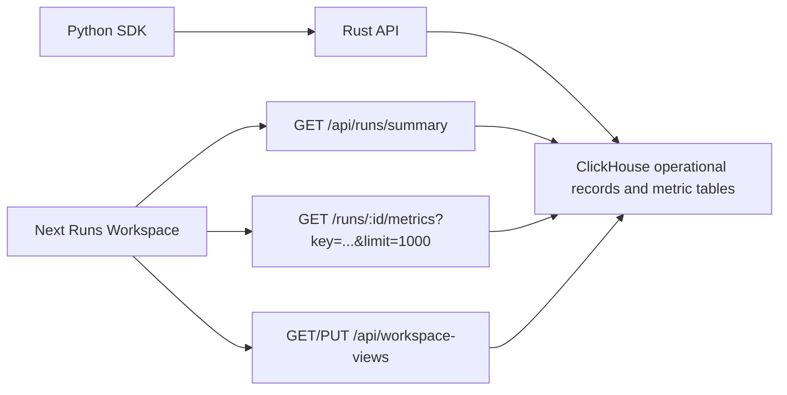
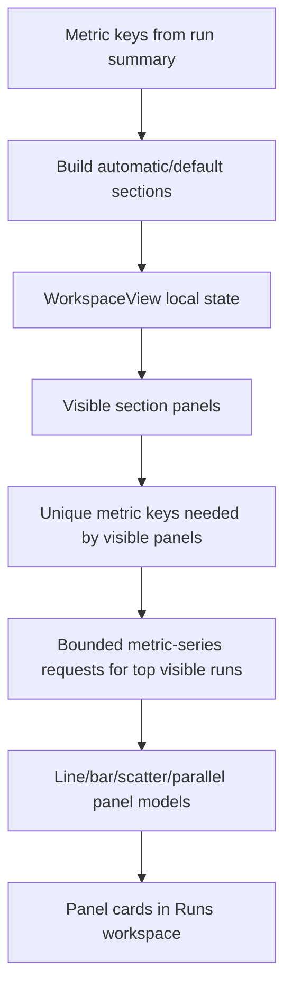

# Design: Runs Workspace Panels

Date: 2026-05-10

Status: Accepted and implemented for the frontend-local first slice; amended for movable/resizable panel layout MVP

Owner: Codex

## Summary

The Runs page is the primary selling surface. It should evolve from a fixed table/chart/inspector workbench into a W&B-style experiment workspace where researchers can filter runs, add sections, add panels from available metrics, edit panel settings, and save the resulting workspace view.

The supplied W&B screenshots are the visual reference. The implementation should not copy W&B branding or introduce a parallel component system. It should translate the same information architecture into this repo's existing console tokens: compact topbar, left navigation rail, flat panels, low-radius controls, restrained teal accent, and bounded chart rendering.

This design covers the durable product/API direction and a narrow implementation slice. The slice ships a local frontend workspace editor and documents the Rust/ClickHouse persistence API that should back customer-owned saved workspaces after human auth/user context lands in the Rust request context.

## Research Notes

Sources reviewed:

- W&B Panels docs: https://docs.wandb.ai/models/app/features/panels
- W&B Line plots overview: https://docs.wandb.ai/models/app/features/panels/line-plot
- W&B Line plot reference: https://docs.wandb.ai/models/app/features/panels/line-plot/reference
- W&B Bar plots: https://docs.wandb.ai/models/app/features/panels/bar-plot
- W&B Scatter plots: https://docs.wandb.ai/models/app/features/panels/scatter-plot
- W&B Parallel coordinates: https://docs.wandb.ai/models/app/features/panels/parallel-coordinates
- W&B Media panels and query panels index pages.
- Grafana dashboard layout docs: https://grafana.com/docs/grafana/latest/visualizations/dashboards/build-dashboards/create-dashboard/
- Grafana panel overview: https://grafana.com/docs/grafana/latest/visualizations/panels-visualizations/panel-overview/

Important W&B workspace behaviors to adapt:

- Workspaces can be automatic or manual.
- Automatic workspaces generate panels from logged keys; manual workspaces show only intentionally added panels.
- Panels live inside sections; sections can be collapsed, added, renamed, deleted, and configured.
- Panels can be added globally or directly to a section.
- Quick add creates panels from available metric keys.
- Panel controls include edit, duplicate, move, remove, full screen, and share/copy link.
- Line plots support x-axis choices, y-axis metrics, y-axis ranges, smoothing, point aggregation, max runs/groups, grouping, legends, expressions, and multi-metric regex panels.
- Section and workspace defaults can override individual panel settings.
- Large sections should support pagination or bounded visible panels.

Important Grafana/Prometheus-style dashboard behaviors to adapt:

- Dashboards support custom layouts where each panel can be positioned and sized manually.
- Panels move by dragging the panel title/header to another row, tab/grouping, or dashboard position.
- Drop targets should show a clear solid blue placement indicator.
- Panels resize by dragging the lower-right corner.
- Panel placement and size changes are saved with the dashboard layout.

## Goals

- Make `Runs` a workspace-first page with:
  - Top rectangular filter/toolbar surface.
  - Dedicated run selector/list surface.
  - Workspace panel search.
  - Sections with collapsible headers and panel counts.
  - Add section.
- Add panels drawer.
- Quick add from available metric keys.
- Per-panel edit, duplicate, remove, and full-screen inspect actions.
- Line chart panels in the first slice.
- Show other W&B-like panel categories only as roadmap copy in docs, not disabled product chrome.
- Workspace autosave to local storage now, with API-ready layout shape.
- Frontend-local custom layout MVP:
  - Remove per-section `Add panels` controls; keep one global top toolbar entry point.
  - Drag panels by their header/drag handle.
  - Drop panels before/after other panels, into empty sections, or into an `Unsectioned` area that represents panels outside named metric-prefix sections.
  - Resize panel cards in grid-column and grid-row units from a lower-right handle.
  - Persist panel order, section membership, and size through the existing local workspace layout.
- Preserve existing run summary, metric series, comparison, and artifact API routes.
- Design a Rust/ClickHouse persistence API for customer/org-owned workspace views.
- Keep all data queries bounded; panels must not fetch full metric histories by default.
- Keep the screen responsive: desktop uses run selector + workspace canvas + optional drawer; mobile stacks filter, run list, panels, and drawer.

## Non-Goals For First Slice

- Do not implement every W&B advanced expression operator.
- Do not persist workspace views in Rust/ClickHouse in this slice; the API is designed below, but implementation waits for human user identity and membership roles.
- Do not ship bar, scatter, parallel-coordinate, media, query, or text panels in the first implementation slice.
- Do not implement report publishing, public sharing, email invites, or social embeds.
- Do not replace the existing `Metrics`, `Run Detail`, or `Compare` tabs.
- Do not introduce a new CSS framework, component library, or chart library.

## Visual Translation

Reference elements to adapt:

- W&B: dark global header, left app rail, run selector sidebar, workspace toolbar, panel sections, add-panel drawer, full-screen panel editor.
- InstantML: keep the existing topbar and rail. Inside the `Runs` tab, use a two-layer workspace:
  - `runs-workspace-filter`: a full-width top rectangle containing project/status/search/sort/metric/table controls.
  - `runs-workspace-layout`: left run selector plus main canvas.
  - `workspace-canvas`: panel toolbar, sections, and add-section footer.
  - `panel-drawer`: right-side add/edit drawer on desktop; full-width sheet on mobile.

Assumptions for ambiguous screenshot details:

- Run colors are deterministic from run id/order, not user-editable in the first slice.
- Panel drag/reorder is represented by duplicate/remove/add-section controls; true drag/drop waits for persisted layout.
- Full screen means an in-app enlarged panel overlay, not a route-level shareable URL yet.
- Query/media/text/bar/scatter/parallel panels are roadmap-only for this slice; the add drawer only exposes working line panels and quick-add metric rows.

## Data Model

Frontend workspace layout shape:

```ts
type WorkspaceView = {
  schemaVersion: 1;
  id: string;
  name: string;
  project: string | null;
  mode: "automatic" | "manual";
  sections: WorkspaceSection[];
  settings: WorkspaceSettings;
  updatedAt: string;
};

type WorkspaceSection = {
  id: string;
  name: string;
  collapsed: boolean;
  settings?: Partial<PanelSettings>;
  panels: WorkspacePanel[];
};

type WorkspacePanel = {
  id: string;
  type: "line";
  title: string;
  metricKey?: string;
  metricKeys?: string[];
  layout?: PanelLayout;
  settings?: Partial<PanelSettings>;
  hidden?: boolean;
};

type PanelLayout = {
  // 12-column grid span. Defaults to 6 on desktop and collapses naturally on mobile.
  w: 3 | 4 | 5 | 6 | 7 | 8 | 9 | 10 | 11 | 12;
  // Approximate row height unit for chart/body depth. Defaults to 4.
  h: 3 | 4 | 5 | 6 | 7 | 8 | 9 | 10;
};

type WorkspaceSettings = PanelSettings & {
  hideEmptySections: boolean;
  sortPanelsAlphabetically: boolean;
  sectionOrganization: "prefix" | "manual";
};

type PanelSettings = {
  xMode: "step" | "time";
  xRange?: { min?: number; max?: number };
  yRange?: { min?: number; max?: number };
  smoothing: number;
  smoothingMethod: "ema" | "running-average" | "gaussian" | "none";
  groupBy: "" | "seed" | "tag" | `config:${string}`;
  groupAggregation: "mean" | "min" | "max";
  showGroupAverage: boolean;
  pointAggregation: "sampled" | "full";
  ignoreOutliers: boolean;
  maxRuns: number;
  legend: "visible" | "hidden";
  chartType: "line" | "area";
};
```

First-slice generation rules:

- Automatic mode generates a capped high-signal line-panel subset from available metric keys, grouped by first prefix (`train`, `eval`, `system`, `custom`). The full metric key set remains available through the metric catalog and add-panel drawer. Rendering remains bounded by visible-section and panel caps.
- Manual mode starts as a blank slate when selected explicitly. The local default for existing users may seed one starter panel, but the mode label must be clear.
- Quick add can add any available metric key that is not already represented by a visible panel.
- Workspace panel runsets draw from explicitly selected runs first, up to the global `MAX_SELECTED_RUNS` browser/network safety cap. If no runs are selected, panels fall back to the current filtered run page/top N and use each panel's `maxRuns` setting as the automatic preview cap.
- Unit-bounded metrics such as accuracy, F1, precision, recall, and AUC use a `0..1` y-axis when logged values are within that range. Unbounded metrics such as loss, reward, and return keep auto-fit y domains.
- Chart range brushing is a local view interaction for metric charts and fullscreen workspace panels. Dragging a range chooses an inspected segment; the main chart fits to the visible points inside that segment and recomputes the y-domain from those points, so zooming into a flat or volatile segment uses the chart area instead of preserving the full-run y-scale.
- Panel settings are resolved by precedence: workspace defaults < section overrides < panel overrides.
- Manual panel placement is resolved directly from `panel.layout`. Panels without a valid layout use `{ w: 6, h: 4 }`.
- Moving a panel preserves its `id`, `settings`, and `layout`.
- Dropping a panel outside named sections creates or reuses a local `section-unsectioned` section named `Unsectioned`. This is the frontend-local approximation of Grafana's top-level dashboard placement while the current data model keeps panels section-owned.
- Resize is intentionally coarse in the MVP. It snaps to grid columns/rows rather than storing pixel sizes, which keeps layouts portable across desktop widths and future API persistence.

## Rust/ClickHouse API Design

Customer-owned workspace views should be persisted by org and optionally user/project after human auth context exists. This is intentionally not implemented in the first slice because the current Rust `RequestContext` only carries org/API-key service-account context.

Future ClickHouse operational payload shape:

- `id`
- `org_id`
- `owner_user_id`
- `project_id`
- `name`
- `scope`: `user` or `org`
- `mode`: `automatic` or `manual`
- `layout`: JSON object, capped at 64 KB
- `is_default`
- `created_at`
- `updated_at`

Schema rule: add this as a future operational record kind and keep uniqueness/default-view checks in service code until a hosted coordination design exists.

REST routes:

- `GET /api/workspace-views?project=<name>&scope=user|org`
  - Returns summaries by default and the default view metadata for the current org/user/project context. Full 64 KB layouts should be returned only by `GET /api/workspace-views/:view_id` or with an explicit `include_layout=true`.
- `POST /api/workspace-views`
  - Creates a view.
  - Body: `{ name, project?, scope?, mode, layout, is_default? }`.
- `GET /api/workspace-views/:view_id`
  - Returns one view if visible to the caller.
- `PUT /api/workspace-views/:view_id`
  - Replaces name/mode/layout/default flag.
- `DELETE /api/workspace-views/:view_id`
  - Deletes a view owned by the current user or writable by org admins.

Auth:

- Local mode uses the fixed local org and `owner_user_id = null`.
- API-key mode should require a future `workspace:read` or `workspace:write` scope for service account access.
- Human auth should use membership role:
  - viewer/member: read org views and write user views.
  - admin/owner: write org views.
- Project-scoped API keys may read/write only views for their project and must not create org-wide defaults.

Validation:

- `layout` must be a JSON object under 64 KB in first hosted slice.
- `schemaVersion` must be accepted.
- Section count capped at 50.
- Panel count capped at 200.
- Panel metric keys must be strings <= 256 bytes.
- Unknown panel types are rejected.
- Section and panel IDs must be unique stable strings.
- Names/titles must be non-empty and length-capped.
- Enum values must match the schema.
- Numeric fields such as `smoothing`, ranges, and `maxRuns` must be finite and bounded.
- Route-level `name`, `project`, `scope`, and `mode` are authoritative; embedded layout values cannot contradict row metadata.

Response shape:

```json
{
  "workspace_views": [
    {
      "id": "uuid",
      "name": "Default workspace",
      "project": "demo",
      "scope": "user",
      "mode": "manual",
      "layout": {},
      "is_default": true,
      "updated_at": "2026-05-10T00:00:00Z"
    }
  ]
}
```

## Query Flow



Panel rendering flow:



## Frontend Architecture

Files:

- `apps/web/app/page.tsx`
  - Owns workspace layout state and persistence calls/fallback.
- `apps/web/app/dashboard-components.tsx`
  - Adds `RunsWorkspace`, `WorkspaceSectionView`, `WorkspacePanelCard`, `AddPanelDrawer`, `PanelEditDrawer`, `FullscreenPanel`.
- `apps/web/app/dashboard-models.ts`
  - Adds pure helpers for workspace defaults, run colors, panel metric requirements, panel previews, and local-storage validation.
- `apps/web/app/dashboard-types.ts`
  - Adds workspace and panel types.
- `apps/web/src/state.js`
  - Adds pure helpers only if testable outside React.
- `apps/web/tests/state.test.js`
  - Covers workspace default generation and layout validation helpers.
- `apps/web/tests/ui-smoke.mjs`
  - Covers Runs workspace sections, add panel, edit panel, collapse section, fullscreen panel, and mobile sanity.

## Performance Considerations

- Automatic mode generates a capped high-signal panel subset for responsiveness on rich projects; users can add any remaining logged metric key from the drawer.
- Each panel fetches only selected runs up to `MAX_SELECTED_RUNS`, or the top visible runs up to `maxRuns` when nothing is selected, with metric points capped at 1000.
- Deduplicate metric requests across panels by metric key.
- Use active-tab rendering already in place so other tabs do not rerender.
- Do not render point markers for point-heavy charts.
- Add panel search filters the panel list in memory.
- Section collapse should skip panel body rendering.

## Failure Modes

- No runs: show empty workspace with reset-demo and add-panel disabled until metrics exist.
- No metric keys: show an empty `Charts` section and route users to SDK logging/imports.
- Failed metric fetch: panel card shows a scoped error without breaking the workspace.
- Invalid saved layout: reset to generated automatic layout and show a client-safe message.
- Mobile drawer overflow: drawer becomes a full-width sheet below the filter area.

## Testing Plan

- `npm run test:node`
- `npm run rust:test` if Rust API implementation is added in this slice.
- `npm run web:build`
- `npm run test:ui`
- Browser validation at desktop.
- Computer Use validation on the running local app because the user explicitly requested it.
- Side-by-side visual comparison against supplied W&B screenshots:
  - left run selector and search/filter controls
  - panel search toolbar
  - section header count/actions
  - panel grid density
  - add-panel drawer and edit drawer
  - mobile stacking and control reachability

## Documentation Plan

- Update `apps/web/README.md` with workspace/panel behavior and limits.
- Update `apps/rust-server/README.md` if API persistence lands in this slice.
- Keep this design doc updated with reviewer notes and implementation decisions.

## Review Notes

Movable/resizable panel layout amendment review:

- Product/design review: Accept a custom-layout MVP, but keep the interaction obvious. Use a visible drag handle in the panel header, a lower-right resize handle, and blue drop indicators. Remove section-level `Add panels` buttons so creation happens from one global toolbar action; researchers can add to a section using the drawer target selector or add first and drag later.
- Frontend architecture review: Avoid a heavy grid-layout dependency for the first slice. Use the existing `WorkspaceView` JSON, HTML drag/drop for panel movement, pointer events for coarse resize, and CSS grid spans. Store portable `w`/`h` units instead of pixels.
- Maintainability review: Keep all movement and resizing local to `apps/web` until Rust workspace-view persistence lands. Sanitize old layouts by defaulting missing/invalid `layout` values; do not break existing saved local views.
- Failure-mode review: Disable fine-grained custom layout expectations on mobile by letting panels collapse to one column. Search-filtered layouts should still render safely; moving hidden panels is deferred because it can surprise users.

Senior product/design review:

- Finding: Automatic/manual modes were semantically wrong if automatic only generated a preferred subset and manual started pre-populated.
- Decision: Automatic now means “generate a bounded useful starting set from logged keys,” grouped by prefix, while preserving full-key add/search. Manual is defined as blank when selected explicitly; local default seeding must be labeled clearly.
- Finding: Settings hierarchy was promised but not modeled.
- Decision: Add `WorkspaceSettings`, section overrides, panel overrides, and explicit precedence.
- Finding: First slice was over-scoped with line/bar/scatter/parallel.
- Decision: First implementation slice ships line panels only.
- Finding: Toolbar placement risked duplicating topbar/commandbar controls.
- Decision: Reuse/rehome existing controls into one Runs workspace filter surface rather than adding a second layer.

Senior Rust/ClickHouse/API review:

- Finding: Persisted user views are unsafe before Rust carries human `user_id` and membership roles in `RequestContext`.
- Decision: First slice is frontend-local only. API/schema remains future design.
- Finding: Future schema must enforce same-org project/user ownership and avoid nullable uniqueness bugs.
- Decision: Future persistence should enforce `(org_id, project_id)` and `(org_id, owner_user_id)` ownership plus scoped uniqueness in service code unless a later storage design provides durable constraints.
- Finding: Project-scoped API keys need restrictions.
- Decision: Project-scoped keys cannot create org-wide/default workspace views.
- Finding: Migration must be additive.
- Decision: Future persistence uses a dedicated operational record kind and service-level uniqueness/default checks.

Veteran ML researcher review:

- Finding: Panels should draw from the filtered run set/top N, not only selected runs.
- Decision: `maxRuns` controls only the automatic fallback preview. Explicit run selection is the chart runset and can exceed `maxRuns` up to `MAX_SELECTED_RUNS`.
- Update after in-app QA: the previous behavior was too confusing in practice because a panel could say `4 highlighted` while plotting 6 runs. Panels now plot selected runs first, then fall back to filtered page/top N only when there is no selection.
- Finding: Structured filters matter for real sweeps.
- Decision: First UI surface should make room for tag/config/metric filters, but only implement existing search/status/project controls plus a clear future extension point.
- Finding: Scatter/parallel require a typed field catalog.
- Decision: Defer non-line panels until `FieldRef` semantics and field catalog endpoints are designed.
- Finding: Automatic sections should use metric prefixes.
- Decision: Automatic sections group by first prefix.

## Decision

Accepted for a frontend-local first slice implementing W&B-style Runs workspace sections and line panels only. Rust/ClickHouse workspace persistence is designed but deferred.

## Implementation Notes

- Implemented the frontend-local first slice in `apps/web` with automatic prefix sections, line panels, panel search, add/edit/fullscreen/remove/duplicate controls, and local-storage layout sanitization.
- Amended the first slice with a single global add-panel entry point, drag-to-move panels between sections/unsectioned placement, lower-right panel resizing, and persisted `w`/`h` layout units.
- Added UI smoke coverage for workspace pagination, automatic/manual panels, add/edit/collapse/fullscreen flows, desktop mid-width behavior, and mobile horizontal-overflow checks.
- Added UI smoke coverage for panel resize handles, moving panels between sections, and preserving the customized placement through reload before resetting back to automatic mode.
- Added chart-range zoom behavior and fullscreen panel polish: the modal owns the visible title/metric context, hides the duplicate inner card header, keeps the plot bounded to the viewport, and exposes the range brush for zooming inspected sections.
- Rust/ClickHouse workspace persistence remains deferred until human user identity and org membership roles are present in the Rust request context.
