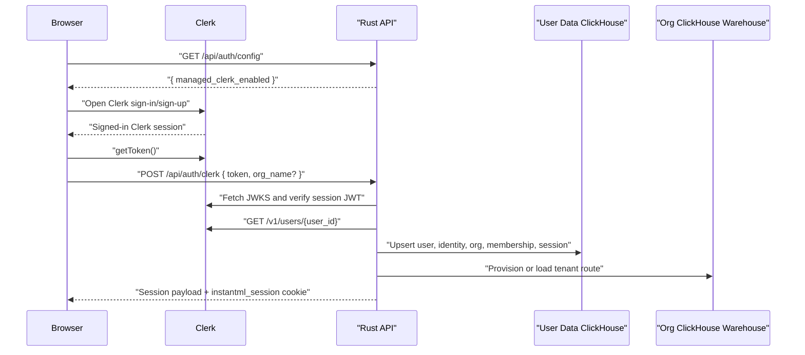
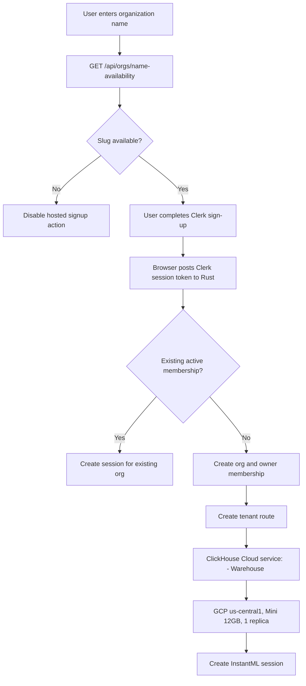
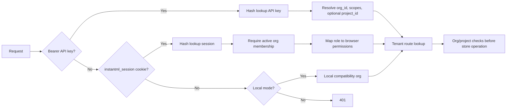

# Design: Clerk Hosted Auth

Date: 2026-05-16

Status: Accepted first hosted-auth slice

## Context

InstantML already has local development auth, browser sessions, org memberships, copy-once SDK API keys, and org-scoped Rust/ClickHouse data access. Hosted auth should not replace those authorization boundaries. Clerk owns identity and sign-in UX; InstantML still owns org membership, API key issuance, session cookies, and tenant routing.

This supersedes the earlier direct Google OAuth plan. Google can still be enabled inside Clerk, but the app should integrate with Clerk rather than hand-rolling Google Identity Services.

## Goals

- Add Clerk to the Next.js App Router app with `clerkMiddleware()`, `<ClerkProvider>`, `<Show>`, `<SignInButton>`, `<SignUpButton>`, and Clerk account UI only before an InstantML session is created. Once an InstantML session exists, sign-out must revoke the InstantML cookie and then sign out of Clerk.
- Exchange a verified Clerk session token for an InstantML `HttpOnly` browser session.
- Keep every API read/write scoped to the resolved `org_id`, active membership, and role/scope checks.
- Require unique org names at signup and keep the duplicate-slug check on the server.
- Provision hosted ClickHouse Cloud warehouses as `<Org Name> - Warehouse <org-id-prefix>` on GCP Iowa (`us-central1`) using Mini 12GB, one replica. The org-id suffix prevents two normalized or truncated org names from recovering into the same paid service.
- Keep local development auth available for smoke tests and offline work.

## Non-Goals

- Do not use Clerk Organizations in this slice. InstantML orgs remain the source of truth for tenant IDs and warehouse routing.
- Do not expose Clerk tokens to SDKs or store them as SDK credentials.
- Do not move product data into Clerk metadata.

## Flow

The Rust API verifies the Clerk session token signature against Clerk JWKS using `CLERK_SECRET_KEY`, requires an HTTPS Clerk issuer or the exact configured `CLERK_JWT_ISSUER`, a fresh unexpired session token, and then fetches the Clerk user profile to confirm the primary email is verified. The stable identity key is `(provider = "clerk", provider_subject = Clerk user id)`.

## Signup And Tenant Provisioning

The availability endpoint is only a UX check. `create_clerk_session` still enforces duplicate org slug rejection while holding the store lock, so concurrent signups fail closed.

## Authorization

Browser sessions and SDK API keys are separate credentials. Browser mutation requests validate `Origin` before using cookies. SDK bearer-token requests do not rely on browser cookies and are authorized by API key scopes plus org/project boundaries.

The shared demo org is intentionally browse-only. Demo API-key creation returns only `export:read`, with no copy-once secret reveal, API-key authentication clamps any canonical `InstantML Demo` key to `export:read` as an effective scope, and demo browser sessions are denied write/admin permissions. This protects both the demo tenant warehouse and User Data control-plane records from stale demo keys or demo browser sessions that may have been issued before the read-only policy.

## API Contract

- `GET /api/auth/config` returns `{ dev_auth_enabled, managed_clerk_enabled }`.
- `POST /api/auth/clerk` accepts `{ token, mode, account_type, org_name, seat_emails }` and returns the existing auth session payload while setting `instantml_session`.
- `POST /api/auth/logout` revokes the InstantML session; the frontend also calls Clerk sign-out.
- `GET /api/orgs/name-availability?name=...` returns `{ name, slug, available, message }`.

## Review Notes

- Reviewer feedback: do not trust email or user profile data sent from the browser. Resolution: Rust verifies the Clerk token and fetches the Clerk user profile server-side.
- Reviewer feedback: keep org isolation in the API, not the UI. Resolution: sessions require active membership, role checks gate browser mutations, API keys keep scope/project checks, and data rows remain org-scoped.
- Reviewer feedback: hosted ClickHouse provisioning can create paid resources. Resolution: Cloud-service provisioning remains opt-in and automated tests use local/database-mode provisioning.
- Live provisioning note: if ClickHouse Cloud creates a service but the browser/API request times out before route credentials are persisted, retrying provisioning finds the existing service, resets its password through the ClickHouse Cloud API, and persists the recovered tenant route. This avoids manual User Data edits while preserving the per-org service boundary.
- Reviewer feedback: do not recover a tenant from an ambiguous ClickHouse Cloud service name. Resolution: service names now retain the requested warehouse label but include a stable org-id prefix so retries recover only the intended org service.
- Reviewer feedback: signing out from Clerk alone must not leave the InstantML cookie authorized. Resolution: dashboard and landing sign-out actions call `/api/auth/logout` before Clerk sign-out, and dashboard avoids Clerk account menu sign-out surfaces.

## Test Plan

- Rust unit tests for Clerk claim freshness and verified primary email handling.
- Rust auth/session tests for duplicate org names, active memberships, role permissions, and org/project scoping.
- Next build verification for Clerk App Router setup.
- UI smoke default verifies landing, signup/onboarding, API key creation, demo reset, and initial dashboard load. Full workspace interaction coverage is available with `INSTANTML_UI_SMOKE_FULL_WORKSPACE=1`.
