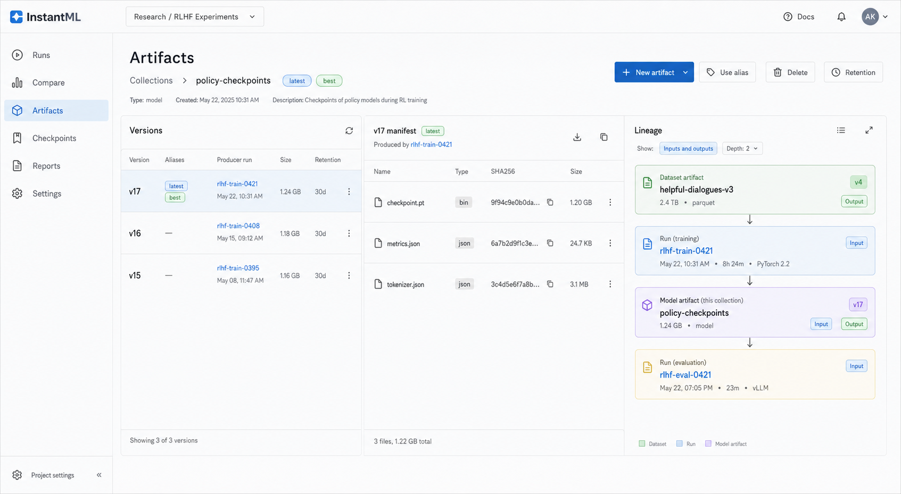

# Design: Versioned Artifact Manifests And Lineage

Date: 2026-05-30

Status: First slice implemented on `codex/artifact-lineage-parity`

Owner: Codex

## Summary

InstantML can upload and preview individual artifact files today, and it can
fork runs from checkpoint artifacts. It does not yet have W&B-style artifact
collections: immutable multi-file versions, `latest`/`best` aliases, artifact
manifests, explicit input/output artifact edges, retention/delete workflows, or
large direct uploads. That gap matters because artifacts are the
reproducibility object in the training workflow: users need to know which
dataset trained a model, which model produced an eval result, which checkpoint
is best, and whether old bytes are actually retained or eligible for deletion.

The smallest useful parity slice adds a versioned artifact layer next to the
existing raw artifact rows. A versioned artifact is a project-scoped collection
plus immutable versions. Each version owns a canonical manifest of files and
references, has stable `vN` addressing, automatically receives `latest` when it
is the newest committed version, and can be promoted to `best`. Runs declare
artifact inputs with `use_artifact()` and artifact outputs with
`log_artifact()`, creating a bounded artifact/run DAG for the dashboard.

Large bytes move through presigned R2 multipart uploads so the Python SDK does
not base64-encode checkpoints through Cloud Run. The first implementation does
not add browser file upload; the dashboard can show disabled or SDK-snippet
entry points until the browser upload product flow is separately designed. The
Rust API still owns auth, object-key generation, plan-capacity checks, manifest
finalization, alias moves, delete/retention state, and audited downloads. Existing
`ArtifactRow` routes remain compatible for current SDK helpers, Run Detail
media previews, checkpoint fork flows, and Node compatibility smokes.

Frontend design basis:



The image is a visual basis only. The implementation should follow the exact
data boundaries and loading rules in this design, not infer behavior from
generated text in the mockup.

## Research Notes

W&B Artifacts are the parity target. W&B documents artifacts as versioned data
objects that act as run inputs and outputs, for example datasets into training
runs and model checkpoints out of them:
[W&B Artifacts overview](https://docs.wandb.ai/models/artifacts). W&B lineage
is a DAG built by marking inputs with `use_artifact()` and outputs with
`log_artifact()`, and it exposes producer/consumer traversal through
`logged_by()` and `used_by()`:
[artifact lineage graphs](https://docs.wandb.ai/models/artifacts/explore-and-traverse-an-artifact-graph).
W&B artifact versions have immutable manifests, logical digests, aliases, and
versions:
[Artifact SDK reference](https://docs.wandb.ai/models/ref/python/experiments/artifact).
W&B automatically assigns `latest` to the newest linked version and creates
stable `v0`, `v1`, ... references; custom aliases such as `best` point at one
version in a collection:
[W&B aliases](https://docs.wandb.ai/models/registry/aliases).

Deletion and retention should copy the important behavior, not every registry
feature. W&B soft-deletes artifact versions before garbage collection and can
require explicit alias deletion:
[delete artifacts](https://docs.wandb.ai/models/artifacts/delete-artifacts).
W&B TTL policies schedule artifact deletion and can be set when an artifact is
created or after creation:
[artifact TTL](https://docs.wandb.ai/models/artifacts/ttl).

The upload design follows the R2/S3-compatible path already chosen for hosted
artifact storage. Cloudflare R2 presigned URLs grant temporary single-operation
access, support GET/HEAD/PUT/DELETE, must use the R2 S3 API domain, and should
be treated as bearer tokens:
[R2 presigned URLs](https://developers.cloudflare.com/r2/api/s3/presigned-urls/).
R2 multipart uploads use S3 part constraints: 5 MiB minimum part size except
the final part, 5 GiB maximum part size, and 10,000 parts:
[R2 upload objects](https://developers.cloudflare.com/r2/objects/upload-objects/).
R2's S3 compatibility includes multipart operations such as
`CompleteMultipartUpload`, `AbortMultipartUpload`, `UploadPart`, and
`ListParts`:
[R2 S3 compatibility](https://developers.cloudflare.com/r2/api/s3/api/).
Future browser direct uploads also require bucket CORS for the presigned origin:
[R2 CORS](https://developers.cloudflare.com/r2/buckets/cors/).
R2 bucket lifecycle rules can delete objects and abort incomplete multipart
uploads, with a default multipart abort after seven days:
[R2 object lifecycles](https://developers.cloudflare.com/r2/buckets/object-lifecycles/).
AWS S3's multipart overview is still useful for failure semantics: parts incur
storage until the upload is completed or aborted:
[S3 multipart overview](https://docs.aws.amazon.com/AmazonS3/latest/userguide/mpuoverview.html).

## Goals

- Add project-scoped artifact collections with immutable version manifests.
- Preserve stable `vN` version addressing, automatic `latest`, and movable
  `best` aliases.
- Add explicit artifact input/output relationships between runs and artifact
  versions.
- Add delete and retention behavior that is clear, recoverable, and compatible
  with usage accounting.
- Add presigned R2 multipart uploads for large checkpoints and multi-file
  artifacts without sending bytes through JSON/base64.
- Add a bounded lineage UI for selected artifact versions and runs.
- Keep existing raw artifact routes and checkpoint UI working during migration.

## Non-Goals

- Do not build a full model registry, protected registry aliases, registry
  automations, webhooks, approvals, or production-stage governance.
- Do not migrate every existing raw `ArtifactRow` into collections in the first
  implementation.
- Do not deduplicate object bytes across artifact versions in this slice.
- Do not expose raw R2 bucket names, object keys, or presigned download URLs in
  public artifact metadata.
- Do not add recursive unbounded lineage queries.
- Do not add direct browser downloads through presigned URLs; downloads still
  stream through the Rust API for auth and audit.
- Do not add browser direct upload in the first slice. The UI can expose
  catalog/detail actions and SDK snippets, but file picking, browser hashing,
  progress, renewal, cancellation, and CORS recovery require a follow-up design.
- Do not implement the deprecated Node server versioned-artifact surface unless
  a compatibility smoke explicitly requires a small read-only fallback.

## Users and Use Cases

Training engineers:

- Log a dataset artifact as an input to a training run.
- Log a checkpoint/model package as an output artifact.
- Promote the best model version after eval with a `best` alias.
- Resume or evaluate using `policy-checkpoints:best` without copying artifact
  IDs.

Research leads:

- Inspect a model artifact and see the dataset, training run, and eval run that
  produced or consumed it.
- Delete or expire old checkpoint versions without losing the latest/best
  version accidentally.

Platform owners:

- Upload large checkpoints without Cloud Run request-size/base64 overhead.
- Keep storage usage explainable: active, soft-deleted pending GC, expired, and
  hard-deleted bytes are separate states.

## Proposed Design

### First Slice Shape

The first implementation should cover all named product gaps with bounded
semantics:

1. SDK can create a versioned artifact output for one run.
2. SDK and dashboard can resolve artifact versions; SDK and write-capable
   browser sessions can mark an artifact version as a run input without moving
   aliases.
3. Collections expose versions, manifests, aliases, retention, and delete state.
4. Artifact detail shows a bounded lineage graph from the selected artifact
   version.
5. Hosted R2 can upload large SDK-originated files through presigned multipart
   URLs.
6. Existing raw artifact rows continue to work and appear as legacy artifacts.

### Concepts

Artifact collection:

- Project-scoped namespace for versions, for example
  `policy-checkpoints` of type `model`.
- Unique by `(org_id, project_id, type, name)`.
- Owns a mutable description, metadata, optional default retention, and alias
  map.

Artifact version:

- Immutable committed version within a collection.
- Stable version index `v0`, `v1`, ... assigned at commit time.
- Has a canonical `digest` derived from manifest entries.
- Has `state = uploading | active | soft_deleted | deleting | deleted | failed`.
- Has optional `ttl_days`, `expires_at`, and `retention_mode`.
- Has producer fields: `source_run_id`, `source_step`, and `logged_at`.

Manifest:

- Immutable list of entries for one version.
- Entry paths are normalized slash paths, unique within a version.
- Entries can be stored bytes (`local` or `r2`) or external references.
- Manifest entries are paginated in the API; list endpoints never return full
  manifests by default.

Aliases:

- `vN` is a stable system version label derived from `version_index`, not a
  mutable alias record.
- `latest` is a system alias that points to the newest active version in a
  collection. It moves only after a version successfully commits.
- `best` is a custom mutable alias. It can be set by SDK/API/UI.
- Alias names are unique within a collection and point at one active version.
- First slice does not add protected aliases, but delete behavior treats
  non-system aliases as explicit references that require `delete_aliases=true`
  or prior alias removal.

Edges:

- `output`: `run -> artifact_version`, created when a run logs a committed
  artifact version.
- `input`: `artifact_version -> run`, created when a run uses/resolves an
  artifact version.
- Existing run fork lineage stays in `RunRow` and is folded into the UI graph
  only when relevant.

### Version Commit Flow

Small and large artifacts share one logical commit flow:

1. Client builds an artifact object with files/references and metadata.
2. Client calls initiate upload with run id, collection name/type, expected
   files, expected sizes, expected SHA-256 digests, optional aliases, optional
   TTL, and idempotency key.
3. Server authorizes the run, validates manifest path/size/count caps, verifies
   plan storage capacity from expected byte deltas, creates or resolves the
   collection, and creates an upload session.
4. The server checks whether the requested manifest digest already matches the
   current active `latest` version before creating any upload targets. A digest
   no-op returns the existing version and may still apply requested alias moves
   if the caller is authorized.
5. For R2 stored files, server chooses opaque random bucket/object keys and
   starts an R2 multipart upload, including one-part files. Versioned uploads do
   not use reusable single PUT final-object URLs.
6. Server returns presigned `UploadPart` URLs for enough parts for the first
   renewal window. URLs expire quickly and include any required signed headers,
   such as `content-length`, that the client must send with the PUT.
7. Client uploads file parts directly to R2, records ETags, then calls complete.
8. Complete validates the upload session under the store lock, releases the
   lock for local/R2 provider calls while the session remains retryable,
   completes the provider multipart upload, validates cheap provider evidence
   such as `HEAD` content length against the manifest size, records
   `provider_completed` after provider success, reacquires the lock, revalidates
   session/version/alias state, deduplicates again if another writer already
   committed the same manifest digest, and then persists the committed artifact
   version, manifest-entry chunks, aliases, output edge, and stored idempotency
   response.
9. Only after metadata commit does `latest` move.

The existing base64 upload route remains for raw artifact rows and can be used
by older SDK helpers. New `VersionedArtifact` objects default to the presigned path
when the server advertises it through `/api/capabilities` or a failed initiate
does not return `unsupported`.

Initiate and complete use the existing idempotency-record pattern:

- Same idempotency key and same request hash returns the existing upload session
  or committed artifact-version response.
- Same idempotency key with a different request hash returns `409`.
- Retrying complete after the server finalized metadata returns the committed
  version without re-running provider completion or alias movement.
- Retrying complete after provider completion but before metadata commit resumes
  the metadata commit path without re-running provider completion.

Complete state machine:

```text
uploading
  -> provider_completed
  -> active
```

`AbortMultipartUpload` is safe while the session is `uploading` and provider
completion has not succeeded. This first slice keeps provider failures
retryable by leaving the session in `uploading`; a hosted follow-up can add a
durable ambiguous-error reconciliation worker that records
`failed_cleanup_pending`, probes provider state with `HEAD`/`ListParts`, and
then resumes metadata commit or orphan cleanup.

### Presigned Multipart Details

R2 object key:

```text
artifact-versions/<opaque-version-token>/<entry_id>
```

The object key must not include the original filename, manifest path, run ID,
artifact version ID, collection name, project name, or user-provided text.
Those values live only in metadata controlled by the Rust API. Presigned URLs
expose the object key to the SDK process and network tooling, so keys must be
opaque.

Upload session state (server-internal, not a public DTO):

```json
{
  "id": "uuid",
  "org_id": "uuid",
  "project_id": "uuid",
  "run_id": "uuid",
  "collection_name": "policy-checkpoints",
  "collection_type": "model",
  "artifact_version_id": "uuid",
  "state": "uploading",
  "expires_at": "2026-05-30T12:30:00Z",
  "expected_total_bytes": 12345,
  "files": [
    {
      "entry_id": "uuid",
      "path": "checkpoint.pt",
      "size_bytes": 12345,
      "sha256": "hex",
      "storage_backend": "r2",
      "storage_key": "server-internal opaque key",
      "multipart_upload_id": "r2-upload-id",
      "part_size_bytes": 67108864,
      "part_count": 20
    }
  ]
}
```

Part sizing:

- Default part size: 64 MiB.
- Minimum non-final part size: 5 MiB.
- Maximum part size: 5 GiB.
- Maximum part count: 10,000.
- Maximum files per version in first slice: 1,000.
- Maximum total parts per upload session: 20,000.
- Maximum complete request body: 2 MiB.
- Maximum files completed in one request: 1,000.
- Maximum manifest entry JSON payload per operational record chunk: 500 KiB.
- Upload session records store compact file ranges and provider upload IDs, not
  presigned URLs or per-part mutable state. Part ETags are accepted only in the
  complete request and stored in the idempotency response or provider evidence
  fields when needed for retry.

Presigned URL renewal:

- Initiate returns URLs for at most 256 parts per response.
- `POST /api/artifact-uploads/{upload_session_id}/renew` returns URLs for a
  requested contiguous part range.
- URL expiry default is 15 minutes, configurable up to 60 minutes.
- Renewed parts include signed required headers; clients must send those headers
  exactly when uploading to the presigned URL.
- Renewals re-check auth, billing state, upload session ownership, and session
  expiry.

Integrity:

- SDK computes full-file SHA-256 for every stored file before initiate.
- First slice does not require signed per-part `Content-MD5`; R2 ETags plus
  expected sizes are object-service evidence. A follow-up may add signed
  `Content-MD5` after the SDK sends part hashes before URL generation or renew.
- Server stores SHA-256 as a reproducibility digest and stores R2 ETags as
  object-service evidence. The server does not claim cryptographic verification
  of full-file SHA-256 unless it later downloads/audits bytes.
- Server validates object size through expected sizes and HEAD/list-parts data
  where provider APIs make that cheap.

Failure behavior:

- If complete fails before provider completion, server leaves the session in
  `uploading` so the same complete request can retry instead of stranding a
  terminal intermediate state.
- If complete fails after provider completion but before metadata commit, the
  server records `provider_completed` first and retries resume at metadata
  commit without re-running provider completion.
- Ambiguous provider-success/persist-failure reconciliation is deferred to a
  hosted follow-up that can safely probe provider state with `HEAD`/`ListParts`
  before reclaiming bytes.
- If a process crashes before abort, R2's lifecycle/default incomplete upload
  cleanup is the safety net.
- Worker cleanup aborts expired upload sessions and records how many sessions
  were aborted.

### Delete And Retention

Version states:

- `active`: visible and downloadable.
- `soft_deleted`: hidden from default lists, aliases removed or blocked by the
  delete request, bytes still retained and counted.
- `deleting`: worker is deleting bytes.
- `deleted`: bytes are gone or confirmed absent; version remains as tombstone
  metadata for audit/export.
- `failed`: upload session failed before commit.

Retention modes:

- `inherit`: use collection default retention if present.
- `days`: delete after `ttl_days` from version `created_at`.
- `keep_forever`: never expire automatically.
- `none`: no TTL.

Rules:

- `latest` is recomputed from active versions and never stored as a stale
  dangling alias.
- `best` and other custom aliases block manual deletion unless the request sets
  `delete_aliases=true`.
- TTL expiration skips `keep_forever` versions.
- The first implementation enforces TTL through availability checks:
  expired versions are not listed, resolved, downloaded, or included in
  retained-byte usage, and `latest` points to the newest remaining available
  version. A cleanup worker can later materialize expiration as soft-delete
  records.
- First slice treats `best` as retention-protecting unless the caller explicitly
  clears the alias or force-deletes aliases.
- Soft-deleted bytes continue to count as retained storage until GC confirms
  deletion. Usage responses should expose pending-delete artifact bytes.
- Shortening TTL, deleting a version with `latest`, clearing or moving `best`,
  and deleting a collection require explicit confirmation fields and a non-empty
  audit reason.
- Alias changes/deletes require `confirm` equal to the alias string. Retention
  and version delete requests require `confirm` equal to the version id. The
  audit reason is stored with the operational record and returned in internal
  history views.

Garbage collection:

- A leased cleanup worker scans expired active versions and marks them
  soft-deleted. In hosted mode this should run as a bounded worker process or
  Cloud Scheduler-triggered operator endpoint, not as an unbounded request-path
  loop.
- The request-path maintenance worker also fails expired upload sessions after
  their retry window so reserved bytes are released and unfinished provider
  multipart uploads can be aborted idempotently.
- Cleanup uses small batches, jitter, retry backoff, provider-rate caps, and
  idempotent state transitions so multiple Cloud Run instances do not stampede
  the same provider keys.
- Worker deletes R2/local objects for soft-deleted versions after a configurable
  grace window, default 24 hours.
- Before deleting any storage key, worker checks that no non-deleted manifest
  entry, active upload session, cleanup-pending orphan, or protected tombstone
  references the same `(storage_backend, storage_key)`.
- A reconciliation/orphan scanner must periodically inspect InstantML-owned
  artifact-version prefixes and record orphan-pending bytes before deleting
  unreferenced objects.
- Worker emits sanitized observability counts only: versions expired,
  objects deleted, bytes deleted, failures, and retryable provider errors.

### Usage Accounting

Retained storage for plan checks and usage summaries includes:

- Existing raw local/R2 `ArtifactRow.size_bytes`.
- Versioned local/R2 manifest entry bytes for versions in `active`,
  `soft_deleted`, or `deleting`.
- Upload-byte reservations for `uploading` and `provider_completed` sessions
  until abort, expiry cleanup, metadata commit, or orphan reconciliation clears
  them.

Retained storage excludes:

- Versioned entries in `deleted`.
- External/reference-only manifest entries.
- Raw imported/external artifact declarations that InstantML does not store.

Usage responses should expose active versioned bytes, pending-delete bytes,
reserved upload bytes, and orphan-pending bytes separately while keeping the
existing compatibility totals. Initiate reserves expected bytes against plan
capacity; complete corrects the reservation to committed retained bytes; abort
or expiry releases the reservation only after provider cleanup is confirmed or
the orphan state is recorded.

### Compatibility Matrix

| Surface | First-slice behavior |
| --- | --- |
| `POST /api/runs/:run_id/artifacts` | Unchanged raw metadata route. |
| `POST /api/runs/:run_id/artifacts/upload` | Unchanged raw base64 byte route for existing SDK helpers. |
| `GET /api/runs/:run_id/artifacts` | Unchanged raw selected-run artifact list. |
| `GET /api/artifacts/:artifact_id/download` | Unchanged raw byte download route. |
| `run.log_checkpoint_file()` | Keeps raw artifact upload in the first slice. |
| `POST /api/runs/:run_id/forks` | Keeps `checkpoint_artifact_id` pointing at raw `ArtifactRow`; versioned checkpoint fork is deferred or added later with a separate `artifact_version_id`/entry reference. |
| Run summaries | Keep raw `artifact_counts`; add versioned artifact output counts only after a UI-backed contract is designed. |
| Imports | May create metadata-only versioned collections later; first slice can keep imported artifacts raw/external. |

### UI

The existing top-level `Artifacts` dashboard tab becomes the artifact catalog.
The current selected-run artifact browser remains available inside Run Detail
Files. In the global Artifacts tab, legacy raw artifacts appear only in a
collapsed "Legacy raw artifacts for selected run" panel that loads on open, or
as a fallback when a project has no versioned collections.

Artifact catalog route state:

```text
/dashboard/artifacts
/dashboard/artifacts?project=<project>&collection=<collection_id>
/dashboard/artifacts?project=<project>&collection=<collection_id>&version=<version_id>
```

The first slice uses query parameters through the existing dashboard tab route;
it does not add nested artifact routes. Opening a collection/version syncs the
URL, back/forward restores selection, invalid IDs are removed with a local
message, and project mismatch clears collection/version selection before the
next fetch.

Catalog view:

- Type filters: `model`, `dataset`, `checkpoint`, `table`, `media`, `file`.
- Collection table: name, type, latest version, best version, producer run,
  versions count, retained bytes, pending-delete bytes, updated time.
- Empty state explains how to log a versioned artifact from the SDK.

Collection detail:

- Header: collection name, type, `latest` and `best` chips, description,
  retained bytes, file count, actions.
- Versions table: version (`vN`), aliases, producer run, source step, digest,
  size, file count, retention, state, created time.
- Manifest panel for selected version: paginated files/references with path,
  type, SHA-256, size, download action, and copy entry ID.
- Lineage panel: bounded artifact/run DAG with input/output direction badges.
- Delete/retention actions open confirmation dialogs that state whether aliases
  or retained bytes are affected.
- "New artifact" is disabled or opens an SDK snippet drawer in the first slice.
  Browser file upload, progress, cancel, renew, hashing, and CORS recovery are
  explicitly deferred.

Run Detail:

- Summary should surface versioned checkpoint/model outputs alongside legacy
  checkpoint rows.
- Graph section uses one unified bounded graph DTO instead of client-side ad hoc
  fan-out. The first slice should extend `/api/runs/:run_id/lineage` with
  `include_artifacts=true` or add an equivalent unified route that returns run
  fork nodes, artifact-version nodes, edges, truncation flags, and display
  summaries. Fetch it only when the Graph section is open.

Loading rules:

- Initial dashboard load fetches no artifact manifests or lineage graphs.
- `Artifacts` tab fetches collection summaries only.
- Collection detail fetches version summaries for one collection.
- Selecting a version fetches only that version's first manifest page and
  lineage graph.
- Manifest and lineage fetches use abort controllers/request keys so stale
  responses cannot render after the selected run or version changes.

State matrix:

| Surface | Loading | Empty | Error/retry | Disabled/action states |
| --- | --- | --- | --- | --- |
| Catalog | Skeleton table, no manifest fetch | "No versioned artifacts yet" plus SDK snippet | Inline retry; Node/unsupported route falls back to legacy panel | Create disabled in demo/read-only sessions |
| Collection detail | Preserve catalog, skeleton versions | "No active versions" if collection exists | 404 clears selection; project mismatch clears selection | Manage buttons hidden/disabled without `artifacts:manage` |
| Version detail | Skeleton manifest and lineage panes | "Version has no files" for reference-only or empty manifest | 410 shows deleted-version state and select-newest action | Delete/promote disabled for deleted versions |
| Manifest | Row skeleton for selected page | Empty filtered prefix message | Inline retry for page fetch | Download disabled for reference-only or deleted entries |
| Lineage | Compact loading node list | "No inputs or outputs recorded" | Inline retry with request id | Graph controls disabled while stale payload is hidden |
| Legacy raw panel | Loads only when opened | "No raw artifacts for selected run" | Inline retry; does not block catalog | Hidden until opened or catalog is empty |

Responsive and accessibility rules:

- Three-pane versions/manifest/lineage layout is allowed only at wide desktop
  widths. Medium widths use versions plus a tabbed Manifest/Lineage detail pane.
  Mobile stacks collection summary, versions, manifest, and lineage in order.
- Every graph has a table/list equivalent with the same nodes and edges.
- Edge direction is represented by labels/icons as well as color.
- Alias/status chips must meet contrast requirements in light and dark themes.
- Keyboard focus order follows catalog, versions, manifest, lineage, then action
  dialogs; dialogs use existing focus-trap patterns.

### SDK

Add a `VersionedArtifact` helper while preserving current `Artifact(File)` and
`log_artifact(name, uri, ...)` compatibility. The existing exported
`instantml.Artifact` class is a raw file wrapper today, so reusing that name for
a W&B-style collection package would be a breaking constructor change. A later
major version can alias or migrate the names with warnings after usage is known.

```python
artifact = im.VersionedArtifact(
    name="policy-checkpoints",
    type="model",
    metadata={"framework": "torch"},
    description="Policy checkpoints for RLHF run.",
)
artifact.add_file("checkpoint.pt")
artifact.add_file("tokenizer.json")
artifact.add_dir("tokenizer/", name="tokenizer")

logged = run.log_artifact(
    artifact,
    step=1200,
    aliases=["best"],
    ttl_days=30,
)

dataset = run.use_artifact("helpful-dialogues:latest", type="dataset")
dataset_dir = dataset.download(path_prefix="train/")
```

Compatibility rules:

- `run.log_artifact("name", "uri", artifact_type="file")` keeps the current
  metadata-only/raw route behavior.
- `run.log_artifact(name=..., uri=..., artifact_type=..., step=...,
  size_bytes=..., metadata=...)` keeps the current raw route behavior.
- `run.log_artifact(im.VersionedArtifact(...), step=None, aliases=None,
  ttl_days=None, idempotency_key=None)` uses the new versioned upload path and
  maps `step` to `source_step`.
- `run.log_checkpoint_file()` may keep using the raw upload path in the first
  implementation; add `versioned=True` later or make a narrow compatibility
  update after tests prove checkpoint UX parity.
- `run.upload_file()` keeps returning a raw artifact row for now.

New helpers:

- `im.VersionedArtifact.add_file(path, name=None, mime_type=None)`
- `im.VersionedArtifact.add_dir(path, name=None, recursive=True)`
- `im.VersionedArtifact.add_reference(uri, name, size_bytes=None, sha256=None)`
- `Run.log_artifact(versioned_artifact, step=None, aliases=None, ttl_days=None,
  idempotency_key=None)`
- `Run.use_artifact(ref, type=None)`. First slice intentionally omits
  `aliases` here; alias movement belongs on `LoggedArtifact.promote(...)`.
- `Api.artifact(ref, type=None)`
- `Api.artifact_versions(collection_ref, type=None, limit=..., cursor=...)`
- `LoggedArtifact.download(root=None, path_prefix=None)`
- `LoggedArtifact.get_entry(path)`
- `LoggedArtifact.promote(alias="best")`
- `LoggedArtifact.delete(delete_aliases=False)`

Download rules:

- Default download root is `./artifacts/<collection-name>/<version-or-alias>/`
  when no root is provided.
- `path_prefix` filters manifest entries but does not strip the prefix from
  output paths unless a later explicit option is added.
- `LoggedArtifact.get_entry(path).download(root=None)` is the single-file
  restore helper for checkpoints.
- The SDK rejects output paths containing NUL/control characters, backslashes,
  absolute paths, Windows drive prefixes, percent-decoded traversal, or
  normalization-equivalent traversal. Every destination is resolved under the
  root and verified to remain contained before writing.

SDK upload behavior:

- For versioned artifacts, SDK performs sync direct upload in the foreground in
  the first slice. It is intentionally not placed on the scalar metric async
  hot path.
- SDK retries initiate/renew/complete with idempotency keys.
- Repeated initiate with the same idempotency key returns the existing session
  or committed version. Renew can return already uploaded/listed parts when the
  server can recover them. Unknown part state is resolved by server-side
  `ListParts` or by documented re-upload of the same part number.
- SDK can resume within the same process while it still has the upload session
  and local files. Durable cross-process multipart resume is deferred.
- Presigned URLs are memory-only in the SDK and browser. They are never written
  into durable queues, local storage, telemetry, analytics, thrown exceptions,
  or retry logs. Expired URLs require renewal.
- When the server does not advertise versioned artifacts, SDK raises a clear
  `InstantMLError` rather than silently logging raw files.

### Backend Implementation Notes

Use new Rust domain rows persisted through `operational_records`. No
ClickHouse table migration is required for the first slice, but manifest entry
chunks must stay bounded and explicitly tested. The in-memory replay projection
stores collection/version summaries and manifest chunk locators by default, not
every manifest entry for every version. Loading a manifest page materializes
only the requested version's chunks. If design-partner datasets need more than
1,000 manifest entries per version, or if aggregate replay memory exceeds the
budget below, add a dedicated ClickHouse manifest table before raising the cap.

The first slice inherits the repo's current single-active-writer tenant/cell
assumption. `vN` assignment and `latest` movement are not safe under multiple
active data-plane writers because `operational_records` does not provide
compare-and-commit uniqueness. Raising Cloud Run data-plane scale above one
active writer for tenants that create artifacts requires a follow-up design with
a write lease, dedicated ClickHouse read/write model, or equivalent uniqueness
mechanism.

New operational record kinds:

- `artifact_collection`
- `artifact_version`
- `artifact_manifest_entries`
- `artifact_alias`
- `artifact_edge`
- `artifact_upload_session`
- `artifact_delete`
- `artifact_retention`

Store indexes:

- `artifact_collections_by_project_type_name`
- `artifact_versions_by_collection_created`
- `artifact_versions_by_collection_index`
- `artifact_aliases_by_collection_name`
- `artifact_manifest_chunks_by_version`
- `artifact_edges_by_version`
- `artifact_edges_by_run`
- `artifact_upload_sessions`
- `artifact_versions_by_expiration`

Apply/replay must be deterministic and tenant-scoped like existing run,
artifact, and report records.

Replay/entity contract:

| Kind | `entity_id` | Required payload identity | Replay validation |
| --- | --- | --- | --- |
| `artifact_collection` | collection UUID | `org_id`, `project_id`, `id` | tenant org matches payload; entity id matches `id` |
| `artifact_version` | version UUID | `org_id`, `project_id`, `collection_id`, `id` | tenant org matches payload; collection exists or can replay later; entity id matches `id` |
| `artifact_manifest_entries` | `<version_id>:<chunk_index>` | `org_id`, `project_id`, `collection_id`, `artifact_version_id`, `chunk_index` | tenant org matches payload; entity id matches version/chunk; entries all match version/org |
| `artifact_alias` | `<collection_id>:<alias>` | `org_id`, `project_id`, `collection_id`, `artifact_version_id`, `alias` | tenant org matches payload; entity id matches collection/alias |
| `artifact_edge` | edge UUID | `org_id`, `project_id`, `run_id`, `artifact_version_id`, `id` | tenant org matches payload; entity id matches `id`; direction is input/output |
| `artifact_upload_session` | session UUID | `org_id`, `project_id`, `run_id`, `artifact_version_id`, `id` | tenant org matches payload; entity id matches `id`; state is known |
| `artifact_delete` | version or collection UUID | `org_id`, `project_id`, target id, reason | tenant org matches payload; target id matches entity |
| `artifact_retention` | version or collection UUID | `org_id`, `project_id`, target id, retention fields | tenant org matches payload; target id matches entity |

Implementation must update the tenant replay validation helpers for every new
kind. Unknown artifact-management kinds should fail tenant replay during
development/tests rather than being silently ignored.

### API Contracts

All new Rust handlers need `#[utoipa::path(...)]` annotations and generated
OpenAPI updates through `npm run codegen:api`.

Artifact collections:

```text
GET    /api/artifact-collections?project=&type=&q=&cursor=&limit=
GET    /api/artifact-collections/{collection_id}
GET    /api/artifact-collections/{collection_id}/versions?cursor=&limit=
PATCH  /api/artifact-collections/{collection_id}
DELETE /api/artifact-collections/{collection_id}?delete_versions=false&delete_aliases=false
```

Artifact versions:

```text
GET    /api/artifact-versions/resolve?ref=<project/name:alias>&type=<type>
GET    /api/artifact-versions/{version_id}
GET    /api/artifact-versions/{version_id}/manifest?path_prefix=&cursor=&limit=
GET    /api/artifact-versions/{version_id}/lineage?direction=both&depth=2&limit=200
PATCH  /api/artifact-versions/{version_id}/retention
DELETE /api/artifact-versions/{version_id}?delete_aliases=false
GET    /api/artifact-entries/{entry_id}/download
```

Aliases:

```text
PUT    /api/artifact-collections/{collection_id}/aliases/{alias}
DELETE /api/artifact-collections/{collection_id}/aliases/{alias}
```

Upload sessions:

```text
POST /api/runs/{run_id}/artifact-uploads
POST /api/artifact-uploads/{upload_session_id}/renew
POST /api/artifact-uploads/{upload_session_id}/complete
POST /api/artifact-uploads/{upload_session_id}/abort
```

Run edges:

```text
POST /api/runs/{run_id}/artifact-inputs
GET  /api/runs/{run_id}/artifact-edges?direction=both&limit=200
GET  /api/runs/{run_id}/lineage?include_artifacts=true&depth=2&limit=200
```

Initiate upload request:

```json
{
  "collection": {
    "name": "policy-checkpoints",
    "type": "model",
    "description": "Policy checkpoint package",
    "metadata": {}
  },
  "aliases": ["best"],
  "ttl_days": 30,
  "source_step": 1200,
  "manifest": {
    "entries": [
      {
        "path": "checkpoint.pt",
        "kind": "file",
        "size_bytes": 1288490188,
        "sha256": "hex",
        "mime_type": "application/octet-stream"
      }
    ]
  }
}
```

Initiate upload response:

```json
{
  "upload_session": {
    "id": "uuid",
    "artifact_version_id": "uuid",
    "expires_at": "2026-05-30T12:30:00Z",
    "part_size_bytes": 67108864
  },
  "files": [
    {
      "entry_id": "uuid",
      "path": "checkpoint.pt",
      "upload_kind": "multipart",
      "part_size_bytes": 67108864,
      "part_count": 20,
      "parts": [
        {
          "part_number": 1,
          "url": "https://...",
          "expires_at": "2026-05-30T12:15:00Z",
          "required_headers": {}
        }
      ]
    }
  ]
}
```

Complete upload request:

```json
{
  "files": [
    {
      "entry_id": "uuid",
      "parts": [
        { "part_number": 1, "etag": "\"...\"" }
      ]
    }
  ]
}
```

Complete upload response:

```json
{
  "artifact_version": {
    "id": "uuid",
    "collection_id": "uuid",
    "name": "policy-checkpoints",
    "type": "model",
    "version": "v17",
    "aliases": ["latest", "best"],
    "digest": "sha256:...",
    "file_count": 3,
    "size_bytes": 12345,
    "state": "active",
    "source_run_id": "uuid",
    "created_at": "2026-05-30T12:00:00Z"
  }
}
```

Error behavior:

- `400 validation_error`: invalid ref, alias, path, digest, part list, TTL, or
  manifest cap.
- `401 unauthorized`: missing auth.
- `403 forbidden`: missing scope, project restriction, session role, origin, or
  upload-session ownership.
- `404 not_found`: run, collection, version, alias, entry, or upload session
  not visible.
- `402 payment_required` / `plan_limit_exceeded`: capacity or billing gate.
- `409 conflict`: idempotency key body mismatch, delete blocked by aliases,
  alias points at a non-active version, or upload session already finalized.
- `410 gone`: artifact version is deleted or upload session expired.
- `429 rate_limited`: renew/initiate abuse or plan short-window limits.

Unified graph DTO:

```json
{
  "nodes": [
    {
      "id": "run:uuid",
      "kind": "run",
      "label": "rlhf-train-0421",
      "summary": {},
      "state": "active"
    },
    {
      "id": "artifact-version:uuid",
      "kind": "artifact_version",
      "label": "policy-checkpoints:v17",
      "summary": { "aliases": ["latest", "best"] },
      "state": "active"
    }
  ],
  "edges": [
    {
      "from": "artifact-version:uuid",
      "to": "run:uuid",
      "direction": "input"
    }
  ],
  "truncated": false,
  "limit": 200,
  "depth": 2
}
```

The frontend must dedupe nodes by `kind:id`, sort runs by newest-first within a
level, hide stale graph payloads when selection changes, and show truncation
copy when `truncated=true`.

### Auth And Scopes

Existing scopes remain:

- `artifacts:write` can create output artifact upload sessions.
- `export:read` can resolve, list, read manifests, and download entries. It
  cannot create run/artifact input edges.

Add one new API-key scope:

- `artifacts:manage` can move aliases, delete versions/collections, and change
  retention. Project-scoped API keys with this scope can affect only their
  scoped project.

Browser sessions:

- Viewer can list/resolve/download.
- Member can log output artifacts and mark inputs.
- Owner/admin can delete, change retention, and move aliases in the first
  implementation. A later team permission model can widen alias moves to
  members if needed.

Demo org stays read-only for all mutation routes.

`POST /api/runs/{run_id}/artifact-inputs` requires `sdk:ingest` or
`artifacts:write` plus run/project access. Destructive routes require
owner/admin browser sessions or org/project-authorized API keys with
`artifacts:manage`, explicit confirmation fields, and an audit reason.

## Component Impact

Backend:

- Add versioned artifact domain rows, validation, store indexes, replay support,
  upload-session state, alias moves, retention/delete worker functions,
  direct-upload R2 signing, OpenAPI annotations, and observability events.
- Preserve current `ArtifactRow` create/upload/list/download routes.

Frontend:

- Redesign `/dashboard/artifacts` into the artifact catalog and collection
  detail workflow.
- Add bounded lineage graph and manifest tables.
- Merge versioned artifact outputs into Run Detail Summary/Graph without
  increasing initial dashboard fetches.

Python SDK:

- Add `VersionedArtifact`, `LoggedArtifact`, versioned `log_artifact(...)`
  overload, `use_artifact(...)`, and artifact download helpers.
- Keep current raw artifact/checkpoint helpers compatible.

Storage:

- Continue storing bytes in local filesystem for raw local artifacts and R2 for
  hosted direct uploads.
- Persist versioned artifact metadata in ClickHouse operational records.
- Use R2 multipart sessions for large hosted files.

Docs:

- Update architecture/API/schema docs, component READMEs, public docs, SDK
  examples, and migration notes.

## Data Model

`ArtifactCollectionRow`:

```rust
pub struct ArtifactCollectionRow {
    pub id: Uuid,
    pub org_id: Uuid,
    pub project_id: Uuid,
    pub project: String,
    pub name: String,
    pub kind: String,
    pub description: Option<String>,
    pub metadata: Value,
    pub default_ttl_days: Option<i64>,
    pub created_at: DateTime<Utc>,
    pub updated_at: DateTime<Utc>,
    pub deleted_at: Option<DateTime<Utc>>,
}
```

`ArtifactVersionRow`:

```rust
pub struct ArtifactVersionRow {
    pub id: Uuid,
    pub org_id: Uuid,
    pub project_id: Uuid,
    pub collection_id: Uuid,
    pub version_index: i64,
    pub digest: String,
    pub source_run_id: Option<Uuid>,
    pub source_step: Option<f64>,
    pub file_count: i64,
    pub size_bytes: i64,
    pub state: String,
    pub metadata: Value,
    pub ttl_days: Option<i64>,
    pub retention_mode: String,
    pub expires_at: Option<DateTime<Utc>>,
    pub delete_requested_at: Option<DateTime<Utc>>,
    pub deleted_at: Option<DateTime<Utc>>,
    pub created_at: DateTime<Utc>,
}
```

`ArtifactManifestEntriesRecord`:

```rust
pub struct ArtifactManifestEntriesRecord {
    pub org_id: Uuid,
    pub project_id: Uuid,
    pub collection_id: Uuid,
    pub artifact_version_id: Uuid,
    pub chunk_index: i64,
    pub entries: Vec<ArtifactManifestEntryRow>,
}
```

`ArtifactManifestEntryRow`:

```rust
pub struct ArtifactManifestEntryRow {
    pub id: Uuid,
    pub org_id: Uuid,
    pub project_id: Uuid,
    pub collection_id: Uuid,
    pub artifact_version_id: Uuid,
    pub path: String,
    pub kind: String,
    pub size_bytes: Option<i64>,
    pub sha256: Option<String>,
    pub mime_type: Option<String>,
    pub storage_backend: String,
    pub storage_key: Option<String>,
    pub storage_path: Option<String>,
    pub reference_uri: Option<String>,
    pub created_at: DateTime<Utc>,
}
```

`ArtifactAliasRow`:

```rust
pub struct ArtifactAliasRow {
    pub id: Uuid,
    pub org_id: Uuid,
    pub collection_id: Uuid,
    pub alias: String,
    pub artifact_version_id: Uuid,
    pub kind: String,
    pub created_at: DateTime<Utc>,
    pub updated_at: DateTime<Utc>,
    pub deleted_at: Option<DateTime<Utc>>,
}
```

`ArtifactEdgeRow`:

```rust
pub struct ArtifactEdgeRow {
    pub id: Uuid,
    pub org_id: Uuid,
    pub project_id: Uuid,
    pub run_id: Uuid,
    pub artifact_version_id: Uuid,
    pub direction: String, // input or output
    pub source: String, // sdk, ui, import
    pub created_at: DateTime<Utc>,
}
```

`ArtifactUploadSessionRow`:

```rust
pub struct ArtifactUploadSessionRow {
    pub id: Uuid,
    pub org_id: Uuid,
    pub project_id: Uuid,
    pub run_id: Uuid,
    pub artifact_version_id: Uuid,
    pub state: String,
    pub request_hash: String,
    pub expected_total_bytes: i64,
    pub total_part_count: i64,
    pub files: Vec<ArtifactUploadFile>,
    pub expires_at: DateTime<Utc>,
    pub created_at: DateTime<Utc>,
    pub updated_at: DateTime<Utc>,
}
```

Validation:

- Names, aliases, paths, and metadata use bounded string/JSON helpers.
- Alias format: lowercase letters, digits, `_`, `-`, `.`, max 64 bytes.
- Reserved aliases: `latest` and any `v[0-9]+`.
- Manifest path format: normalized relative path, no empty segments, no `.`,
  no `..`, slash separator, max 1,024 bytes.
- First slice entry cap: 1,000 entries per version.
- First slice project aggregate cap: 25,000 active manifest entries and 2,000
  active artifact versions per project while manifests live in operational
  records.
- First slice collection-version list cap: default 100, max 1,000.

## API Contracts

See the "API Contracts" section above for endpoint shapes. Public DTOs must
omit raw `storage_key`, `storage_path`, bucket names, object keys, and provider
upload IDs. Upload-session responses expose only entry IDs, part numbers,
presigned URLs, expirations, and required headers. Manifest entries expose
`entry_id`, `path`, `kind`, `size_bytes`, `sha256`, `mime_type`,
`storage_backend`, and download availability only.

Reference grammar:

```text
<name>                                      # requires type when ambiguous
<name>:<alias-or-version>                   # requires type when ambiguous
<project>/<name>:<alias-or-version>         # requires type when ambiguous
<type>/<name>:<alias-or-version>
<project>/<type>/<name>:<alias-or-version>
```

Default alias resolution:

- Missing alias resolves to `latest`.
- `vN` resolves by `version_index`.
- Aliases resolve only active versions by default.
- Because collections are unique by `(project_id, type, name)`, `type` is
  required whenever a name is ambiguous. SDK calls should pass `type=` for all
  `use_artifact()` calls in examples.

## Performance Considerations

Expected first-slice scale:

- 10-100 artifact collections per project.
- 1-200 versions per active collection.
- 1-1,000 manifest entries per version.
- 25,000 active manifest entries per project while using operational-record
  manifest chunks.
- Checkpoint/model package sizes from MiB to hundreds of GiB.
- Dataset manifests may hit the 1,000-entry cap; larger dataset versioning needs
  a dedicated manifest-table follow-up before launch claims.

Read shapes:

- Collection list returns summaries only: no manifest entries, no graph.
- Version list is paginated and scoped to one collection.
- Manifest entries are paginated and scoped to one version.
- Lineage is bounded by `depth <= 2`, `limit <= 200`, and direct indexes.
- Run Detail fetches artifact edges only when Graph is open.

Write shapes:

- Initiate writes one upload-session operational record.
- Complete writes one collection if new, one version, alias rows, edge rows, and
  manifest-entry chunk records.
- Part uploads bypass Rust and Cloud Run.

Indexes:

- In-memory replay indexes are enough for the first bounded slice.
- Manifest-entry indexes store chunk locators and per-version summary counts,
  not all entries for every version.
- Do not raise manifest caps or support whole-project lineage traversal until a
  dedicated ClickHouse read model is designed and benchmarked.

Latency targets:

- Collection list p95 < 150 ms for 100 collections.
- Version list p95 < 150 ms for 500 versions in one collection.
- Manifest page p95 < 150 ms for 1,000 entries, returned 100 at a time.
- Lineage p95 < 200 ms for 200 nodes/edges.
- Initiate p95 depends on R2 calls but should avoid reading bytes into Rust
  memory. Complete streams provider bytes through SHA-256 verification before
  activation in this slice; hosted rollout should replace that with provider
  checksum enforcement once R2 checksum headers are configured end to end.
- Complete request processing must stay under the configured JSON body cap,
  perform at most 1,000 provider calls, and complete within the API timeout.
  If that cannot be met for the chosen caps, an async finalize design is
  required before implementation.
- Same-origin Rust downloads keep the current artifact safety path, but
  checkpoint packages above the Cloud Run practical timeout should use
  file-level downloads or a future audited presigned download design.

Memory concerns:

- Replay RSS for versioned artifact indexes must stay below 128 MiB over the
  existing data-plane baseline at the first-slice aggregate caps.
- Manifest entries are loaded by selected-version page, not retained in full for
  every version in the process index.
- Upload-session records store expected part metadata but not byte buffers.

Release gates:

- Add a local benchmark that seeds the aggregate caps, measures replay startup
  time/RSS, collection list p95, version list p95, manifest page p95, and graph
  p95.
- Add complete-request benchmark coverage for maximum allowed part metadata and
  maximum allowed body size.
- Add cleanup benchmark coverage for expired-session abort throughput, GC delete
  throughput, retry behavior, and provider-rate caps.
- Add fake-provider tests for ambiguous multipart complete outcomes and orphan
  reconciliation.
- Add an R2 smoke for one small single PUT and one multipart object, guarded so
  live credentials are required explicitly.

## Simplicity Review

This is the simplest useful W&B-parity slice because it adds the missing
artifact object model without changing scalar metrics, raw artifact compatibility
routes, run list queries, or checkpoint fork semantics. It uses the existing
Rust operational record pattern and in-memory projection, but caps manifest
size so that choice remains honest.

Deferred:

- Registry/protected aliases/approval workflows.
- Byte deduplication and incremental manifests.
- Whole-project lineage search.
- Dataset-scale manifests over 1,000 entries.
- Durable multipart resume across process restarts.
- Public presigned downloads.
- Automatic `best` selection from metric goals.

## Failure Modes

- Initiate succeeds but client never uploads: session expires; worker aborts
  multipart uploads; no visible version is committed.
- Client uploads some parts then fails: abort endpoint or worker/lifecycle cleanup
  removes parts; reserved upload bytes continue to count until cleanup confirms
  abort or records orphan-pending state.
- Complete succeeds in R2 but metadata commit fails: server attempts object
  cleanup; if cleanup fails, a later orphan scanner by prefix must delete
  unreferenced objects.
- Process restarts during upload: session replay lets the client complete if it
  still has session id and part ETags; otherwise it aborts/ages out.
- Alias move races with delete: store lock serializes mutation; delete returns
  conflict if alias state changed.
- TTL expires a version currently selected in UI: UI refresh sees `410`/state
  change and prompts selection of another active version.
- Presigned URL leaks: URL expires quickly and is scoped to one object/part, but
  it is still a bearer token until expiry; logs must never record it.
- SDK direct upload fails because R2 CORS or presigned access is misconfigured:
  SDK reports a storage configuration error with request id and no presigned URL
  in the message. Browser upload is deferred.
- R2 returns provider auth errors: API maps to sanitized service/storage errors,
  not customer `403`.

## Security Considerations

- Presigned upload URLs are bearer tokens and must not appear in Rust logs,
  frontend logs, SDK logs, errors, traces, local storage, durable queues, or
  persisted records.
- Object keys are server-generated opaque values; clients never choose bucket or
  key paths, and keys must not contain user-provided filenames or stable run,
  project, collection, or version identifiers.
- Public DTOs omit raw bucket names and object keys after upload initiation.
- Download remains same-origin Rust API, preserving auth checks, content-safety
  headers, and audit logs. Downloads default to
  `Content-Disposition: attachment`, sanitized filenames,
  `X-Content-Type-Options: nosniff`, and `Content-Security-Policy: sandbox`.
  Stored MIME type is display metadata, not trust. UI previews are allowed only
  for the existing safe media allowlist; SVG, HTML, JavaScript, and unknown
  types are copy/download-only.
- Browser mutation routes keep CSRF/origin checks.
- Manifest paths are normalized and not used as filesystem paths without local
  artifact root containment checks.
- API keys need `artifacts:manage` for destructive or retention operations.
- Delete and retention are audited through operational records.
- R2 bucket CORS for future browser upload should allow only exact production,
  staging, and configured localhost origins, `AllowedMethods=["PUT"]`,
  headers limited to the signed upload headers, `ExposeHeaders=["ETag"]`,
  `AllowCredentials=false`, short `MaxAgeSeconds`, and no wildcard origins.
  First-slice SDK upload does not depend on browser CORS.

Audit event matrix:

| Action | Audit fields |
| --- | --- |
| upload initiate/renew/complete/abort | actor type/id, API key or session id, org/project/run/version/session ids, outcome, request id, timestamp |
| input edge creation | actor, org/project/run/version ids, outcome, request id, timestamp |
| alias move/delete | actor, org/project/collection/version ids, alias, reason, outcome, request id, timestamp |
| retention change/delete/GC hard delete | actor or worker id, org/project/collection/version ids, reason, state transition, byte counts, outcome, request id, timestamp |
| download | actor, org/project/version/entry ids, outcome, range flag, request id, timestamp |

Audit and observability events must not include presigned URLs, object keys,
filenames, manifest paths, metadata JSON, reference URI query strings, request
bodies, bearer tokens, session IDs, or raw user content.

Metadata privacy:

- Collection descriptions, metadata, manifest paths, and reference URIs are
  sensitive user content.
- Do not log them or search-index raw values by default.
- Redact reference URI query strings in UI and exports unless the user requests
  a full private export.
- Bound metadata key count, JSON depth, and byte size; reserve `instantml.*`
  metadata keys for server-owned fields.
- After hard delete, keep only minimal tombstone fields needed for audit and
  usage reconciliation unless a customer retention/export policy requires more.

## Testing Plan

Backend:

- Unit tests for alias validation, reserved aliases, latest recomputation,
  best alias move, delete alias conflict, retention expiry, manifest digest
  canonicalization, path normalization, version index assignment, and old-record
  replay defaults.
- Store tests for upload initiate idempotency, complete idempotency, conflict on
  mismatched idempotency body, incomplete upload abort, active reference checks
  before GC delete, and run input/output edge indexing.
- Replay tests for every new operational record kind, entity ID mapping,
  tenant-org mismatch rejection, payload-org mismatch rejection, unknown
  artifact-management kind rejection in development/test, and single-writer
  version index behavior.
- Usage tests for active bytes, soft-deleted bytes, deleting bytes, reserved
  upload bytes, orphan-pending bytes, deleted-byte exclusion, external-reference
  exclusion, and plan capacity reservations.
- R2 signer tests for UploadPart, CompleteMultipartUpload, AbortMultipartUpload,
  single PUT, required signed headers, URL redaction, and object-key generation.
- Fake R2 tests for ambiguous complete, streamed digest reconciliation,
  metadata commit failure after provider completion, orphan cleanup,
  expired-session abort, and provider-rate backoff.
- Route tests for permissions: viewer/member/admin, project-scoped API keys,
  demo read-only mutation denial, `artifacts:manage` enforcement, and origin
  validation.
- OpenAPI type drift: `npm run codegen:api` and `npm run verify:api-types`.

SDK:

- Unit tests for `VersionedArtifact.add_file`, `add_dir`, `add_reference`,
  digest inputs, `log_artifact(VersionedArtifact, step=...)`, old positional and
  keyword `log_artifact(name, uri)` compatibility, existing `Artifact(File)`
  constructor compatibility, `use_artifact(type=...)`, partial download, retry
  behavior, and clear unsupported errors.
- Tests that scalar async logging never tries to process artifact bytes.
- Tests that multipart upload sends part ETags, does not persist presigned URLs,
  redacts URLs from exceptions, renews expired parts, retries complete
  idempotently, and contains all download paths under the requested root.

Frontend:

- Node/model tests for collection summaries, manifest rows, alias chips,
  retention copy, delete confirmation copy, and lineage graph node shaping.
- Component tests for loading, empty, error, populated, stale-response, and
  truncated states.
- Route-state tests for query-param selection, invalid collection/version
  cleanup, project mismatch cleanup, and back/forward behavior.
- Accessibility tests for graph list/table fallback, focus order, non-color-only
  direction labels, and disabled manage actions.
- Browser smoke with local Rust/ClickHouse + mocked upload capability:
  load seeded versioned artifacts, promote best through manage controls, mark as
  input to another run, open collection detail, verify manifest rows and
  lineage. Browser file upload is not part of the first-slice smoke.

Integration:

- Contract smoke keeps existing raw artifact upload/download passing.
- New Rust-only smoke covers versioned artifact create/resolve/list/lineage.
- Benchmark gates from Performance Considerations must pass before
  implementation is accepted.
- Optional live R2 smoke uploads a small file and a multipart file, then deletes
  the version and confirms GC cleanup in a controlled bucket/prefix.

Coverage:

- No coverage exception planned. If live R2 multipart cannot run in CI, unit and
  fake-provider tests must cover signing/finalization, and the README must
  document the explicit live smoke command.

## Documentation Plan

Implementation must update:

- `README.md`
- `PRODUCT_STRATEGY.md` only if positioning or status changes materially
- `apps/README.md`
- `apps/rust-server/README.md`
- `apps/rust-server/src/store/README.md`
- `apps/rust-server/clickhouse/README.md` if a manifest table is added later
- `apps/web/README.md`
- `packages/python-sdk/README.md`
- `docs/architecture/current-api.md`
- `docs/architecture/current-schemas.md`
- `docs/architecture/current-system.md`
- `docs/design/README.md`
- Public docs under `apps/docs`
- `.env.example` for R2 CORS/upload session settings if new env vars are added

## Implementation Notes

The first slice is implemented in the primary Rust/ClickHouse path, Python SDK,
and dashboard UI. It adds a versioned artifact layer beside existing raw
artifact rows:

- Rust domain/store/API support for artifact collections, immutable version
  manifests, `latest` and custom alias records, run input/output edges, upload
  sessions, retention updates, soft delete, manifest downloads, and bounded
  artifact lineage responses.
- Local and R2 artifact-store upload targets for versioned entries. Local
  development completes inline through the API. R2 uses opaque random
  `artifact-blobs/<uuid>` object keys and presigned multipart UploadPart URLs
  with signed required headers, including for one-part files. Completion
  validates provider completion and object size before any version becomes
  active; SHA-256 remains the client-computed manifest/reproducibility digest
  rather than a server-side full-object re-read in the request path.
- Usage accounting distinguishes raw artifacts, active versioned artifacts,
  pending-delete versioned bytes, and upload-session reserved bytes. Reserved
  bytes count toward write-gate checks before commit, including
  `provider_completed` sessions that have provider bytes but not committed
  metadata.
- Python SDK support through explicit `VersionedArtifact`,
  `Run.log_versioned_artifact(...)`, the compatible
  `Run.log_artifact(VersionedArtifact, ...)` overload, `Api.artifact(...)`,
  `Run.use_artifact(...)`, `LoggedArtifact.download(...)`,
  `LoggedArtifact.promote(...)`, and `LoggedArtifact.delete(...)`.
- The dashboard Artifacts tab now loads collection summaries only when the tab
  is active, shows collection/version/manifest/lineage panels, keeps legacy raw
  run artifacts clearly separated, and gates alias/retention/delete controls on
  artifact-management permission.

Deferred from this slice:

- Browser direct upload and browser multipart progress/retry UX.
- Physical hard-delete/garbage-collection worker for soft-deleted versioned
  artifact bytes and materialized expiry tombstones. Expired versions are
  already hidden from read/resolve/download paths in this slice.
- Automatic checkpoint-fork migration to versioned artifact refs; existing
  raw checkpoint artifacts and fork flows remain compatible.
- Full registry governance such as protected aliases, approvals, automations,
  and automatic `best` promotion from metric objectives.
- Live R2 multipart smoke evidence in CI. Unit and local tests cover the
  request/manifest/control-plane paths; a controlled R2 bucket smoke is still
  required before hosted rollout.

## Alternatives Considered

Replace `ArtifactRow` with versioned artifacts immediately:

- Rejected because raw artifacts are already used by rich objects, media
  previews, checkpoint fork UI, importers, SDK compatibility, and contract
  smokes. A side-by-side versioned layer is safer.

Use only current `ArtifactRow` plus metadata aliases:

- Rejected because it cannot represent multi-file manifests, collection-level
  aliases, direct run input/output DAGs, or large package downloads clearly.

Dedicated ClickHouse manifest tables immediately:

- Rejected for the first implementation because the repo already uses
  operational records for low-volume product metadata. Accepted as the next step
  before raising file-count caps or supporting dataset-scale manifests.

Presigned downloads:

- Rejected for this slice because the current same-origin download route keeps
  authorization, audit, content-safety headers, and raw storage locations hidden.

Automatic `best` from metric objectives:

- Rejected for this slice. It needs metric direction semantics and per-collection
  policy. Manual `best` alias gives users the core workflow first.

R2 lifecycle rules for artifact TTL only:

- Rejected as the source of truth because retention must respect aliases,
  version state, usage reporting, and lineage visibility. R2 lifecycle remains
  a safety net for incomplete multipart uploads, not the product control plane.

## Review Notes

Fresh backend/storage reviewer:

- Finding: Replay/entity validation, complete idempotency, single-writer version
  assignment, lock discipline, raw artifact compatibility, and reference
  disambiguation were under-specified.
- Risk: Cross-tenant malformed records, duplicate `vN`, duplicate provider
  completion, blocked store locks, broken checkpoint forks, and ambiguous refs.
- Recommended edit: Add replay/entity contract, idempotency semantics,
  single-active-writer constraint, provider I/O outside store lock,
  compatibility matrix, usage accounting, and `type` disambiguation.
- Decision: Accepted. Design revised with those constraints.

Fresh frontend/product reviewer:

- Finding: Browser upload was implied but not designed; Run Detail graph merging,
  state handling, routing, responsive behavior, and legacy artifact placement
  needed sharper contracts.
- Risk: A hidden large upload surface, ad hoc UI fan-out, blank states, broken
  deep links, inaccessible graph-only views, and selected-run fetch regressions.
- Recommended edit: Remove browser upload from first slice or fully specify it;
  define unified graph DTO, state matrix, query-param routing rules,
  responsive/accessibility rules, and lazy legacy panel placement.
- Decision: Accepted. First slice is SDK upload only; UI contracts were added.

Fresh performance/reliability reviewer:

- Finding: Aggregate manifest replay, upload-session metadata, ambiguous
  multipart completion, cleanup concurrency, quota reservations, GC reference
  checks, Cloud Run budgets, and benchmark gates were not strong enough.
- Risk: Cloud Run OOM/startup failures, oversized JSON/session records, leaked
  R2 objects, cleanup stampedes, storage quota bypass, accidental deletion of
  referenced bytes, and benchmarks that miss real release blockers.
- Recommended edit: Add aggregate caps, memory budget, compact sessions, total
  part/body caps, multipart state machine, leased cleanup, upload-byte
  reservations, stronger GC reference rules, request budgets, and release gates.
- Decision: Accepted. Design revised; implementation remains blocked on these
  gates.

Fresh security/privacy reviewer:

- Finding: `export:read` could mutate lineage, object keys leaked stable/user
  context, content/download safety, SDK path containment, presigned URL handling,
  CORS, destructive auth, audit logging, and metadata privacy needed explicit
  rules.
- Risk: Read-only keys writing edges, leaked object locations, XSS/content
  sniffing, filesystem overwrite on download, bearer URL leakage, overly broad
  CORS, accidental destructive actions, and sensitive user metadata in logs or
  tombstones.
- Recommended edit: Make input edges require write scope, use opaque keys,
  require attachment/sandbox/nosniff headers, add SDK path containment, keep
  presigned URLs memory-only, specify CORS, require confirmation/audit reasons,
  add audit matrix, and treat metadata/reference paths as sensitive content.
- Decision: Accepted. Design revised accordingly.

Fresh SDK/API ergonomics reviewer:

- Finding: New `im.Artifact(...)` conflicted with the existing SDK
  `Artifact(File)` wrapper; `log_artifact` lost old keyword/step behavior;
  refs were ambiguous without `type`; per-part MD5 signing, retry/resume,
  `use_artifact(..., aliases=...)`, missing `add_dir`, and download defaults
  needed cleanup.
- Risk: Breaking existing users, unclear source-step logging, ambiguous
  resolution, impossible MD5 signing, weak retry behavior, permission confusion,
  poor package ergonomics, and unsafe/unclear downloads.
- Recommended edit: Introduce `VersionedArtifact`, preserve old overloads,
  include `step`, require/accept `type`, remove first-slice `use_artifact`
  aliases, defer signed part MD5, define retry/list-parts behavior, add
  `add_dir`, and specify download root/prefix rules.
- Decision: Accepted. SDK section revised.

Second-pass pre-implementation review:

- Backend/storage, frontend/product, performance/reliability,
  security/privacy, and SDK/API reviewers all found no blocking issues after
  the first revision.
- Backend/storage recommendation: implement in narrow phases, test invariants
  before wiring UI, preserve raw artifact compatibility, delay physical delete
  behind conservative reference checks, and keep graph bounds enforced
  server-side.
- Frontend/product recommendation: treat the generated image as visual
  direction rather than a pixel spec, label legacy raw artifacts clearly,
  provide mobile lineage list/table fallback, and write accessible disabled and
  destructive-action copy early.
- Performance/reliability recommendation: keep the first slice strict, add
  benchmark fixtures early, make cleanup/reconciliation observable, keep
  browser upload deferred, and re-check reserved/committed/deleted usage bytes.
- Security/privacy recommendation: treat presigned URLs as bearer secrets,
  test `export:read` as non-mutating, add tenant-isolation tests, require
  `artifacts:manage` for destructive actions, and test SDK path containment.
- SDK/API recommendation: keep `VersionedArtifact` explicit, preserve old raw
  routes and overloads, test ref ambiguity, implement API/schema before SDK/UI,
  and keep generated OpenAPI/types authoritative.
- Decision: Accepted. No new blockers; proceed with the first-slice
  implementation while keeping browser direct upload and broader registry
  semantics out of scope.

## Coverage Exceptions

No permanent exception planned. The focused implementation tests cover Rust
versioned-artifact validation and usage accounting, Python SDK upload/resolve
helpers, static UI endpoint contracts, and Next production build type checking.
Live R2 multipart behavior remains a manual hosted smoke until disposable R2
test credentials are available in CI.

## Decision

Revised after five fresh-agent reviews, then accepted after a second
pre-implementation review round with no blockers. Implementation should keep
the first slice to SDK-originated versioned artifacts, bounded lineage UI,
opaque R2 multipart uploads, explicit usage reservations, and the benchmark and
security gates above.
