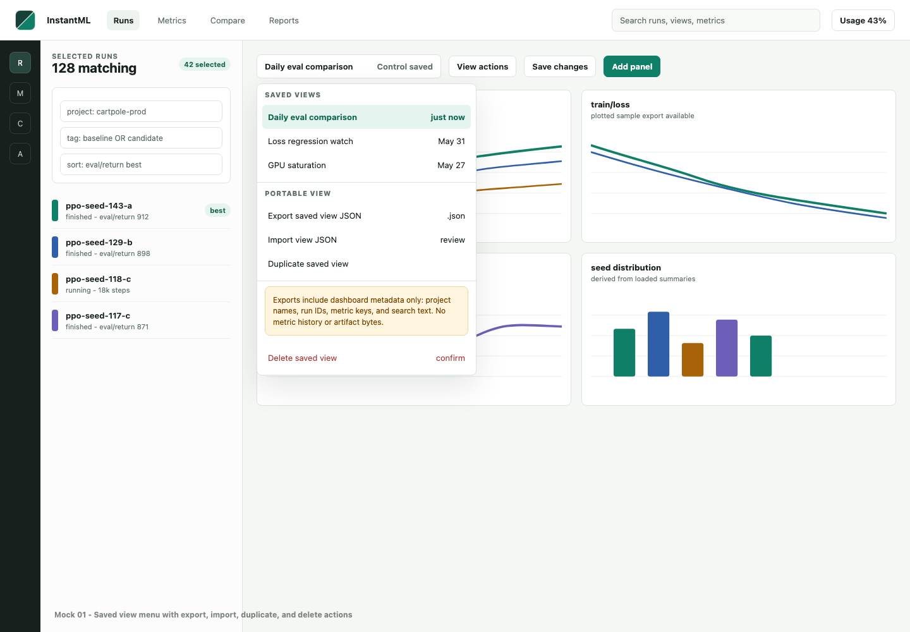
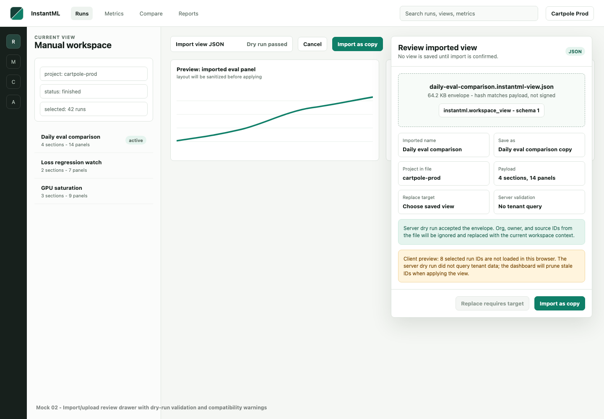
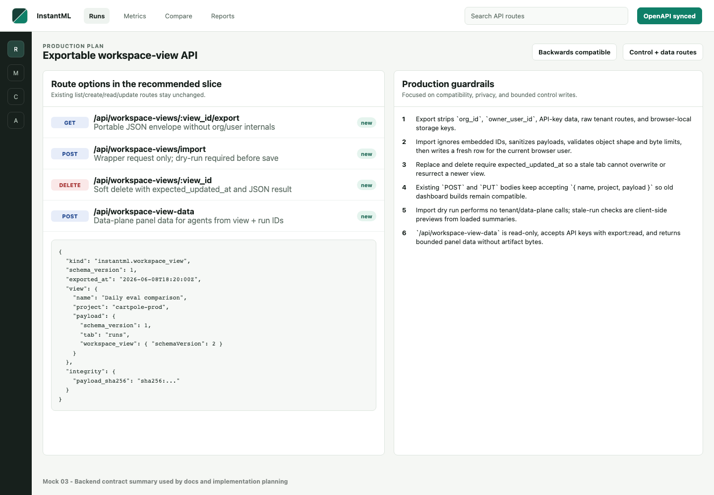
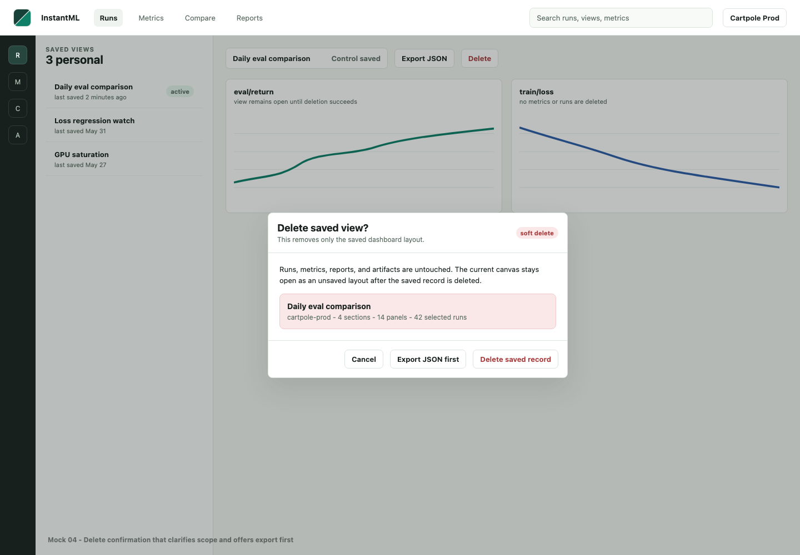

# Design: Exportable Workspace Views

Date: 2026-06-08

Status: First production slice implemented

Owner: Codex

## Implementation Status

Implemented on 2026-06-08:

- Rust control-plane routes:
  `GET /api/workspace-views/:view_id/export`,
  `POST /api/workspace-views/import`, and
  `DELETE /api/workspace-views/:view_id`.
- Rust data-plane route: `POST /api/workspace-view-data`.
- OpenAPI/codegen coverage for all new request and response shapes.
- Dashboard topbar actions for shared saved-view export, import with dry-run
  preview, and optimistic soft-delete.
- Documentation updates in `docs/architecture/current-api.md`,
  `apps/rust-server/README.md`, and `apps/web/README.md`.

First-slice limits intentionally remain:

- Import UI creates a new shared view. Backend replace support exists for API
  clients but is not exposed in the first UI.
- Local-only `localStorage` saved views remain backward-compatible fallbacks and
  are not exported from the shared-view toolbar.
- `/api/workspace-view-data` returns full line-panel series and latest-value
  summaries for value panels; scatter/distribution/logged-histogram panels
  return warnings plus run summary data.

## Summary

InstantML already persists named workspace views through the Rust control-plane
API. The current surface lets the dashboard list, create, read, and update
views, while localStorage remains a development and compatibility fallback.
Users still cannot treat a dashboard view as a portable artifact: there is no
first-class JSON export, no reviewed JSON import/upload flow, and no delete
route even though `WorkspaceViewRow` already has `deleted_at`.

This design adds an intentionally narrow production slice:

1. Export a saved view as a portable JSON envelope that represents the
   dashboard state without leaking org/user/control-plane internals.
2. Import/upload a JSON view through a dry-run-first API and browser review
   drawer.
3. Delete saved views through a soft-delete control-plane route.
4. Add a bounded data-plane API that accepts a view plus run IDs and returns the
   run/metric data that view would render, for direct agent/API use.
5. Preserve every existing workspace-view route shape, payload shape, generated
   type envelope, and localStorage fallback.

Per the latest product direction in this thread, MCP integration is ignored for
this slice and recorded as a deferred follow-up only.

Mock PNGs for the proposed UI and route contract live beside this design:

- 
- 
- 
- 

## Goals

- Export the current saved workspace view as a JSON file that can be imported
  into another browser session or workspace.
- Upload/import a JSON view through the API with dry-run validation before
  persistence.
- Add a soft-delete route for saved views.
- Add an agent-oriented view data projection API: given a portable view payload
  and explicit run IDs, return the bounded panel data the dashboard would show.
- Keep control-state routes on the control plane and independent from tenant
  ClickHouse/data-plane availability.
- Keep server import dry-run free of tenant/data-plane calls; stale run and
  missing metric warnings are client-side previews from already loaded data.
- Keep existing `GET/POST/PUT /api/workspace-views` contracts compatible.
- Preserve old saved local views, current generated OpenAPI envelopes, and the
  frontend normalizer that accepts both `workspace_view(s)` and legacy
  `view(s)` envelopes.
- Make the user-facing import flow explicit about what will be saved, what
  context will be replaced, and which stale run IDs may be pruned when applied.
- Sanitize exported and imported payloads so future dashboard fields cannot
  accidentally leak secrets, signed URLs, tenant routing, or auth material.
- Keep the view data projection route read-only, bounded, and data-plane-owned;
  it must not persist views or mutate dashboard state.
- Use optimistic concurrency for replace/delete so stale tabs cannot overwrite
  or resurrect newer saved-view state.
- Ship with production-level auth, validation, logging, response headers, tests,
  and docs.

## Non-Goals

- MCP tools or agent-authored views in this slice.
- Public/shared view links or collaborative org-level view permissions.
- Async export jobs, ZIP bundles, Parquet, or artifact byte export.
- Including run metric data inside exported/imported view JSON files. The
  separate view data projection API may return bounded read-only run/metric data
  for explicit run IDs.
- A new custom dashboard editor or new panel type.
- A new workspace-view database table unless implementation discovers an
  unavoidable blocker.
- Hard deletion or restore UI in the first slice.
- Expanding the deprecated Node server with new product behavior.

## Users and Use Cases

Researchers:

- Export a tuned comparison workspace before resetting filters or sharing setup
  with a teammate.
- Import a view from another project and adjust the project/run selection after
  InstantML prunes stale run IDs.
- Delete obsolete experiment views without touching runs, metrics, artifacts, or
  reports.
- Ask an agent to explain or summarize exactly what a saved comparison view
  would show for a chosen set of runs.

ML platform owners:

- Treat dashboard layout state as portable, readable JSON instead of hidden
  browser storage.
- Preserve data portability as part of the W&B-style trust wedge.

Operators and support:

- Ask a user to export a problematic view JSON so support can reproduce a layout
  issue without exporting private metric history.
- Keep these operations bounded and visible in sanitized control-plane logs.

Agents and automation:

- Receive a portable view JSON plus run IDs from a user and call one API route
  to get the relevant panel data without reverse-engineering all dashboard
  metric-series and summary endpoints.
- Use API-key auth for read-only investigation while preserving project-scoped
  key restrictions and existing data export guardrails.

## Existing Context

Implemented today:

- `GET /api/workspace-views`: summary list with `workspace_views` and
  `next_cursor`.
- `POST /api/workspace-views`: creates `{ name, project, payload }`.
- `GET /api/workspace-views/:view_id`: returns `{ workspace_view }` with full
  `payload`.
- `PUT /api/workspace-views/:view_id`: updates any subset of `name`, `project`,
  and `payload`.
- `payload` must be a JSON object under 64 KiB.
- Views are control-plane records, user-owned in hosted browser sessions, and
  local-compatible when unauthenticated local mode is active.
- Shared demo sessions are read-only.
- API keys are intentionally rejected by current workspace-view routes.
- `WorkspaceViewRow` already includes `deleted_at`, and persistence already
  upserts that field.
- The frontend falls back to scoped localStorage when the control API is
  unavailable.

## Frontend Options

### Option A: Adjacent saved-view actions menu

Keep the existing saved-view selector focused on applying views. Add a separate
adjacent `View actions` menu with full labels and icons for `Export saved view
JSON`, `Import view JSON`, `Duplicate saved view`, and `Delete saved view`.
Import opens a right-side review drawer. Delete opens a small confirmation
modal. Export downloads immediately after fetching the portable envelope.

Strengths:

- Puts portability where users already manage views.
- Avoids a new global screen.
- Works for the current workspace-first mental model.
- Keeps the first slice small and testable.

Weaknesses:

- Long-term bulk management is cramped if users have dozens of views.
- Discoverability depends on users opening the saved-view menu.

Decision: recommended first slice.

### Option B: Settings or Reports "Views library"

Add a dedicated list surface with all saved views, import/export/delete actions,
and filters by project.

Strengths:

- Better for bulk management and future org/shared view concepts.
- Easier to show metadata columns.

Weaknesses:

- Adds a new frontend screen with data dependencies for a small first slice.
- Users still need inline actions from the active workspace.

Decision: defer until view count, sharing, or admin workflows justify it.

### Option C: Command-palette-only actions

Expose `Export current view`, `Import view JSON`, and `Delete current view` in
Cmd/Ctrl+K.

Strengths:

- Fast for power users.
- Minimal visible chrome.

Weaknesses:

- Too hidden for a portability feature.
- Delete and import need richer confirmation/review than a command row.

Decision: optional follow-up after Option A.

## Backend Options

### Option 1: Extend existing control-plane workspace-view routes

Add:

- `GET /api/workspace-views/:view_id/export`
- `POST /api/workspace-views/import`
- `DELETE /api/workspace-views/:view_id`

Keep existing `workspace_view` storage and `deleted_at`. Export and import use a
portable envelope around the existing `payload`. Delete writes a replacement row
with `deleted_at` set. No tenant data-plane calls are needed.

Strengths:

- Smallest production-ready extension.
- Uses the existing control-plane ownership and split-service routing model.
- Keeps payload byte limits and list-summary behavior intact.
- No new table, worker, or storage backend.
- Easy to test with current store route tests and OpenAPI generation.

Weaknesses:

- Import validation cannot verify every referenced run without crossing into the
  data plane. The UI must treat stale run IDs as expected and prune on apply.
- No org/shared view ownership in this slice.

Decision: recommended.

### Option 2: Reuse existing read/create/update only

The browser could call `GET /api/workspace-views/:view_id`, strip private fields
locally, and upload with `POST /api/workspace-views`.

Strengths:

- Fewer backend routes.
- Could be implemented quickly.

Weaknesses:

- Easy to accidentally leak `org_id`, `owner_user_id`, or source IDs into a
  portable file.
- No dry-run server validation.
- No clear API contract for import/upload.
- Does not satisfy delete.

Decision: rejected.

### Option 3: Use the generic data export route

Extend `GET /api/export` to include workspace views.

Strengths:

- Reuses the current trust/export route family.

Weaknesses:

- Conflates run data export with browser control state.
- `GET /api/export` is data-plane/user-owned export behavior with different
  scopes and size semantics.
- View import still needs a separate control-plane write route.

Decision: rejected.

### Option 4: Create async view import/export jobs

Add job state, background workers, and possibly object storage for view bundles.

Strengths:

- Extensible to full project export bundles later.

Weaknesses:

- View JSON is intentionally small; jobs would be ceremony and new failure
  surface.

Decision: rejected for this slice.

## Proposed Design

### Recommended first slice

Implement Option A on the frontend and Option 1 on the backend.

User flow:

1. User chooses an active saved view from the saved-view selector.
2. User opens the adjacent `View actions` menu and chooses
   `Export saved view JSON`.
3. Browser calls `GET /api/workspace-views/:view_id/export`, receives an
   attachment-safe JSON envelope, and downloads
   `instantml-view-<safe-name>.json`.
4. User chooses `Import view JSON` from the same actions menu.
5. Browser reads a local `.json` file, parses it, and sends
   `POST /api/workspace-views/import` with `dry_run: true`.
6. Import review drawer shows name, target project, payload schema, panel count,
   selected-run count, client-side stale-run preview, warnings, and conflict
   strategy. It also states that no metrics, artifacts, reports, or run data are
   imported.
7. User confirms `Import as copy`, or explicitly selects a replace target,
   reviews the target name/project/last updated time, re-runs dry run with that
   `existing_view_id`, and then confirms `Replace existing`.
8. Browser sends the same import body with `dry_run: false`.
9. Server creates or updates a control-plane view for the current user and org.
10. Frontend refreshes the saved-view list, selects the imported view, and
    applies it through the existing sanitizer.

Delete flow:

1. User chooses `Delete saved view`.
2. Confirmation modal states that only the saved layout is deleted.
3. Modal offers `Export JSON first`.
4. User confirms.
5. Browser calls `DELETE /api/workspace-views/:view_id` with
   `expected_updated_at`.
6. Server soft-deletes the view; frontend removes it from the menu and keeps the
   current in-memory canvas visible as an unsaved layout if the deleted view was
   active. The user must explicitly reset if they want the generated/default
   workspace.

### Portable JSON envelope

Exported files use a stable wrapper instead of serializing `WorkspaceViewRow`
directly.

```json
{
  "kind": "instantml.workspace_view",
  "schema_version": 1,
  "exported_at": "2026-06-08T18:20:00Z",
  "source": {
    "app": "instantml",
    "view_payload_schema": 1
  },
  "view": {
    "name": "Daily eval comparison",
    "project": "cartpole-prod",
    "payload": {
      "schema_version": 1,
      "tab": "runs",
      "workspace_view": {
        "schemaVersion": 2,
        "sections": []
      }
    }
  },
  "integrity": {
    "payload_sha256": "sha256:<hex>"
  }
}
```

Rules:

- `kind` must be `instantml.workspace_view`.
- `schema_version` is the envelope version, not the frontend workspace schema.
- `view.name`, `view.project`, and `view.payload` are the only persisted fields
  in the first slice.
- Export uses a shared sanitizer before serialization. Known workspace-view
  payload fields are preserved. Sensitive keys and sensitive-looking string
  values are recursively rejected or dropped with warning codes before export.
  The export body must not include `org_id`, `owner_user_id`, session IDs,
  API-key metadata, tenant routes, object-storage references, signed URLs,
  artifact storage URIs, report share tokens, or localStorage keys.
- Export may include run IDs, metric keys, project names, selected tab, search
  query, panel layout, Compare settings, and table columns because those are
  part of the dashboard state. The UI must label the file as dashboard metadata,
  not run data.
- `payload_sha256` is computed from canonical JSON serialization of
  `view.payload`. Import treats mismatch as a warning by default, not a hard
  failure, so hand-edited files can still be imported after review. The hash is
  not a signature and must not be described as authenticity proof. A future
  strict mode can reject mismatches.

### Import behavior

`POST /api/workspace-views/import` accepts only a wrapper request in v1. Bare
export envelopes are rejected so callers cannot bypass the dry-run-first flow.

```json
{
  "exported_view": {
    "kind": "instantml.workspace_view",
    "schema_version": 1,
    "view": {
      "name": "Daily eval comparison",
      "project": "cartpole-prod",
      "payload": {}
    }
  },
  "dry_run": true,
  "conflict_strategy": "create_copy",
  "existing_view_id": null,
  "expected_updated_at": null,
  "name": "Daily eval comparison copy",
  "project": "cartpole-prod"
}
```

`conflict_strategy` values:

- `create_copy` (default): create a fresh view ID for the current user.
- `replace_existing`: update `existing_view_id`; the caller must own that view
  and provide `expected_updated_at` from the target view summary/detail. Stale
  values return a conflict instead of overwriting newer state.

Server response:

```json
{
  "workspace_view": null,
  "import_result": {
    "dry_run": true,
    "accepted": true,
    "conflict_strategy": "create_copy",
    "applied_name": "Daily eval comparison copy",
    "applied_project": "cartpole-prod",
    "payload_bytes": 42817,
    "sanitized_preview": {
      "dropped_sensitive_fields": 0,
      "max_depth": 9
    },
    "warnings": [
      {
        "code": "integrity_not_strict",
        "message": "Payload hash is advisory in this version."
      }
    ]
  }
}
```

When `dry_run` is `false`, `workspace_view` contains the created or updated row
using the existing runtime envelope name. The persisted payload is the sanitized
payload from validation, not the raw uploaded payload.

Server validation:

- Request body must fit a route-specific 128 KiB import envelope cap, even if
  the generic JSON body limit is larger.
- `dry_run` is required and must be boolean.
- Envelope must be a JSON object.
- `kind` and `schema_version` must be recognized.
- `view.name` must pass the existing name validator unless an override `name`
  is supplied.
- `view.project` must be `null` or pass the existing optional non-empty name
  validator unless an override `project` is supplied.
- `view.payload` must be a JSON object and must serialize to at most 64 KiB.
- If payload has recognizable workspace fields, validate soft structural caps:
  max 50 sections, max 200 panels, max 2,000 selected run IDs, max 256 bytes per
  metric key, known primitive enum values where safe.
- Reject dangerous property names at every depth: `__proto__`, `prototype`, and
  `constructor`.
- Cap recursive depth, object key count, array lengths, warning count, and
  string length even when the total payload is under 64 KiB. First-slice default
  targets: max depth 24, max 2,500 total object keys, max 2,000 array entries
  except tighter domain caps such as selected runs/panels, max 8 KiB per
  generic string, and max 50 warnings returned to clients.
- Unknown future frontend payload fields are preserved only after the recursive
  sanitizer accepts their key/value shape. Unknown fields that look sensitive
  are dropped with warning codes.
- Embedded IDs are ignored; created rows always use the authenticated current
  org/user context.
- `replace_existing` requires `existing_view_id`, `expected_updated_at`,
  ownership of that view, and a non-deleted existing row.
- Server dry run performs no tenant/data-plane calls. It may count referenced
  run IDs or metric keys inside the payload, but it must not verify their
  existence against tenant ClickHouse.

Frontend validation:

- File picker accepts `.json` and `application/json`, but parsing is by content.
- Client refuses files above 128 KiB before upload to keep the review flow
  responsive.
- Client parses JSON in memory, never evaluates it, and never fetches remote
  URLs from the file.
- Client sends a dry run before enabling confirm.
- Client shows warnings from the server and local sanitizer warnings before
  saving. Missing-run or metric-with-no-local-data warnings are client-side best
  effort against already loaded summaries/catalog data, not server dry-run
  results.
- `replace_existing` is disabled until the user selects a target saved view; the
  drawer must show the target name, project, and last updated time, then re-run
  dry run with that `existing_view_id` and `expected_updated_at`.

Required import review fields:

- Imported tab.
- Source project and target project.
- Filters/search/sort in the payload.
- Selected-run total and client-side retained/pruned preview when local data is
  already loaded.
- Section and panel counts by type.
- Metric keys with no local data, when known from already loaded catalogs.
- A plain statement that no metrics, artifacts, reports, or run data are
  imported.

### Delete behavior

`DELETE /api/workspace-views/:view_id`

- Auth and ownership match update.
- Shared demo sessions remain read-only.
- Caller must provide `expected_updated_at` as a query parameter. If the stored
  row has changed, return `409` with `code: "workspace_view_conflict"`.
- Server writes a `workspace_view` replacement row with original fields and
  `deleted_at = now`.
- List and read routes continue excluding deleted rows.
- Response should be `200` JSON so the existing frontend API client can parse
  it without a new no-content path:

```json
{
  "deleted": true,
  "view_id": "uuid",
  "deleted_at": "2026-06-08T18:20:00Z"
}
```

- A repeated delete on the same ID can return `404` because the visible resource
  is gone. This avoids leaking deleted rows across ownership boundaries.

### Agent view data projection API

Agents need a single read endpoint that answers: "for this saved dashboard view
and these runs, what data would the view show?" This is not a control-state
route. It reads tenant run/metric data, so it belongs on the data plane and
must be routed separately from `/api/workspace-views/*`.

Recommended route:

- `POST /api/workspace-view-data`

First-slice behavior:

- Accept a portable `ExportedWorkspaceView` or its `{ name, project, payload }`
  view object directly in the request body.
- Accept explicit `run_ids`; do not use the run IDs embedded in the view as the
  authoritative run set.
- Do not resolve saved `view_id` in the first slice. API-key agents should not
  need control-plane saved-view access to use this route; they can pass the view
  JSON supplied by a user or exported elsewhere.
- Sanitize the input view through the same recursive sanitizer used by import.
- Resolve only supported panel types from the sanitized payload. Unsupported or
  future panels return warnings instead of failing the entire request.
- Return bounded summaries and plotted/derived panel data, not full unsampled
  run history.
- Do not fetch artifact bytes, report bodies, table object rows, console logs,
  or external URLs in v1.

Request:

```json
{
  "view": {
    "kind": "instantml.workspace_view",
    "schema_version": 1,
    "view": {
      "name": "Daily eval comparison",
      "project": "cartpole-prod",
      "payload": {}
    }
  },
  "run_ids": ["run-uuid-1", "run-uuid-2"],
  "options": {
    "max_panels": 20,
    "metric_point_limit": 500
  }
}
```

Response:

```json
{
  "view_data": {
    "schema_version": 1,
    "generated_at": "2026-06-08T18:20:00Z",
    "limits": {
      "run_ids": 100,
      "panels": 20,
      "points_per_series": 500,
      "max_points_per_series": 500,
      "total_points": 1,
      "max_total_points": 50000,
      "max_response_bytes": 10485760
    },
    "metric_keys": ["eval/return"],
    "runs": [
      {
        "id": "run-uuid-1",
        "project": "cartpole-prod",
        "name": "ppo-seed-143-a",
        "status": "finished",
        "metric_aggregates": {}
      }
    ],
    "metric_series": [
      {
        "metric_key": "eval/return",
        "series": [
          {
            "run_id": "run-uuid-1",
            "metrics": [
              { "step": 1, "value": 12.4, "created_at": "2026-06-08T18:20:00Z" }
            ]
          }
        ]
      }
    ],
    "panels": [
      {
        "id": "panel-eval-return",
        "type": "line",
        "title": "eval/return",
        "metric_key": "eval/return",
        "data_kind": "metric_series",
        "series_key": "eval/return",
        "summary_values": [],
        "warnings": []
      }
    ],
    "warnings": []
  }
}
```

Panel support:

- `line`: fetch bounded metric series through the same series store path as the
  dashboard, with per-series and total-point caps.
- `bar`, `dot`, `value_histogram`, and distribution-style latest-value panels:
  derive values from run summaries and metric aggregates.
- `scatter`: derive x/y values from run summaries when both axes are metric or
  config/metadata fields already present in summary data; otherwise return an
  unsupported-field warning.
- `logged_histogram`, media, table, query/text, report-only panels, artifacts,
  console logs, and rich object rows are out of scope for v1 and return
  unsupported-panel warnings.

Bounds:

- `MAX_VIEW_DATA_RUN_IDS = 100` in v1.
- `MAX_VIEW_DATA_PANELS = 20` by default and never above 50.
- `MAX_VIEW_DATA_POINTS_PER_SERIES = 500`.
- `MAX_VIEW_DATA_TOTAL_POINTS = 50_000`.
- `MAX_VIEW_DATA_RESPONSE_BYTES = 10 MiB`.
- Request body cap is 256 KiB because it includes a view plus run IDs.

Auth:

- Browser sessions with read access to the current org may call it.
- API keys may call it with `export:read`.
- Project-scoped API keys may only request run IDs inside their project; runs
  outside scope return not found.
- Shared demo API keys and browser sessions may call it because they are already
  read-only, subject to the same bounds.

Failure behavior:

- `400` for invalid view payload, too many run IDs, no run IDs, unsupported
  request options, or response budget exceeded before partial response can be
  produced.
- `403` for missing `export:read` on API keys.
- `404` for inaccessible/missing run IDs, without leaking cross-org/project
  existence.
- Per-panel unsupported data returns panel warnings when the rest of the view can
  be resolved.

Security and logging:

- Do not log raw view JSON, run IDs, metric keys, panel titles, query strings,
  or values.
- Logs may include route template, actor kind, org_id, project-scoped-key
  presence, run count, panel count, returned point count, warning codes/counts,
  response byte bucket, status, and request ID.
- Response headers use `Cache-Control: private, no-store` and
  `X-Content-Type-Options: nosniff`.

### Responsive and accessibility requirements

- The desktop import review drawer becomes a full-screen sheet or bottom sheet
  on mobile breakpoints.
- Drawer and modal action rows stay sticky at the bottom on small screens.
- Menus are viewport-clamped and never render off-screen.
- Touch targets are at least 44 px on mobile.
- Long filenames, warnings, and project names wrap without clipping controls.
- The `View actions` menu uses semantic buttons with full accessible names, not
  shorthand-only labels such as `DL` or `DEL`.
- Import drawer and delete confirmation use `role="dialog"`, `aria-modal`,
  focus trap, Escape close, and return focus to the invoking action.
- Dry-run success uses a polite status region; blocking import/delete errors use
  `role="alert"`.
- Delete confirmation should initially focus `Cancel` or the safest action, not
  the destructive button.
- Smoke coverage should include mobile, tablet, and the existing 1280 px
  dashboard viewport.

## Component Impact

Backend:

- `apps/rust-server/src/store/workspace_views.rs`: add export envelope creation,
  import/dry-run validation, create/replace import paths, and soft delete.
- `apps/rust-server/src/store/view_data.rs` or a similarly narrow module: add
  view payload interpretation plus bounded panel data projection over existing
  run-summary and metric-series store paths.
- `apps/rust-server/src/http/handlers/dashboard.rs`: add route handlers and
  `utoipa::path` annotations.
- `apps/rust-server/src/http/handlers/metrics.rs` or a new data-plane handler:
  add `POST /api/workspace-view-data` with `browserSession` and `bearerApiKey`
  (`export:read`) security.
- `apps/rust-server/src/http/mod.rs`: register new control routes.
- `apps/rust-server/src/http/mod.rs`: register `/api/workspace-view-data` on
  data routes, not control routes.
- `apps/rust-server/src/http/openapi.rs`: add schemas for export/import
  envelopes and delete response. New routes should advertise `browserSession`
  only; if touching current workspace-view annotations, correct existing
  browser-only control-state route security so OpenAPI does not imply API keys
  are accepted.
- `apps/rust-server/src/http/observability.rs`: add safe route templates for
  `/api/workspace-views/import`, `/api/workspace-views/:view_id/export`, and
  DELETE `/api/workspace-views/:view_id`, plus `/api/workspace-view-data`.
- `apps/rust-server/openapi.generated.json`: regenerated through
  `npm run codegen:api`.
- `tools/sync-docs-openapi.mjs` and docs OpenAPI validation fixtures: update if
  the public filtered OpenAPI route list needs explicit inclusion/exclusion.

Frontend:

- `apps/web/app/dashboard/dashboard-shell.tsx`: add view export/import/delete
  handlers, saved-view list refresh, and active-view unsaved state after delete.
- `apps/web/app/dashboard/state/workspace-view-api.ts` and
  `apps/web/src/workspace-view-api.js`: add typed helpers and legacy envelope
  tolerance.
- `apps/web/app/dashboard/runs/` saved-view menu components or nearest existing
  command surface: add the adjacent `View actions` menu, import drawer, and
  delete confirm.
- `apps/web/src/api.js`: add frontend route-template normalization for the new
  import/export/delete and view-data paths so browser API logs stay
  low-cardinality.
- `apps/web/app/styles/dashboard-runs.css` or nearest style file: add compact
  menu/drawer/modal states.

Python SDK:

- No SDK change in this slice.
- Future follow-up: a raw Python client helper can wrap
  `POST /api/workspace-view-data` after the route has shipped and stabilized.

Storage:

- No new table expected. Use existing `workspace_views.deleted_at`.
- Add or verify a DB-backed control-plane index for persisted view pagination:
  `(org_id, owner_user_id, deleted_at, updated_at DESC, id)`.
- Enforce a first-slice live-view cap of 200 saved views per user and 1,000 per
  org. Soft-deleted views count toward a separate tombstone cap until control
  compaction/purge exists.

Docs:

- Update `apps/rust-server/README.md`, `apps/web/README.md`,
  `docs/architecture/current-api.md`, `docs/architecture/current-schemas.md`,
  and `apps/docs/api/dashboard-control-state.mdx`.

## Data Model

No new persisted row is required.

Existing `WorkspaceViewRow` remains:

- `schema_version`
- `id`
- `org_id`
- `owner_user_id`
- `name`
- `project`
- `payload`
- `created_at`
- `updated_at`
- `deleted_at`

New API-only types:

- `ExportedWorkspaceView`
- `WorkspaceViewImportRequest`
- `WorkspaceViewImportResult`
- `WorkspaceViewImportWarning`

The export envelope is intentionally API-only so older saved rows do not need a
migration.

Limits and indexes:

- `MAX_LIVE_WORKSPACE_VIEWS_PER_USER = 200`.
- `MAX_LIVE_WORKSPACE_VIEWS_PER_ORG = 1000`.
- `MAX_WORKSPACE_VIEW_TOMBSTONES_PER_USER = 500` before an operator/compaction
  follow-up is required.
- DB-backed hosted control storage should use
  `(org_id, owner_user_id, deleted_at, updated_at DESC, id)` for list/read
  pagination. Local in-memory replay can keep the current map/filter path while
  counts are under the caps.
- Tombstones are retained for at least 90 days for audit/replay safety. A later
  control compaction design can hard-purge expired tombstones from DB-backed
  projections without changing the API contract.

## API Contracts

### `GET /api/workspace-views/:view_id/export`

Auth:

- Browser session with read access to the current org.
- Local compatibility access in local unauthenticated mode.
- API-key access remains rejected in this slice.

Output:

- `Content-Type: application/json; charset=utf-8`
- Body: `ExportedWorkspaceView`

Headers on every export response:

- `Content-Disposition: attachment; filename="instantml-view-<safe-name>.json"`
- `Cache-Control: private, no-store`
- `Pragma: no-cache`
- `X-Content-Type-Options: nosniff`
- `Content-Security-Policy: sandbox`
- `Cross-Origin-Resource-Policy: same-origin`

Filename sanitization:

- ASCII basename only.
- No CR, LF, path separators, URL delimiters, control characters, or hidden
  extension tricks.
- Length cap before extension.
- Always force `.json`.
- Fallback to `instantml-view.json`.

### `POST /api/workspace-views/import`

Auth:

- Owner/admin/member browser session for the current org.
- Local compatibility access in local unauthenticated mode.
- Shared demo sessions are read-only.
- API-key access remains rejected in this slice.
- Hosted browser-session mutations must call `validate_session_mutation_origin`
  and reject missing or disallowed `Origin`.
- Import requires `Content-Type: application/json`.

Request:

- `WorkspaceViewImportRequest` only.
- `dry_run` is required.
- `replace_existing` requires `existing_view_id` and `expected_updated_at`.
- Server dry run performs no tenant/data-plane calls.

Response:

- `200` with `{ "workspace_view": WorkspaceViewRow | null, "import_result": ... }`
- `400` for invalid envelope, invalid name/project, unsupported schema, invalid
  JSON object shape, malformed/missing `expected_updated_at`, or byte-limit
  violations.
- `402` with the same billing codes as `POST/PUT /api/workspace-views` when
  `dry_run` is false and the org is write-blocked by billing/payment state.
- `403` for read-only role/demo or replacing a view the user cannot write.
- `404` for missing `existing_view_id` in replace mode.
- `409` with `code: "workspace_view_conflict"` for stale
  `expected_updated_at`.

Billing:

- `dry_run: true` is read-only and does not call `ensure_billing_write_allowed`.
- `dry_run: false` create/replace calls `ensure_billing_write_allowed` and
  preserves existing `402` behavior.

### `DELETE /api/workspace-views/:view_id`

Auth:

- Same as update.
- Hosted browser-session mutation must call `validate_session_mutation_origin`
  and reject missing or disallowed `Origin`.
- Delete is exempt from `ensure_billing_write_allowed` because it only reduces
  saved control state; it still requires write role, same-origin mutation, and
  non-demo/non-read-only session.

Query:

- `expected_updated_at`: required ISO timestamp from the row being deleted.

Response:

- `200` with `{ "deleted": true, "view_id": "uuid", "deleted_at": "iso8601" }`
  on success.
- `403` for read-only role/demo.
- `404` for missing, deleted, or inaccessible view.
- `409` with `code: "workspace_view_conflict"` for stale
  `expected_updated_at`.

### `POST /api/workspace-view-data`

Auth:

- Browser session with tenant read access, or API key with `export:read`.
- Project-scoped API keys are restricted to their project.
- Shared demo credentials may read within the demo scope.

Request:

- `view`: required portable exported view envelope or view object.
- `run_ids`: required array of run UUID strings, max 100.
- `options`: optional limits, each clamped to server caps.

Response:

- `200` with `{ "view_data": WorkspaceViewData }`.
- `400` for invalid view, invalid options, too many run IDs, empty run IDs, or
  exceeded response budget.
- `403` for missing `export:read` on API-key auth.
- `404` for inaccessible/missing run IDs without cross-scope existence leaks.
- Panel-level unsupported data appears in `view_data.panels[].warnings` when
  other panels can still be returned.

Headers:

- `Content-Type: application/json; charset=utf-8`
- `Cache-Control: private, no-store`
- `X-Content-Type-Options: nosniff`

Route ownership:

- Data-plane route. Next rewrites must not send it through the existing
  `/api/workspace-views*` control-plane rewrite.

Existing contracts unchanged:

- `GET /api/workspace-views`
- `POST /api/workspace-views`
- `GET /api/workspace-views/:view_id`
- `PUT /api/workspace-views/:view_id`

## Performance Considerations

Expected data shape:

- Workspace-view payloads remain capped at 64 KiB.
- Import envelopes are capped at 128 KiB.
- Export/import frequency is human-scale and low.
- List responses remain summary-only and capped at 100 rows per page.
- Import/export routes do not fetch metric history, run tables, artifact bytes,
  or tenant ClickHouse records.
- `POST /api/workspace-view-data` is explicitly data-plane and may fetch bounded
  run summaries and bounded metric series for at most 100 run IDs and 50 panels.
- Live saved views are capped at 200 per user and 1,000 per org in the first
  slice so unlimited import-as-copy cannot grow control-plane replay without
  bound.

Latency target:

- Control-plane read/write p95 under 150 ms in normal hosted conditions.
- Browser parse/review for a 64 KiB file should feel instant on a normal laptop.
- View data projection p95 should stay under 500 ms for 20 panels, 20 runs, and
  10,000 returned points on the hosted benchmark path. Larger requests remain
  bounded by caps and should return partial panel warnings or validation errors
  rather than unbounded payloads.

Memory concerns:

- Server holds one bounded JSON object in memory.
- Browser holds one small file and one parsed object in memory.
- View data projection holds a bounded response model in memory and should
  stream internally from existing store helpers where practical; it must not
  materialize full metric histories before sampling/clamping.

Indexes:

- Add or verify the DB-backed control-plane list index
  `(org_id, owner_user_id, deleted_at, updated_at DESC, id)`. The local
  in-memory projection can keep existing filtering while enforcing the same
  caps.

Measurement:

- Add route unit tests and a smoke path. Benchmark only if the new recursive
  sanitizer approaches the 150 ms route target near the 128 KiB envelope cap.
- Add a view-data smoke with representative line/bar/dot panels over 20 runs and
  assert point/byte caps. Add a hosted benchmark follow-up before broadening
  advertised agent-data claims.

## Simplicity Review

This is the smallest useful production design because it:

- Adds three control-plane routes plus one read-only data-plane projection route.
- Reuses the existing row, validation helpers, auth model, OpenAPI generation,
  and frontend saved-view sanitizer.
- Avoids import jobs, object storage, new ownership models, and tenant-data
  verification for import/export/delete.
- Keeps existing route bodies and response envelopes stable.

Deferred complexity:

- MCP/API-key view management.
- Shared/org-level views.
- Restore/recycle-bin UI.
- Full semantic validation of every dashboard payload field.
- Bulk view library.
- View-data support for media, table rows, console logs, artifact bytes, report
  blocks, and rich-object payloads.

## Failure Modes

- Control API unavailable during export: show the existing global API message;
  do not fall back to exporting stale local state unless the active view is a
  localStorage view.
- Control API unavailable during import: keep the drawer open and do not save
  locally unless the user explicitly chooses a local fallback.
- JSON parse fails: show file-level error before any API call.
- Server dry run rejects: show validation error and keep confirm disabled.
- Server dry run cannot confirm whether run IDs or metric keys exist in tenant
  data because it performs no data-plane calls.
- Imported project is missing locally: preserve the project string in the saved
  payload, but applying the view should use existing project fallback behavior.
- Imported run IDs are stale: save the payload; applying the view prunes missing
  runs through the current saved-view sanitizer.
- Delete succeeds while active view is open: remove it from menu, clear
  `savedViewKey`, label the current in-memory layout as unsaved, and keep it
  visible.
- Delete fails after confirmation: leave the view visible and show the error.
- Two tabs update/delete the same view: replace/delete with stale
  `expected_updated_at` returns `409`; repeated delete after success returns
  `404`.
- Oversized file: reject client-side and server-side.
- Malicious JSON field content: never execute; sanitize before applying; export
  with attachment/no-store headers.
- Demo/read-only sessions disable import, replace, delete, and local import
  fallback. Export/read remains available.
- View data projection receives unsupported or future panel types: return
  per-panel warnings and continue resolving supported panels.
- View data projection would exceed run/panel/point/byte caps: reject the
  request or clamp per documented options; do not silently return unbounded
  history.
- View data projection includes inaccessible run IDs: return not found for those
  IDs without revealing whether they exist outside the caller's org/project.

## Security And Privacy

- Browser-session auth only for this slice.
- Cookie-authenticated mutating requests continue using existing allowed-origin
  protections; new import and delete routes must call
  `validate_session_mutation_origin` in hosted browser-session mode.
- Export strips server-owned identity and routing fields through the shared
  sanitizer.
- Import ignores embedded IDs and always binds to current auth context. The
  persisted payload is the sanitized payload returned by validation.
- View JSON may include project names, run IDs, metric keys, search queries, and
  table-column choices; export UI should label the file as dashboard metadata.
- No remote fetches from imported JSON.
- Sanitizer tests must cover `org_id`, `owner_user_id`, API key/session-looking
  fields, tenant routes, bucket/object paths, signed URLs, artifact URIs,
  localStorage keys, and report/share tokens.
- Dangerous property names (`__proto__`, `prototype`, `constructor`) are
  rejected at every depth.
- Export headers are server-mandatory, including attachment, no-store, nosniff,
  sandbox, and `Cross-Origin-Resource-Policy: same-origin`.
- Logs must include only route template, status, org_id, actor kind, operation,
  dry-run flag, conflict strategy, result, payload bytes, warning codes/count,
  error code, and request ID. Do not log raw JSON, uploaded filenames, warning
  messages, view IDs, view names, project names, metric keys, search queries, or
  run IDs.
- `POST /api/workspace-view-data` returns product data and therefore accepts API
  keys only with `export:read`; it must enforce project-scoped key restrictions
  before resolving summaries or metric series.
- View-data logs must not include view JSON, run IDs, metric keys, panel titles,
  query strings, metric values, or config/metadata values.

## Rollout Plan

1. Backend first:
   - Add export/import/delete route handlers.
   - Add `POST /api/workspace-view-data` after the sanitizer is shared, so the
     route can validate the same portable view payload shape as import.
   - Add Rust unit/route tests.
   - Add route-template normalization and low-cardinality workflow events for
     dry-run accepted/rejected, import created/replaced, export downloaded, and
     delete soft-deleted, plus view-data resolved/rejected.
   - Regenerate OpenAPI and TypeScript types.
2. Frontend second:
   - Add saved-view menu actions.
   - Add import review drawer and delete confirmation.
   - Keep localStorage fallback behavior unchanged.
   - Gate mutating controls behind a feature flag during staging rollout. Export
     can stay visible because it is read-only.
3. Docs and QA:
   - Update architecture/current API docs and public dashboard control-state
     docs.
   - Run Rust tests, frontend tests, docs OpenAPI validation,
     `npm run verify:api-types`, and UI smoke covering export/import/delete.
4. Staging verification:
   - Save, export, import-as-copy, replace, delete, and refresh across two
     browser sessions.
   - Call `POST /api/workspace-view-data` with an exported view and 10-20 known
     run IDs through both a browser session and an `export:read` API key.
   - Confirm downloaded JSON omits org/user IDs and uses safe headers.
   - Confirm stale replace/delete returns conflict instead of resurrecting or
     overwriting a view.
   - Confirm project-scoped API keys cannot resolve out-of-project run IDs.
   - Roll back by disabling mutating UI actions first; backend routes are
     additive and can remain dark unless a security issue requires reverting.

## Testing Plan

Rust:

- Export returns portable envelope and strips row IDs/org/user fields.
- Export response always includes attachment/no-store/nosniff/sandbox/CORP
  headers and safe ASCII `.json` filename, including malicious view names.
- Export 404s for deleted, missing, or inaccessible views.
- Import dry run validates without writing.
- Import dry run performs no tenant/data-plane calls.
- Import create-copy writes a new row for the current user/org.
- Import replace updates only an owned existing row when `expected_updated_at`
  matches.
- Import rejects oversized payload, non-object payload, unsupported kind/schema,
  invalid name/project, dangerous property names, over-depth objects,
  over-large strings/arrays, and invalid conflict strategy.
- Import rejects a bare export envelope body in v1.
- Sanitizer drops or rejects sensitive key/value shapes for org/user IDs,
  API/session strings, signed URLs, bucket/object paths, artifact URIs,
  tenant routes, localStorage keys, and report/share tokens.
- Delete soft-deletes a view and list/get exclude it.
- Delete requires matching `expected_updated_at` and returns `409` for stale
  values.
- Race tests cover update-vs-delete, replace-vs-update, double-confirm import,
  and repeated delete.
- Demo/read-only sessions cannot import/delete.
- API-key requests remain rejected.
- Hosted mutating route tests cover allowed same-origin requests, missing
  `Origin`, malicious `Origin`, and required JSON content type for import.
- Billing tests cover dry-run allowed when write-blocked, non-dry-run import
  returning existing `402` behavior, and delete remaining allowed for cleanup.
- OpenAPI tests verify browser-session-only security for new routes and route
  registration in `handlers/mod.rs`; verify `POST /api/workspace-view-data`
  advertises browser session and bearer API-key auth.
- View-data route tests cover line panel series, latest-value derived panels,
  unsupported panel warnings, run/panel/point/byte caps, empty run IDs,
  inaccessible run IDs, project-scoped API keys, missing `export:read`, and
  demo read access.
- Observability tests verify route templates for import/export/delete and
  `/api/workspace-view-data`.

Frontend:

- Saved-view menu exposes export/import/delete for control views.
- Export downloads a Blob and handles non-2xx JSON errors.
- Export UI copy says "Export saved view JSON" and "dashboard metadata only; no
  metrics, artifacts, or reports."
- Local saved views can still be exported from localStorage using the same
  portable envelope builder or an explicit local-only fallback path.
- Import drawer parses valid JSON, rejects invalid JSON, sends dry run, displays
  warnings, and creates/replaces only after confirm.
- Replace is disabled until a target saved view is selected and dry-run has been
  re-run with target `existing_view_id` and `expected_updated_at`.
- Client-side stale-run and missing-metric previews use only already loaded
  summaries/catalogs and are labeled as client previews.
- Applying an imported view still passes through `sanitizeWorkspaceView`.
- Delete confirmation clears the saved key, removes the row, and keeps the
  active canvas visible as unsaved after success; failure leaves the row visible.
- Demo/read-only sessions disable import, replace, delete, and local import
  fallback while preserving export/read.
- Existing saved view normalizer continues accepting both
  `workspace_view(s)` and `view(s)` envelopes.
- Accessibility tests cover focus trap, Escape close, return focus, status/alert
  regions, and initial focus on the safe delete-confirmation action.
- Responsive tests cover mobile sheet, tablet, and 1280 px dashboard viewport
  with no clipped filenames, warnings, or action rows.

Integration/smoke:

- Save a view, export it, import as copy, apply it, delete it, refresh, and
  verify it stays absent.
- Export a view, call `POST /api/workspace-view-data` with selected run IDs,
  verify returned panels match bounded chart/summary data, and verify no artifact
  bytes/table rows/logs are fetched.
- Verify old localStorage scoped views are still listed and can be applied.
- Verify the shared demo can export/read but cannot import/delete.

Coverage:

- No coverage exception planned.

## Documentation Plan

Update with implementation:

- `apps/rust-server/README.md`: new routes, auth, and delete behavior.
- `apps/web/README.md`: export/import/delete UI, local fallback, and
  compatibility notes.
- `docs/architecture/current-api.md`: route contracts and error behavior.
- `docs/architecture/current-schemas.md`: note that export envelope is API-only.
- `apps/docs/api/dashboard-control-state.mdx`: public control-state examples.
- `docs/design/README.md`: add this design to the implemented sequence after
  acceptance/implementation.

## Alternatives Considered

- Existing route reuse only: rejected because export privacy and import dry-run
  semantics should be server-owned.
- Generic data export route: rejected because saved views are control-plane UI
  state, not data-plane run history.
- Async jobs: rejected because the payload is small and bounded.
- Bulk views library first: rejected because inline action solves the daily
  workflow with less surface area.
- Hard delete: rejected because soft delete matches existing row shape and is
  safer for append-only/control replay.

## Review Notes

Fresh reviewer 1 - backend/API:

- Finding: Core direction is right, but the draft blurred the control/data
  boundary, accepted a loose import body, returned `204` despite current
  frontend JSON parsing, omitted billing behavior, and could leave OpenAPI
  claiming API-key access for browser-only routes.
- Risk: Implementation could accidentally query tenant data during control
  dry-run, allow dry-run bypass, break the web client on delete, or mislead
  generated clients.
- Recommended edit: Keep dry-run control-plane-only, accept only
  `WorkspaceViewImportRequest`, return `200` JSON for delete, document billing
  gates, and require browser-session-only OpenAPI security plus docs/codegen
  updates.
- Decision: Accepted. The revised design now makes server dry-run tenant-free,
  wrapper-only, JSON-returning on delete, explicit on billing, and explicit
  about OpenAPI/security updates.

Fresh reviewer 2 - performance/reliability:

- Finding: Replace/delete races, unlimited import-as-copy growth, body bounds,
  route-template observability, and rollout gates were under-specified.
- Risk: Stale tabs could resurrect or overwrite views; tombstones and live rows
  could grow replay/sort cost; logs could misclassify `/import`; mutating routes
  could launch without a rollback path.
- Recommended edit: Add `expected_updated_at` optimistic concurrency, per-user
  and per-org view caps, tombstone retention policy, 128 KiB import envelope cap,
  route-template updates, workflow events, billing/origin details, and staged
  rollout flag.
- Decision: Accepted. The revised design adds concurrency checks, limits,
  tombstone/index guidance, route-specific caps, observability requirements, and
  rollout/rollback criteria.

Fresh reviewer 3 - security/privacy:

- Finding: The export privacy contract was too denylist-based, import needed
  prototype/depth/string hardening, CSRF/origin behavior and export headers
  needed to be server-mandatory, and demo/read-only local fallback needed
  explicit handling.
- Risk: Future payload fields could leak secrets or signed URLs; malicious JSON
  could poison frontend object handling; new mutating routes could skip origin
  checks; direct exports could be inline/cacheable.
- Recommended edit: Add explicit export/import sanitizers, reject dangerous
  property names, cap depth/key/string/array sizes, require origin validation,
  mandate attachment/no-store/nosniff/sandbox/CORP headers, sanitize filenames,
  and disable mutating local fallback for read-only sessions.
- Decision: Accepted. The revised design adds sanitizer tests, hardening limits,
  mandatory headers, strict filename rules, origin validation, safe logging, and
  read-only UI/API behavior.

Fresh reviewer 4 - frontend/usability:

- Finding: The initial delete flow looked destructive to the visible canvas,
  replace import lacked target confirmation, saved-view selector actions mixed
  apply and management, import review lacked enough detail, and mobile/a11y
  requirements were missing.
- Risk: Users could think deleting a saved view deletes their current work,
  accidentally overwrite a view, miss import consequences, or hit inaccessible
  drawer/modal behavior.
- Recommended edit: Keep the current canvas visible as unsaved after delete,
  require explicit replace target and re-run dry-run, use an adjacent `View
  actions` menu, add import review details, and require responsive/a11y gates.
- Decision: Accepted. The revised design now keeps active state as unsaved,
  separates actions from the selector, disables replace until a target is
  reviewed, expands review fields, and adds responsive/accessibility coverage.

Post-review user addendum - agent view data:

- Finding: Agents also need an API that accepts a view plus explicit run IDs and
  returns the data the view would show, rather than reverse-engineering multiple
  dashboard routes.
- Risk: If added under `/api/workspace-views/*`, the route would blur
  control-plane saved-view state with data-plane run/metric reads and might
  bypass existing data export guards.
- Recommended edit: Add a separate data-plane `POST /api/workspace-view-data`
  route that accepts portable view JSON and run IDs, requires `export:read` for
  API keys, enforces project-scoped key restrictions, and returns bounded panel
  summaries/series with unsupported-panel warnings.
- Decision: Accepted as an additive API-only extension to this plan. MCP remains
  out of scope.

Post-implementation senior backend review:

- Finding: The first implementation exported raw saved-view payloads, capped
  per metric series but not aggregate view-data responses, used non-atomic
  replace/delete timestamp checks, and let dry-run replace skip target
  validation.
- Risk: Exports could leak future secret-looking dashboard fields; one agent
  request could fan out to millions of metric points or duplicate panel series;
  concurrent stale tabs could both succeed; dry-run could pass before a real
  replace failed.
- Decision: Accepted and fixed before PR. Export now sanitizes before hashing,
  view-data sanitizes input and returns shared top-level metric series with
  500-point per-series and 50,000-point aggregate caps, Postgres replace/delete
  use conditional `updated_at` updates, and dry-run replace validates the same
  target/timestamp preconditions as real replace.

## Coverage Exceptions

None planned.

## Decision

Revised after fresh review. Recommended first implementation slice is accepted
for export/import/delete planning, with MCP deferred out of scope.
