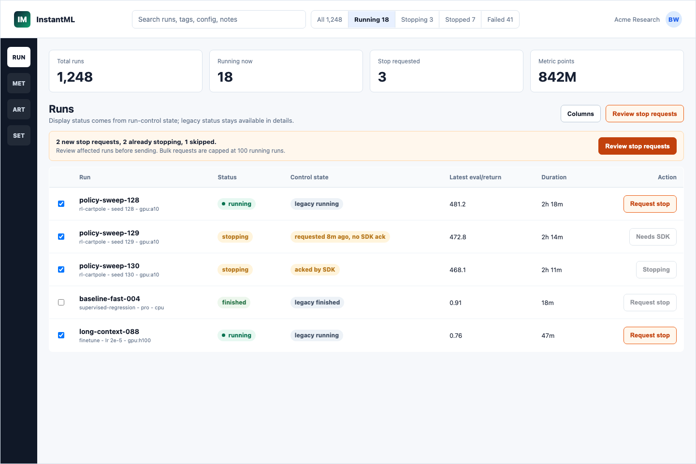
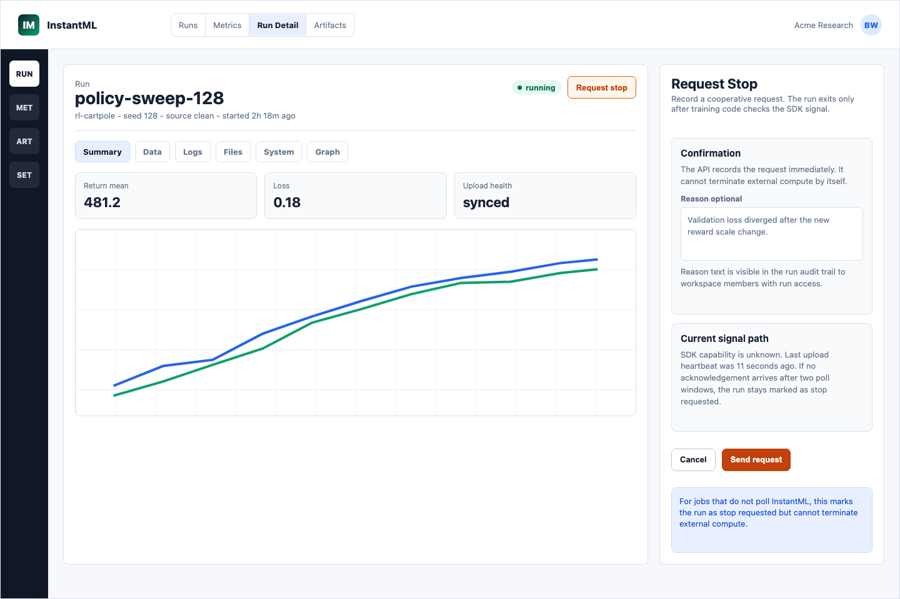
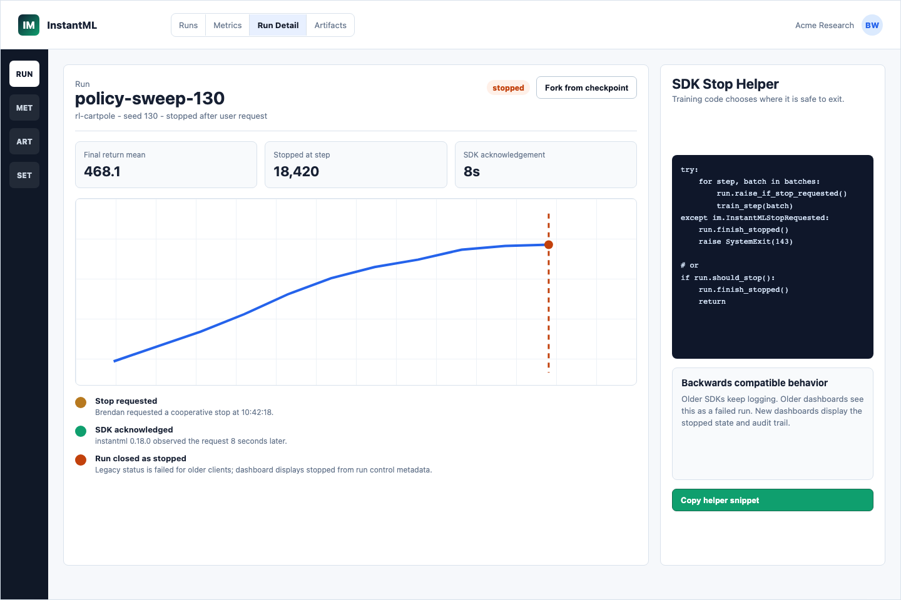
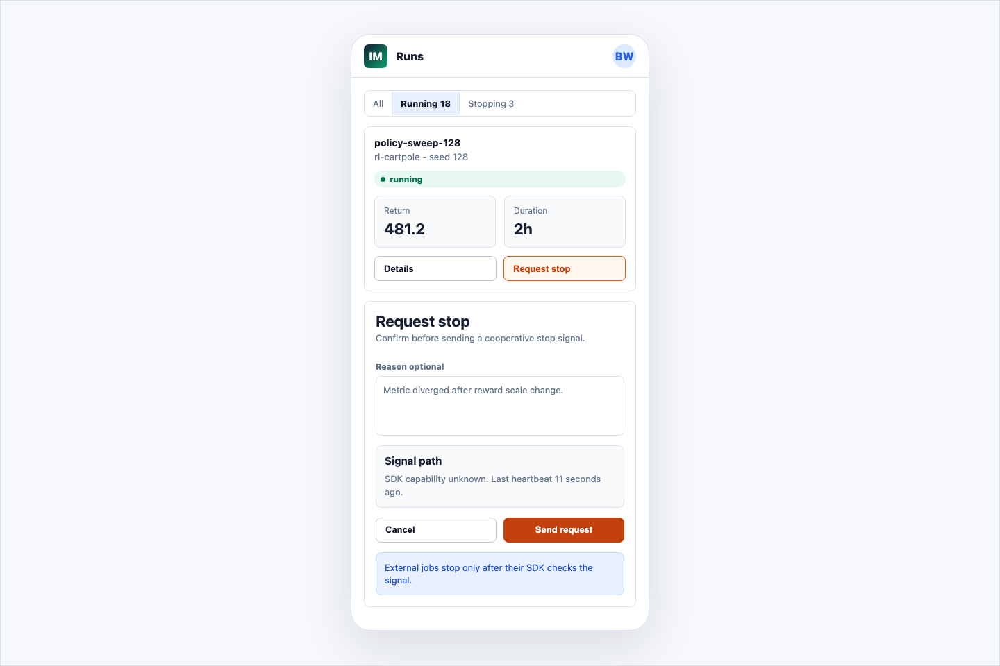

# Design: Run Stop Signal

Date: 2026-06-08

Status: Revised after fresh review; awaiting implementation approval

Owner: Codex

## Summary

InstantML currently observes training runs that are started outside InstantML.
The product can mark runs `running`, `finished`, or `failed`, and the Python SDK
already has lifecycle handlers that PATCH a final status on `atexit`,
`SIGTERM`, or `SIGINT`. What it does not have is a user-initiated control path:
a researcher looking at a bad live run cannot ask the active training process to
stop from the dashboard.

The production-ready first slice should be a **cooperative stop signal**, not a
server-side hard kill. InstantML does not own the user's process, SLURM job,
Kubernetes pod, notebook kernel, or cloud VM today, so the backend cannot safely
terminate arbitrary external compute. Instead, the Rust API records an audited
stop request, the SDK polls a cheap per-run stop-signal endpoint, training code
exits at a safe checkpoint through SDK helpers, and the dashboard shows
`stopping` or `stopped` from new run-control metadata. The existing `status`
field remains backwards compatible for older clients.

The recommended narrow slice adds run-control operational records, single-run
and bounded bulk stop-request endpoints, SDK stop helpers, and dashboard stop
controls for running rows and Run Detail. Hard-kill integration with future
InstantML-managed job runners is intentionally deferred, but the data model
keeps enough request/acknowledgement state to reuse later.

## Mock Designs

The mockups are deterministic HTML/CSS screenshots so product text stays
legible and reviewable. Source: `docs/design/assets/2026-06-08-run-stop-signal/mockups.html`.









## Goals

- Let dashboard users request that currently running SDK-backed runs stop.
- Preserve existing `status: running | finished | failed` behavior for old SDKs,
  old dashboards, importers, Node compatibility checks, and current search
  filters.
- Add an explicit stop request and acknowledgement trail visible in the UI.
- Keep the API simple: REST endpoints, ClickHouse operational records, no
  WebSocket/SSE dependency, no global queue service.
- Make the first slice safe for hosted production: scoped auth, CSRF protection
  for browser sessions, rate limits, idempotency, no sensitive reason text in
  logs, and bounded polling.
- Give users honest copy when a run cannot be stopped because its SDK is old,
  offline, or not polling.

## Non-Goals

- Do not claim InstantML can kill arbitrary external compute.
- Do not add a job scheduler, runner agent, SLURM integration, Kubernetes
  controller, notebook control plane, or SSH/remote-process kill path.
- Do not add `status="stopped"` to the existing `RunRow.status` field in this
  slice.
- Do not require WebSockets, SSE, Redis, Kafka, or another coordination service.
- Do not stop metric/artifact ingestion for a run merely because a stop request
  exists; older SDKs may keep logging and should remain compatible.
- Do not modify the deprecated Node server except for compatibility-test
  expectations if needed. New product control endpoints belong in Rust.

## Users and Use Cases

Research engineer:

- Watches a live sweep and sees a run diverging.
- Clicks `Request stop` from the Runs table or Run Detail.
- Provides an optional reason.
- Sees the run move to `stopping` while the SDK acknowledges.
- Sees `stopped` after the SDK exits and records final state.

Team lead:

- Selects several clearly bad live runs and sends a bounded bulk stop request.
- Gets per-run results, including already terminal runs and non-responsive runs.

SDK user:

- Adds `run.raise_if_stop_requested()` or `run.should_stop()` inside the training
  loop or framework callback.
- Chooses the point where stopping is safe: after an optimizer step, between
  epochs, after checkpointing, or before launching another expensive eval.

Support/operator:

- Can tell whether a stop request was recorded, whether the SDK acknowledged
  it, whether the SDK advertised stop-signal support, and whether a run
  continued logging afterward.

## Proposed Design

### Product Truth

The UI and docs must call this a cooperative stop request. "Kill" may be used
in internal planning as the user's desired outcome, but the shipped product copy
should not imply the API can terminate unmanaged compute. For old SDKs, offline
jobs, notebooks without the helper, or training loops that never check the SDK,
the stop request remains visible but cannot force process termination.

### Recommended Backend Option

Add a run-control entity stored in the existing ClickHouse
`operational_records` table with `kind="run_control"`, keyed by `run_id`. The
record is low-volume operational state and is rebuilt into the Rust in-memory
projection, matching projects/runs/artifacts/imports.

The run-control state machine:

```text
none
  -> requested
  -> acknowledged
  -> completed

requested
  -> terminal_without_completion

acknowledged
  -> terminal_without_completion

terminal_without_completion
  -> completed
```

Meaning:

- `none`: no active stop request exists.
- `requested`: a user or scoped control API key requested a stop while the run
  was still running.
- `acknowledged`: a compatible SDK observed the request and told the API.
- `completed`: the compatible SDK confirmed that it acted on the request. The
  legacy run status is set to `failed` and `finished_at` is stamped if the run is
  still running.
- `terminal_without_completion`: the run became `finished` or `failed` after a
  stop request before the matching SDK completion arrived. This includes both
  "no ack arrived" and "ack arrived but completion did not." A later matching
  `completed` acknowledgement can repair this state. `completed` is absorbing.

Completion has a partial-write invariant because it updates both the legacy run
record and run-control record. The store must never expose
`display_status="stopped"` unless the legacy run is terminal. Persist the
legacy `run` update first when the run is still `running`, then persist
`run_control=completed`. Duplicate `completed` requests must repair either
missing half: if the run is terminal but control is not completed, write the
completed control row; if control somehow says completed while the run is still
running, write the terminal legacy run row before returning.

The dashboard derives a display status without changing `RunRow.status`:

| Legacy `run.status` | Run-control state | New display |
| --- | --- | --- |
| `running` | `none` | `running` |
| `running` | `requested` or `acknowledged` | `stopping` |
| `failed` | `completed` | `stopped` |
| `finished` or `failed` | `terminal_without_completion` | existing terminal status plus stop-request note |

This keeps existing clients functional. Older dashboards and SDKs still see a
normal `failed` run once a stop completes. New dashboards can render `stopped`
from `run_control.display_status`.

### Frontend Option Chosen

Use explicit controls on existing daily surfaces:

- Runs table: show a `Request stop` action only for rows whose legacy status is
  `running` and whose run-control state is not already `requested` or
  `acknowledged`.
- Runs table bulk action: use one entry point, `Review stop requests`, when one
  or more selected runs are currently running. The confirmation must show new
  requests, already-stopping runs, skipped terminal/unauthorized runs, affected
  run names, and the 100-run cap before sending.
- Run Detail: primary `Request stop` button opens a confirmation side panel with
  optional reason text, privacy copy, signal-path state, and cooperative-only
  copy.
- Filters: keep legacy `status=running|finished|failed` query parameters
  unchanged. Add a new optional server-backed `display_status` query parameter
  for `running`, `stopping`, `stopped`, `finished`, and `failed`; use it for the
  `Stopping` and `Stopped` segments so pagination and counts are correct.
- Mobile: use the same confirmation flow as a stacked panel below the selected
  run, including `Cancel`, signal-path state, and non-response warning.

The UI must not offer stop actions for terminal runs, read-only/demo sessions,
viewer-only sessions, or runs in projects outside a project-scoped API key.

### SDK Option Chosen

Add explicit cooperative helpers:

```python
try:
    for step, batch in enumerate(loader):
        run.raise_if_stop_requested()
        loss = train_step(batch)
        run.log({"train/loss": loss}, step=step)
except instantml.InstantMLStopRequested:
    run.finish_stopped()
    raise SystemExit(143)

if run.should_stop():
    run.finish_stopped()
    return
```

Public SDK additions:

- `Run.should_stop(force: bool = False) -> bool`
- `Run.stop_request(force: bool = False) -> StopRequest | None`
- `Run.raise_if_stop_requested() -> None`
- `Run.finish_stopped(message: str | None = None, timeout: float | None = None) -> None`
- `InstantMLStopRequested`, an exception that includes `run_id`,
  `stop_request_id`, `requested_at`, and optional reason only when the caller is
  authorized to read reason text.

Polling behavior:

- The SDK should not start a background stop-polling thread by default. Helper
  calls poll `GET /api/runs/:run_id/stop-signal` only when user code or a
  framework callback calls `should_stop()`, `stop_request()`, or
  `raise_if_stop_requested()` and the cached deadline is due.
- Helper calls must be cheap when no request is due: in-memory deadline check
  only, no lock-heavy work, no HTTP call.
- Polls happen no more frequently than the server-provided
  `poll_after_seconds`, with jitter and network-error backoff.
- Use a separate short stop-control timeout, default 0.75 seconds, instead of
  the normal SDK client timeout. A timed-out no-op poll returns false and backs
  off; it must not stop or materially stall training.
- Default helper interval should start at 60 seconds for Free, 30 seconds for
  Pro, and 15 seconds for Premium/local unless benchmark evidence supports a
  lower value. The server remains authoritative through `poll_after_seconds`.
- `stop_check_interval_seconds=0` disables polling for users with extremely
  high run counts or restricted network environments.
- Polling stops after `finish()`, `finish_stopped()`, or any terminal run state.
- SDKs treat `404` or `405` from older servers as "stop signal unsupported" and
  disable polling with one rate-limited warning.
- `raise_if_stop_requested()` should send an `acknowledged` request before
  raising. It does not mark the run stopped; callers must catch
  `InstantMLStopRequested` and call `finish_stopped()`, or use
  `should_stop()`/`finish_stopped()` explicitly.

For default async logging, stop-control calls should use a short foreground
request path rather than the metric/log async queue. A stop acknowledgement
should not wait behind a large metric backlog. `finish_stopped()` should stop
system samplers/console capture, flush pending metric/log rows where practical,
send the `completed` acknowledgement, and then close the run locally.

## Component Impact

Backend:

- Add `RunControlRow` and store projection maps.
- Add stop-request, bulk stop-request, stop-signal, and stop-ack routes to
  `apps/rust-server`.
- Register routes in OpenAPI and regenerate API artifacts during
  implementation.
- Add route-plane classification and sanitized workflow logs for stop-control
  outcomes.
- Add optional `run_control` object to run summary/detail responses and extra
  `stopping_runs` / `stopped_runs` fields to overview payloads.
- Add `display_status` filtering to run list, run summary, overview, and
  selection projection paths that already share run filtering.
- Add `runs:control` to allowed API-key scopes, OpenAPI, scope validation,
  API-key management docs, and session role capability mapping. Default
  onboarding/device-code SDK keys must not include it.

Frontend:

- Add stop controls in Runs table, Run Detail, and mobile layouts.
- Add confirmation/error/loading states and derived `stopping`/`stopped`
  display helpers.
- Keep existing `status` query filters but use the new server-backed
  `display_status` query for `Stopping` and `Stopped` segments.
- Disable controls for terminal/read-only/demo/unauthorized states.

Python SDK:

- Add stop polling helpers, stop exception, and `finish_stopped()`.
- Keep old servers compatible by treating missing stop endpoints as unsupported.
- Document training-loop and framework-callback integration examples.
- Ensure stop-control foreground calls do not get trapped behind async metric
  upload backlogs.

Storage:

- Use existing ClickHouse `operational_records`; no new ClickHouse table in the
  first slice.
- Add in-memory projection maps and replay tests for `run_control`.

Docs:

- Update this design after review.
- During implementation, update `apps/rust-server/README.md`,
  `apps/web/README.md`, `packages/python-sdk/README.md`,
  `docs/architecture/current-api.md`, and public SDK docs under `apps/docs` if
  the route/API is exposed publicly.

## Data Model

New stored row:

```rust
pub struct RunControlRow {
    pub schema_version: i32,
    pub org_id: Uuid,
    pub run_id: Uuid,
    pub stop_request_id: Option<Uuid>,
    pub stop_state: String,
    pub reason: Option<String>,
    pub requested_at: Option<DateTime<Utc>>,
    pub requested_by_kind: Option<String>, // "user", "api_key", "system"
    pub requested_by_id: Option<Uuid>,
    pub requested_by_api_key_id: Option<Uuid>,
    pub requested_by_service_account_id: Option<Uuid>,
    pub requested_by_session_id: Option<Uuid>,
    pub request_id: Option<String>,
    pub acknowledged_at: Option<DateTime<Utc>>,
    pub acknowledged_by_api_key_id: Option<Uuid>,
    pub acknowledged_request_id: Option<String>,
    pub acknowledged_sdk_version: Option<String>,
    pub completed_at: Option<DateTime<Utc>>,
    pub completed_by_api_key_id: Option<Uuid>,
    pub completed_request_id: Option<String>,
    pub completion_message: Option<String>,
    pub updated_at: DateTime<Utc>,
}
```

Validation:

- `stop_state` is one of `none`, `requested`, `acknowledged`, `completed`,
  `terminal_without_completion`.
- `reason` and `completion_message` use existing bounded text validation with a
  512-byte cap.
- SDK version is bounded to 128 bytes and treated as diagnostic text.
- Request actor fields come from the authenticated context, never the request
  body.
- Request correlation IDs are sanitized with the existing request-id rules and
  stored only as support correlation values, not as secrets.
- New SDKs should add a low-cardinality run metadata flag during run creation,
  such as `_instantml.stop_signal_capable=true` and SDK version, so the UI can
  distinguish "compatible SDK likely" from "compatibility unknown" without
  writing an operational record on every no-op poll.

Summary projection:

```json
{
  "run_control": {
    "stop_state": "requested",
    "display_status": "stopping",
    "stop_request_id": "uuid",
    "stop_requested": true,
    "stop_requested_at": "2026-06-08T20:15:00Z",
    "stop_acknowledged_at": null,
    "stop_completed_at": null,
    "reason": "optional bounded text on authorized detail responses only"
  }
}
```

List and selection projections should include enough state for table rendering
without fetching detail. The optional reason can be omitted from list summaries
and included on `GET /runs/:run_id` only for mutation-capable sessions or
callers with `runs:control` plus read access. It must not appear in exports,
demo/share views, SDK `sdk:ingest` stop-signal responses, frontend logs, or
Rust workflow logs in the first slice.

## API Contracts

### `POST /api/runs/:run_id/stop`

Auth:

- Browser session role `owner`, `admin`, or `member`.
- API keys require a new `runs:control` scope. Project-scoped keys can only stop
  runs in their project.
- Demo read-only sessions are rejected.
- Browser calls must pass the existing mutation-origin/CSRF validation.
- `runs:control` must be added to API-key scope validation, docs, generated
  OpenAPI types, and API-key management UI. It is not granted to default
  onboarding, device-code, or normal SDK ingest keys.

Body:

```json
{
  "reason": "Validation loss diverged after the new reward scale change."
}
```

Headers:

- `Idempotency-Key`: optional. Reusing the same key/body returns the same stop
  request; different body returns `409`.

No-header idempotency:

- If the run already has an active `requested` or `acknowledged` stop request,
  return it with `already_requested: true` and do not rotate
  `stop_request_id`.
- This prevents stale double-clicks and browser retries from invalidating an SDK
  that already observed the original request ID.

Response:

```json
{
  "run": {},
  "run_control": {
    "stop_state": "requested",
    "display_status": "stopping",
    "stop_request_id": "uuid",
    "stop_requested": true,
    "stop_requested_at": "2026-06-08T20:15:00Z"
  }
}
```

If the run is already terminal, return `200` with `stop_state` unchanged and a
safe `already_terminal` flag instead of turning a stale click into a hard error.

### `POST /api/runs/stop`

Batch stop request for selected running rows.

Auth:

- Same as `POST /api/runs/:run_id/stop`.
- Browser calls must pass mutation-origin/CSRF validation.
- The UI must send an `Idempotency-Key`. The server still applies no-header
  active-request idempotency per run as a fallback.

Body:

```json
{
  "run_ids": ["uuid-a", "uuid-b"],
  "reason": "Sweep is diverging after reward scaling change."
}
```

Rules:

- `run_ids` is required, unique, and capped at 100.
- Response is HTTP `200` with per-run results so partial authorization or stale
  terminal races are visible.
- The store should use one lock and one helper path so single and batch behavior
  stay consistent.
- Invisible or unauthorized run IDs return a generic
  `not_found_or_unauthorized` per-run code so project-scoped keys cannot
  enumerate other projects or orgs.
- Batch retries must return existing active stop requests without appending
  duplicate no-op operational records.
- A 100-run batch may write up to 100 operational records. The implementation
  should avoid holding the store lock across unnecessary response decoration and
  should target p95 under 500 ms locally for a full 100-run batch.

Response:

```json
{
  "results": [
    { "run_id": "uuid-a", "ok": true, "run_control": {} },
    { "run_id": "uuid-b", "ok": true, "already_terminal": true }
  ]
}
```

### `GET /api/runs/:run_id/stop-signal`

SDK polling endpoint.

Auth:

- `sdk:ingest` API key or browser session with mutation rights.
- Project-scoped keys can only poll runs in their project.
- This endpoint is a control-poll route. No-op polls are excluded from monthly
  billable API-request rollups and Stripe request-meter events, but they still
  pass a dedicated short-window control-poll rate limit and appear in sanitized
  request logs. Stop mutations and completions remain ordinary counted API
  requests.

Response with no stop:

```json
{
  "run_id": "uuid",
  "run_status": "running",
  "terminal": false,
  "stop_requested": false,
  "state_version": "run-control:uuid:none",
  "poll_after_seconds": 60
}
```

Response with stop:

```json
{
  "run_id": "uuid",
  "run_status": "running",
  "terminal": false,
  "stop_requested": true,
  "state_version": "run-control:uuid:requested:uuid",
  "poll_after_seconds": 15,
  "stop_request": {
    "id": "uuid",
    "requested_at": "2026-06-08T20:15:00Z"
  }
}
```

Reason privacy:

- `sdk:ingest` callers receive only stop boolean, request ID, timestamps, run
  status, terminal flag, and polling cadence.
- Reason text is returned only by detail/control read surfaces for callers with
  mutation-capable browser sessions or `runs:control` plus read access.

Headers:

- `Cache-Control: no-store`.

The endpoint should be an O(1) projection read and must not query metric tables.

### `POST /api/runs/:run_id/stop-ack`

SDK acknowledgement and completion endpoint.

Auth:

- `sdk:ingest` API key with org and project access to the run.
- Project-scoped keys can only acknowledge runs in their project.
- Browser sessions are not required for the first slice. If an implementation
  later allows browser repair actions, those calls must use mutation-capable
  roles and mutation-origin/CSRF validation.

Body:

```json
{
  "stop_request_id": "uuid",
  "state": "acknowledged",
  "sdk_version": "0.18.0"
}
```

or:

```json
{
  "stop_request_id": "uuid",
  "state": "completed",
  "sdk_version": "0.18.0",
  "message": "Exited at epoch boundary after checkpoint save."
}
```

Rules:

- `state="acknowledged"` records that the SDK saw the request.
- `state="completed"` records that the SDK acted on the request. If the run is
  still `running`, set legacy `status="failed"` and stamp `finished_at`.
- Wrong or stale `stop_request_id` returns `409`.
- Duplicate acknowledgements for the same state are idempotent.
- `state="completed"` follows the partial-write invariant described above:
  persist terminal legacy run state before exposing run-control completed, and
  let duplicate completed calls repair missing state.

### Existing `PATCH /runs/:run_id`

Do not add `status="stopped"` here in the first slice. If a run with a pending
stop request is later PATCHed to `finished` or `failed` through the old route,
the store should mark run control as `terminal_without_completion` unless
completion was already recorded. A late matching `completed` acknowledgement can
repair this state.

### Existing Run List and Overview Reads

Keep `status=running|finished|failed` as the legacy status filter. Add optional
`display_status=running|stopping|stopped|finished|failed` to `GET /runs`,
`GET /api/runs/summary`, `GET /api/overview`, and the selection projection path.
The filter uses the same derived display status table above:

- `status=failed` includes legacy failed rows, including stopped rows.
- `display_status=failed` excludes `run_control.completed` stopped rows.
- `display_status=stopped` returns only completed stop-control rows whose
  legacy run status is terminal.
- `display_status=stopping` returns running rows with `requested` or
  `acknowledged` run-control state.

Summary row decoration must join `run_control` from the in-memory projection for
only the returned page/selection rows. Overview stop counts must be computed in
the existing run-count pass or maintained as projection counters; they must not
add a second unbounded ClickHouse operational query.

## Frontend/Backend Options Considered

### Backend Options

| Option | Description | Pros | Cons | Decision |
| --- | --- | --- | --- | --- |
| Status-only PATCH | Reuse `PATCH /runs/:id` with `status="failed"` or new `status="stopped"`. | Tiny implementation. | Cannot signal a live SDK, breaks status compatibility if `stopped`, loses audit/ack state. | Reject. |
| Run-control row plus SDK polling | Record stop intent, SDK polls and acknowledges, UI derives display status. | Backwards compatible, auditable, simple REST, production-safe for unmanaged compute. | Cooperative only; adds bounded polling. | Choose. |
| Metric-response piggyback | Include stop signal in metric/log ingest responses. | Almost no extra reads for sync SDK users. | Default async uploader hides responses from training loop; incomplete for idle runs. | Future optimization. |
| WebSocket/SSE push | Push stop signal to active SDK connection. | Faster perceived stop. | More infra, stateful connections, hard with offline/async SDK. | Reject for first slice. |
| Runner hard kill | InstantML-owned runner sends SIGTERM/SIGKILL or cloud-provider kill. | Real kill for managed jobs. | Product does not run jobs today; dangerous for external compute. | Future managed-runner integration. |

### Frontend Options

| Option | Description | Pros | Cons | Decision |
| --- | --- | --- | --- | --- |
| Run Detail only | Stop button only inside selected run detail. | Low risk and easy to explain. | Too slow for sweeps; weak plural workflow. | Not enough. |
| Runs table row actions plus detail confirmation | Stop visible where users triage runs, with detail flow for context. | Matches daily workflow, discoverable, clear state. | Requires careful disabled/loading states. | Choose. |
| Bulk stop all matching filters | Stop every matching running run, possibly thousands. | Powerful for bad sweeps. | High blast radius and easy accidental damage. | Defer; first slice caps selected runs at 100. |
| Command palette stop | Keyboard-driven destructive command. | Fast for expert users. | Hidden and riskier without visual context. | Future after base flow works. |

## Performance Considerations

Expected write frequency:

- Stop requests are rare compared with metric/log ingest.
- Each stop request writes one `run_control` operational record.
- Each acknowledgement/completion writes one more operational record and, for
  completion, may also write the updated `run` operational record.

Expected read/query shape:

- Dashboard lists read `run_control` from the in-memory projection only for
  returned page or selection rows.
- SDK polling reads one run-control entry by run ID from the in-memory
  projection. It must not hit ClickHouse metric tables.
- Bulk stop caps `run_ids` at 100 and returns per-run results.

Latency targets:

- Stop request p95 under 150 ms in local/staging Rust API when ClickHouse is
  healthy.
- Stop-signal poll p95 under 25 ms because it is an O(1) projection read.
- Dashboard row state should update on the next summary refresh or immediately
  after a successful stop mutation.

Polling budget:

- Stop-signal polling is helper-driven, not a default background thread.
  Training code must call a stop helper or framework callback for polling to
  happen.
- Helper polls include jitter, network-error backoff, and server-provided
  `poll_after_seconds`.
- No-op stop-signal polls are not monthly billable API requests in the first
  slice. They still use a dedicated control-poll rate limiter and safe request
  logs so abuse is visible without blocking Free orgs merely because stop
  helpers are enabled.
- Start helper intervals at 60 seconds for Free, 30 seconds for Pro, and 15
  seconds for Premium/local defaults. The server may return a longer interval
  under load or after repeated no-op polls.
- Stop polling after terminal state.
- Keep a future option to piggyback stop state on metric/log responses to reduce
  polling for sync or directly observed upload paths.

Indexes:

- No new ClickHouse table or index is needed in the first slice.
- The operational record table order `(kind, org_id, entity_id, created_at)`
  already fits replay and per-entity latest-state reconstruction.

Memory:

- One small `RunControlRow` per run with a stop request. Store rows keyed by
  `(org_id, run_id)`.
- Clear or compact old completed controls only after an explicit retention
  design; keep first slice simple and auditable.

Measurement plan:

- Add Rust unit tests for O(1) store projection behavior.
- Add a local/staging load smoke for 100 and 1,000 active helper pollers:
  stop-signal p50/p95, 429 rate, CPU, request-log volume, usage-rollup writes,
  and ClickHouse query count.
- Add a full 100-run bulk-stop smoke that verifies retry idempotency and
  p95 latency.
- Add before/after overview and summary benchmarks on the existing large-run
  fixture, including `display_status=stopping` and `display_status=stopped`.
- Add SDK microbenchmarks for no-request helper calls, due-poll calls, timeout
  behavior, and network-error backoff.
- Track stop endpoints through existing API request logs with route-plane
  `data` and safe workflow fields only.

## Simplicity Review

This design keeps the current architecture: REST routes, ClickHouse
operational records, in-memory projection, generated OpenAPI, and explicit SDK
helpers. It avoids a new status enum migration, avoids a real-time connection
service, and avoids pretending InstantML owns user compute.

Deferred complexity:

- No hard-kill runner integration.
- No "stop all matching query" bulk mutation.
- No push channel.
- No separate audit table.
- No v2 run status enum.
- No automatic interruption of arbitrary Python code from a background thread.

## Failure Modes

- Old SDK or training code does not poll: stop request remains visible as
  `requested`; UI says "waiting for SDK" and shows last SDK heartbeat when
  available.
- SDK polls but network fails: SDK retries on the next interval; UI remains
  `requested`.
- SDK acknowledges then crashes: UI shows `acknowledged`; lifecycle handlers may
  later mark the run failed, otherwise it may remain running until stale-run
  cleanup is separately designed.
- Run finishes before stop request arrives: stop endpoint returns
  `already_terminal`; no mutation to terminal status.
- Run finishes after stop request but before SDK ack: store marks
  `terminal_without_completion`.
- Run finishes after SDK ack but before SDK completion: store marks
  `terminal_without_completion`; a later matching completion can repair it.
- Duplicate stop click or retry: active-request idempotency returns the same
  stop request even without an `Idempotency-Key`.
- Partial completion write: duplicate `completed` calls repair missing terminal
  run state or missing completed control state before returning.
- Malicious reason text: validation bounds the field, responses escape it
  through normal React rendering, and logs never include it.
- Unauthorized user/API key: route returns `403` and no control record is
  written.
- Demo session: mutation is blocked like other demo writes.
- ClickHouse write fails: return a normal API error; UI does not optimistically
  mark the run stopping unless persistence succeeds.

## Security and Privacy

- Stop requests are destructive-adjacent and must require mutation-capable
  roles or a new `runs:control` API-key scope.
- Existing onboarding SDK keys should not receive `runs:control` by default.
- `runs:control` must be wired into API-key scope validation, service-account
  docs, generated OpenAPI types, and API-key creation/list UI. Demo effective
  scopes remain clamped to read-only behavior.
- SDK polling and acknowledgement can use `sdk:ingest` because the active
  training process must be able to see and acknowledge a stop for its run.
- `sdk:ingest` stop-signal responses must not include reason or completion
  message text.
- Project-scoped keys stay project-scoped.
- Browser mutations must use the existing same-origin/CSRF validation.
- Do not log stop reasons, completion messages, run names, metric names, or
  user emails in workflow logs.
- Batch stop must use generic `not_found_or_unauthorized` per-run errors for
  invisible run IDs.
- Stop mutations, batch stop, and stop completion must be classified as
  mutating data/control routes in the short-window rate limiter. Stop-signal
  polling gets a separate control-poll limiter and is excluded from monthly
  billable API-request usage in the first slice.
- Treat stop request IDs as opaque internal IDs. They are not bearer secrets,
  but they should still be validated for org/run membership.
- Return actor labels conservatively. The first slice can show "workspace
  member" or "API key" rather than exposing emails in run summaries.

## Testing Plan

Backend:

- Unit tests for `RunControlRow` validation and projection replay.
- API tests for single stop, batch stop, idempotent retry, stale terminal click,
  project-scoped auth, viewer/demo rejection, and wrong-org rejection.
- API tests for no-header active-request idempotency and batch duplicate retry
  behavior.
- API tests for stop-signal no-op, requested signal, acknowledgement,
  completion, duplicate ack, and stale stop_request_id conflict.
- API tests that `sdk:ingest` stop-signal responses do not include reason or
  completion message text.
- API tests for completion partial-write repair and
  `terminal_without_completion` repair.
- Regression tests proving `PATCH /runs/:id` still rejects `status="stopped"`
  and accepts only `running`, `finished`, `failed`.
- Overview/summary tests for optional `run_control`, `stopping_runs`,
  `stopped_runs`, and server-backed `display_status` filters.
- Rate-limit and usage tests proving stop-signal no-op polls use the
  control-poll limiter and do not increment monthly billable API request usage,
  while stop mutations remain counted.
- Scope validation tests proving `runs:control` is accepted for explicit
  control keys, omitted from default onboarding/device-code SDK keys, and
  clamped in demo sessions.
- OpenAPI generation and `npm run verify:api-types`.

Python SDK:

- Tests for polling throttle, forced polling, old-server 404 fallback, returned
  `StopRequest`, raised `InstantMLStopRequested`, and `finish_stopped()`.
- Tests proving helper calls do not make HTTP requests before the cached
  deadline, use the short stop-control timeout when due, and back off after
  network failures.
- Tests proving `raise_if_stop_requested()` sends acknowledgement before
  raising and canonical examples call `finish_stopped()`.
- Tests that stop control uses a foreground request path in async mode.
- Tests that `finish()` behavior remains unchanged when no stop was requested.
- Tests for process-spool/offline compatibility: stop-control polling should not
  be silently spooled as ordinary metric work.

Frontend:

- Component tests for visible `Request stop` actions on running rows only.
- Confirmation panel loading, success, API error, unauthorized, and stale
  terminal states.
- Bulk review counts for new requests, already stopping rows, skipped rows, cap
  behavior, and per-run result display.
- Derived `stopping`/`stopped` status helper tests.
- Old-SDK/non-response copy states: compatibility unknown, no acknowledgement
  after expected poll window, compatible SDK likely, acknowledged, and stopped.
- Accessibility tests for confirmation focus, Escape handling, and mobile
  stacked confirmation.

Integration:

- Rust SDK smoke: create run, request stop through API, SDK helper observes it,
  `finish_stopped()` completes, run summary displays `stopped`.
- UI smoke: stop a seeded running run and verify table/detail state transitions.

Coverage:

- No planned coverage exception. If a browser-only visual state is too brittle
  for exact pixel tests, cover it with component state assertions and keep the
  PNG mockups as design artifacts, not tests.

## Documentation Plan

Implementation must update:

- `apps/rust-server/README.md`: route list, auth scopes, local testing.
- `apps/web/README.md`: Runs/Run Detail stop workflow and states.
- `packages/python-sdk/README.md`: stop helper examples and old-server fallback.
- `packages/python-sdk/PYPI_README.md`: public SDK stop snippet.
- `docs/architecture/current-api.md`: endpoint contracts and response fields.
- `docs/architecture/current-system.md`: cooperative nature and no hard-kill
  guarantee.
- `apps/docs` public docs if the SDK/API is exposed to users in the same
  implementation slice.

## Alternatives Considered

Add `stopped` to `RunRow.status` immediately:

- Pros: clean display and filtering.
- Cons: breaks current status validation, search, imported status mapping, old
  SDK assumptions, dashboard counts, and Node compatibility expectations.
- Decision: defer until a v2 lifecycle/status migration design.

Use failed status only:

- Pros: no new data model.
- Cons: no way to distinguish user stop from crash, no pending stop state, no
  acknowledgement, weak UX.
- Decision: reject.

Server-side hard kill:

- Pros: closest to the user's word "kill."
- Cons: impossible for unmanaged compute and dangerous without a runner agent,
  process identity, auth boundary, grace policy, and audit trail.
- Decision: future only for InstantML-managed jobs.

Push channel:

- Pros: faster than polling.
- Cons: unnecessary before SDK helper adoption is proven, more stateful infra,
  harder with async/offline jobs.
- Decision: reject for first slice.

## Review Notes

Fresh reviewer 1, backend/correctness:

- Finding: Blocked the draft because `acknowledged -> terminal_without_ack` was
  internally inconsistent, `completed` could expose stopped state before the
  legacy run became terminal, `raise_if_stop_requested()` could accidentally
  become `finished`, duplicate stop clicks could rotate request IDs, terminal
  poll/ack auth was under-specified, and frontend-derived stopping filters would
  be wrong with pagination.
- Risk: Old and new clients could disagree about whether a run was still
  running, SDKs could fail completion with stale request IDs, and UI totals
  could lie.
- Recommended edit: Rename terminal state, define completion repair/write order,
  add no-header active-request idempotency, add `run_status`/`terminal` poll
  fields, specify ack auth, and make stopping/stopped filters server-backed.
- Decision: Block as written; approves the cooperative architecture after these
  P1 edits. This revision applies those edits.

Fresh reviewer 2, performance/scale:

- Finding: Blocked the draft because ordinary 15s/30s polling would be metered
  and rate-limited like normal API traffic, which could exceed Free and Pro
  budgets; SDK hot-loop timeout behavior, overview query impact, measurement
  scope, and bulk retry/write semantics were under-specified.
- Risk: The stop feature could self-inflict 429s, paid overage, or training-loop
  stalls.
- Recommended edit: Make stop polling helper-driven, classify no-op polls as a
  separate non-billable control-poll route with a dedicated limiter, require a
  short stop-control timeout, join run-control page-locally, and add poll/load,
  overview, bulk, and SDK benchmarks.
- Decision: Block as written; approves after route-metering and measurement
  policy edits. This revision applies those edits.

Fresh reviewer 3, security/abuse:

- Finding: Blocked the draft because `runs:control` was not fully wired into
  the auth model, `sdk:ingest` polling leaked reason text, batch stop lacked
  explicit auth/CSRF/idempotency/redaction rules, stop ack omitted auth, audit
  fields were thin, and rate-limit classification needed to be explicit.
- Risk: A scoped ingest key could read private reason text or destructive
  controls could be abused/enumerated.
- Recommended edit: Add `runs:control` to scope validation/docs/OpenAPI/UI, keep
  it off default SDK keys, omit reason from SDK polling, add batch
  `not_found_or_unauthorized`, specify ack auth/project scoping, expand actor
  and request-id audit fields, and classify stop routes in rate limiting.
- Decision: Block as written; approves after scope/privacy/batch/ack edits. This
  revision applies those edits.

Fresh reviewer 4, product/usability:

- Finding: Blocked the draft UX because mocks showed `running` as the primary
  status for stopping runs, old-SDK/offline/non-polling states were promised but
  not designed, bulk stop did not show a safe review breakdown, action labels
  implied hard control, stopped runs could be buried under failed, mobile lacked
  cancel/context, and reason privacy was unclear.
- Risk: Users could believe InstantML had killed external compute, bulk-stop the
  wrong runs, or lose stopped runs in generic failed filters.
- Recommended edit: Make `stopping` primary display state, add compatibility
  unknown/no-ack copy, turn bulk into `Review stop requests`, use `Request stop`
  language, add `Stopped` filtering, add mobile cancel/signal context, and mark
  reason optional/audit-visible.
- Decision: Block as written; approves the cooperative mental model after UX
  copy/state edits. This revision applies those edits and regenerates the PNG
  mockups.

Re-review outcome:

- Backend/correctness: no remaining blockers; approved for narrow first-slice
  implementation planning.
- Performance/scale: no remaining blockers; approved with polling/load,
  overview/list, SDK hot-loop, and bulk retry measurements as pre-merge exit
  gates.
- Security/abuse: no remaining blockers; approved for narrow first-slice
  implementation planning.
- Product/usability: no remaining blockers; approved for narrow first-slice
  implementation planning.

## Coverage Exceptions

None planned.

## Decision

Reviewed by four fresh senior-review agents and revised to address their
blocking findings. Recommended implementation slice: run-control row,
stop-request APIs, SDK cooperative helpers, server-backed display-status
filtering, and dashboard stop controls with no change to the existing
`RunRow.status` enum. Implementation should still proceed narrowly and re-run
OpenAPI/codegen, Rust/API/SDK/UI tests, and the new polling/overview benchmarks
before shipping.

## Implementation Notes

Implemented slice:

- Rust adds `run_control` operational rows, `runs:control` validation,
  stop-request/bulk-request/stop-signal/stop-ack routes, server-backed
  `display_status` filtering, overview `stopping_runs`/`stopped_runs`, and
  generated OpenAPI/TypeScript bindings.
- The Python SDK adds `StopRequest`, `InstantMLStopRequested`,
  `stop_request()`, `should_stop()`, `raise_if_stop_requested()`, and
  `finish_stopped()` helpers. Stop polling is foreground and helper-driven with
  a short timeout; older servers are treated as stop unsupported.
- The dashboard adds stop entry points in the Runs rail, selected-runs
  commandbar, and Run Detail. All entry points use one focus-trapped
  confirmation dialog, patch local run caches after server persistence, and
  render `stopping`/`stopped` from generated `RunControlSummary`.

Verification run during implementation:

- `cargo fmt`
- `cargo check`
- Targeted Rust tests for run-control replay/display filters, OpenAPI route
  inventory, browser-session `runs:control` scope behavior, and demo API-key
  scope clamping.
- `npm run codegen:api`
- `npm run web:build`
- `python -m pytest packages/python-sdk/tests/test_lifecycle.py -q --no-cov`
