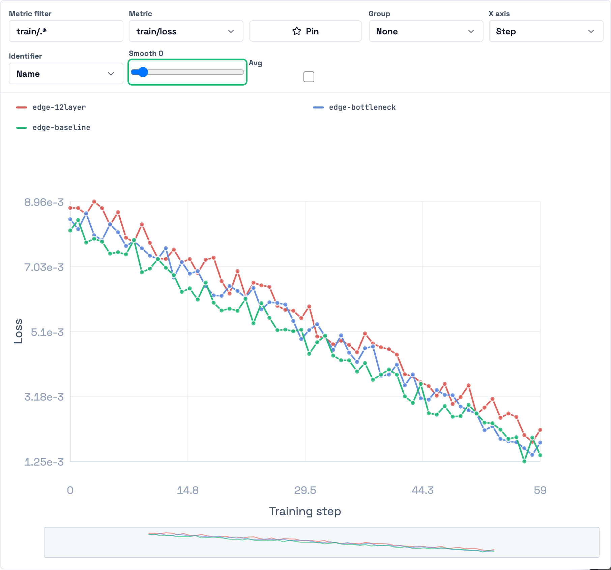
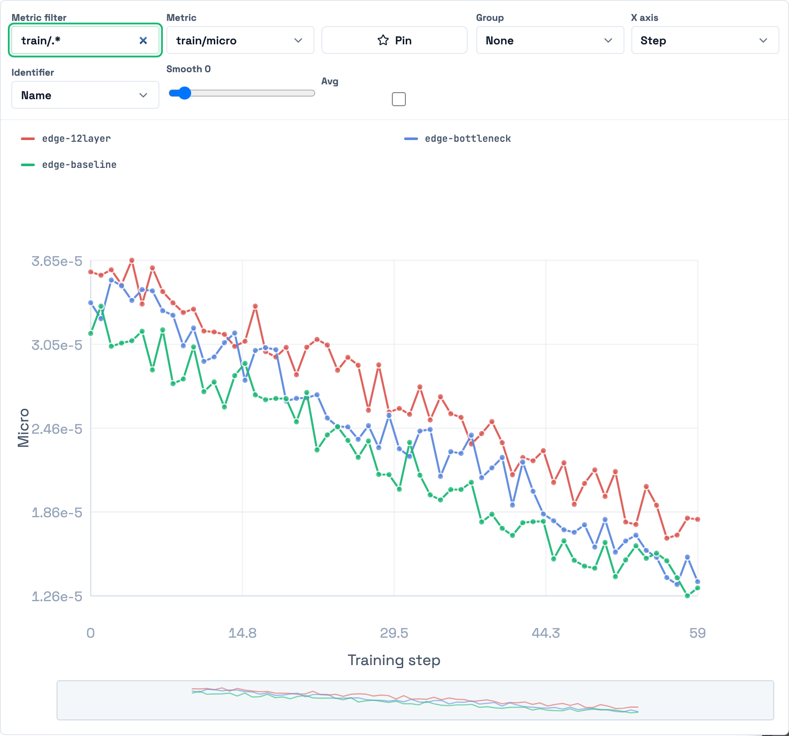
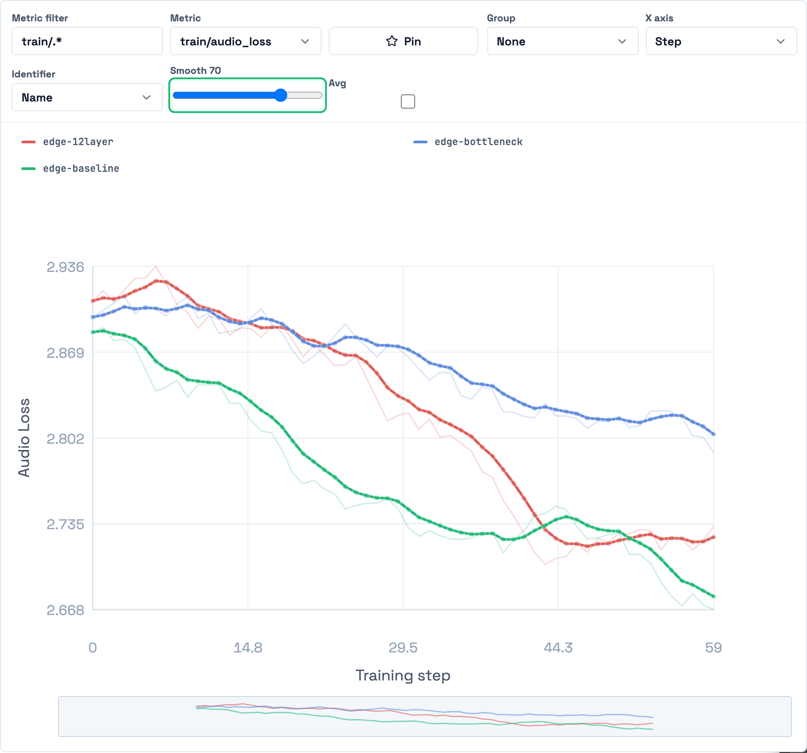
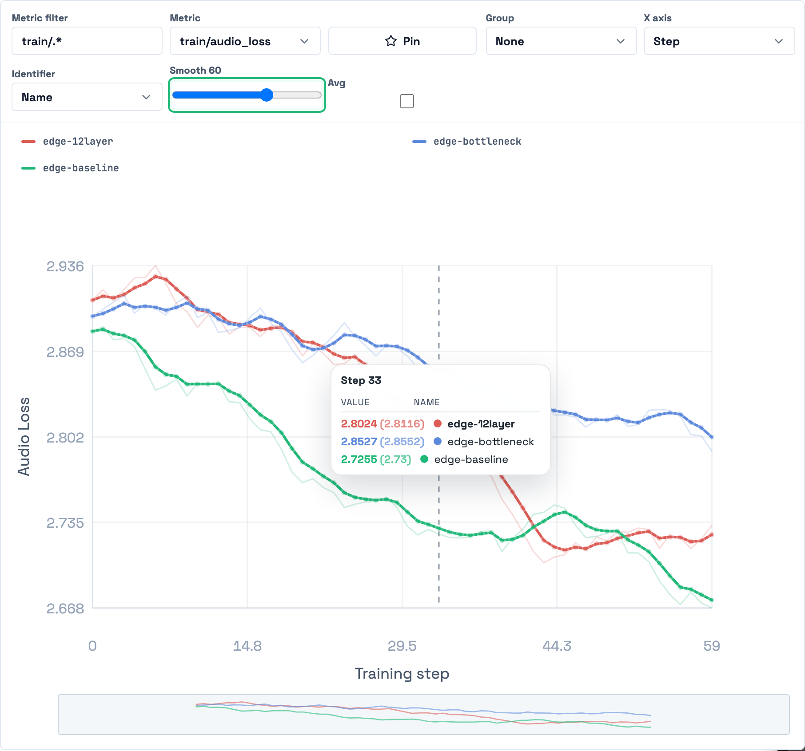
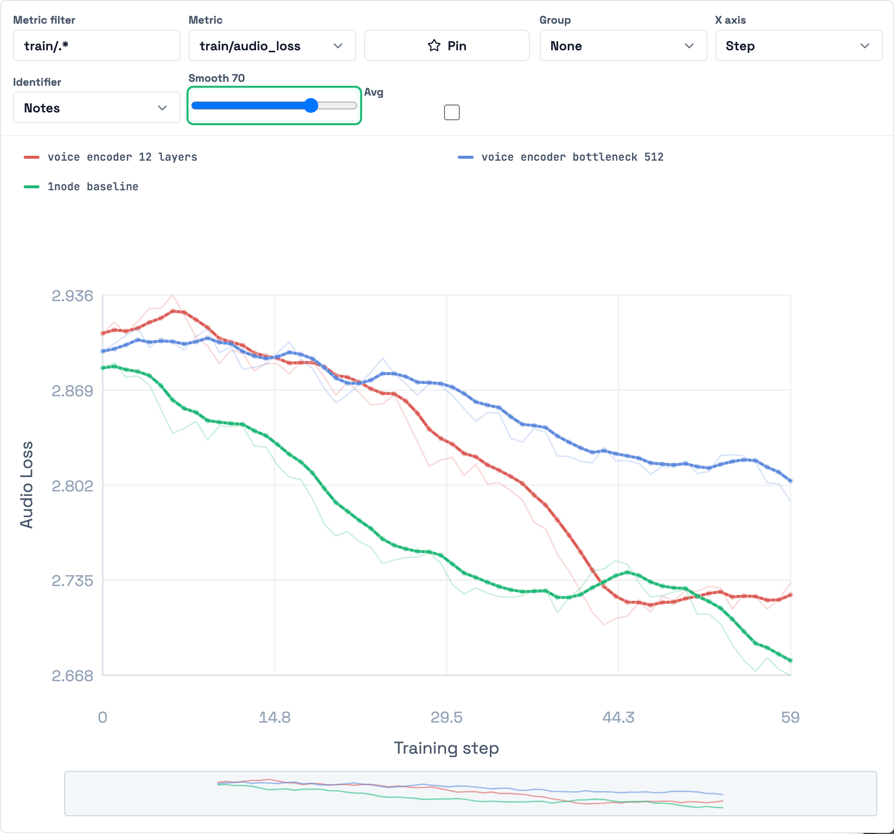
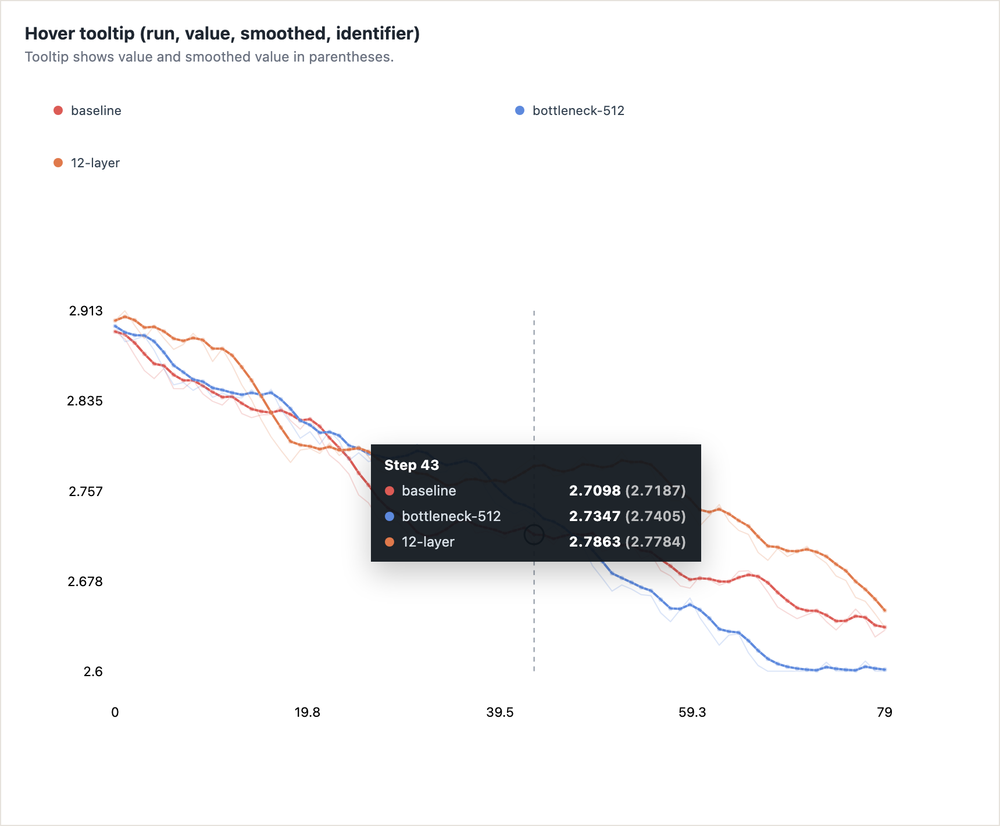

# Metric chart improvements (2026-05-23)

Chart feature work + a styling pass toward the wandb / neptune aesthetic, plus a
performance pass on the rendering hot path.

## Features

1. **Y-axis normalization for tiny magnitudes.** Datasets where every value is
   `< 0.01` (or `~1e-5`) previously squished into a thin band at the floor
   because the value span was clamped to `Math.max(1, span)` in two places
   (`normalizeSeries` for the data, and `MetricChart`'s `yPos` for the
   gridlines/ticks). Both clamps are removed; degenerate single-value windows
   open a magnitude-relative range instead.
2. **Up to 5 significant figures.** `formatMetricValue` renders 5 sig figs in
   tooltips / readouts (`0.00001234` stays legible). Axis ticks use a compact
   `formatAxisTick` (trimmed scientific for `<1e-2` / `>=1e5`) so labels never
   overflow the y-gutter or collide with the rotated axis title.
3. **EMA smoothing overlay.** Smoothing is now non-destructive: each point keeps
   its raw `value` and gains a `smoothedValue`. The chart draws the raw series
   faded with the opaque smoothed curve on top (SVG + canvas).
4. **Hover tooltip.** Neptune-style: a `Step N` header, `Value | Name` columns,
   colored values ranked at the hovered x, the smoothed value in parentheses,
   and a colored swatch + run identifier per row.
5. **Configurable identifier.** A new "Identifier" control switches the run label
   used in legend / tooltip / readout between Name, Notes and Tags (persisted in
   saved views).

## Styling pass

- Hairline gridlines, near-invisible axis spines, lighter tabular tick labels.
- Borderless legend with short line-stroke swatches (wandb style).
- Light, blurred tooltip card with column rule and theme-aware tokens (dark
  variant included).

## Performance

- `normalizeSeries` / `chartDomain` no longer build a `flatMap` of every point
  plus `Math.min(...spread)` (slow; `RangeError` past ~100k points). Extents are
  computed in a single pass via `xExtent`.
- `normalizeSeries` builds `normalizedPoints` + both path strings in one pass
  (was three) and computes `xValue` once per point (it parses a `Date` in time
  mode).

## Verification

- 35 chart/state unit tests (`apps/web/tests/state.test.js`), `tsc` clean.
- Real-app E2E via a local ClickHouse + Rust backend + `next dev`, driving the
  actual dashboard components; screenshots below. Two UI-review passes caught the
  axis-collapse bug and the title/label overlap, both fixed here.
- `apps/web/tests/chart-visual.mjs` is a lightweight harness that renders the
  real `charts.js` + `charts.css` for fast visual sanity checks.

## Screenshots (real app)

| | |
|---|---|
| Tiny magnitude (`<0.01`) normalized |  |
| Micro magnitude (`~1e-5`) |  |
| EMA smoothing overlay |  |
| Hover tooltip |  |
| Identifier = Notes |  |

### Tooltip restyle

| Before | After |
|---|---|
|  |  |
