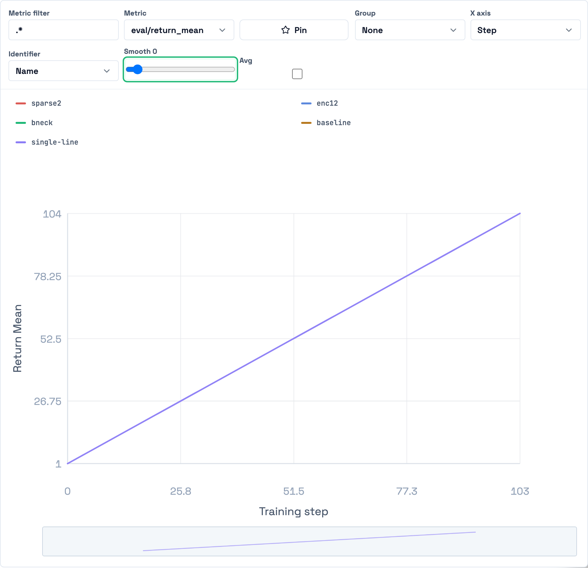
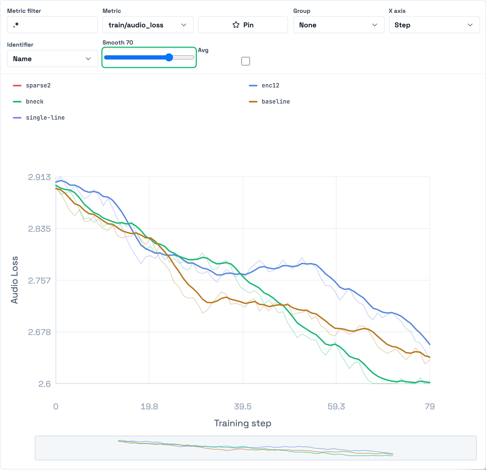
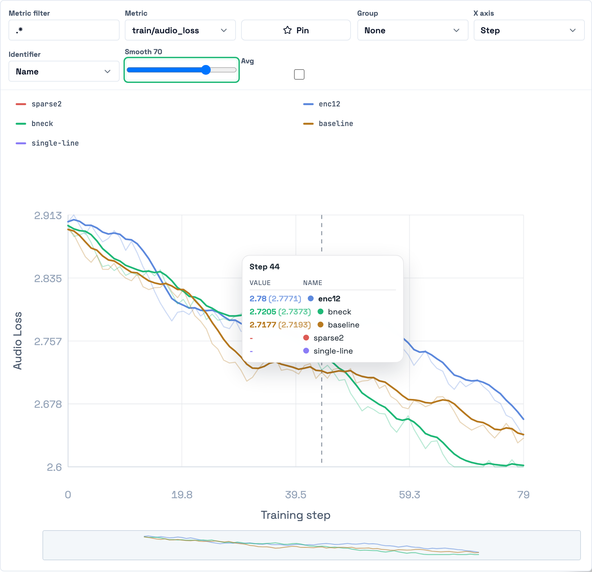
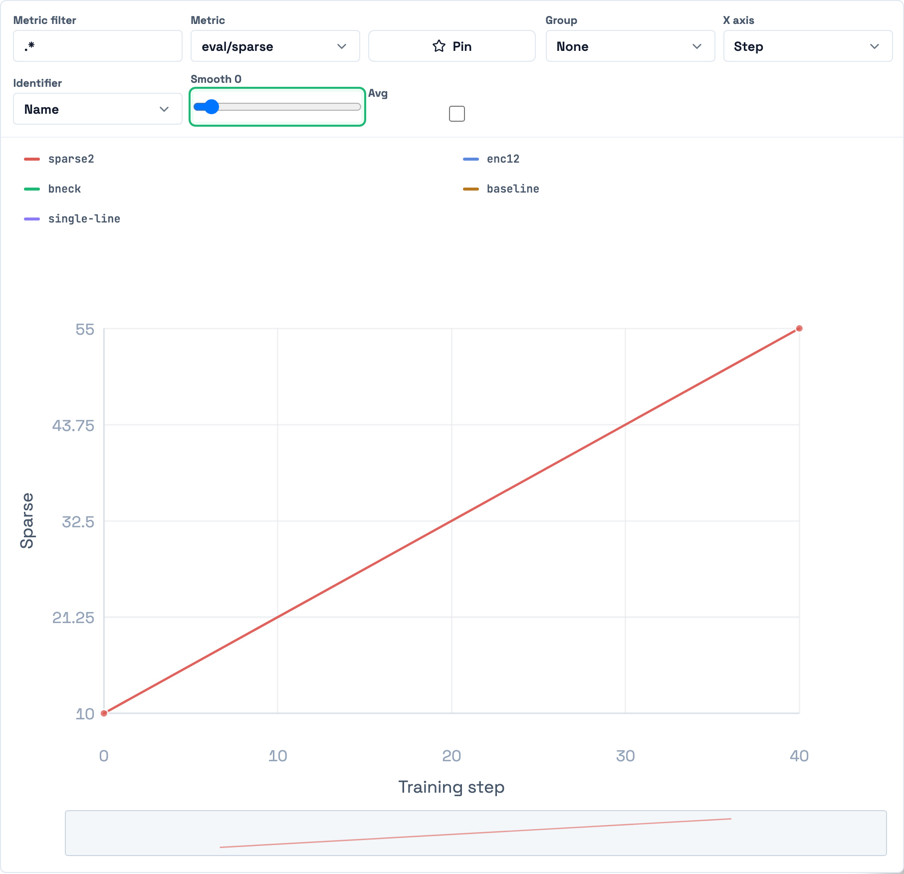

# Chart line + smoothing fixes (2026-05-24)

Follow-up to the chart work in #86, addressing two reported issues.

## 1. Lines were rendering as individual points

Every sample drew a `<circle>` marker (gated by a global `pointCount <= 240`),
so a normal run read as a dotted line instead of a continuous curve.

**Fix:** markers are only drawn for genuinely sparse series (≤ 2 samples, where a
bare polyline would be invisible). Multi-point series render as a clean solid
line. Hovering still shows a marker — a filled `hover-point` dot plus the hover
ring — and hit-testing stays geometric (svg `onMove`), so interactivity is
unaffected.

## 2. EMA smoothing presentation

The smoothed curve now renders at full opacity as the primary signal, with the
raw series kept faintly visible behind it (`opacity: 0.3`, "slightly opaque").
No per-point markers on either line. (Smoothing was already EMA + non-destructive
— this is a presentation/opacity tidy-up so the relationship reads clearly.)

## Screenshots (real app)

| | |
|---|---|
| Solid line, no dots |  |
| EMA smoothing (smoothed opaque + raw faded) |  |
| Hover shows a marker + tooltip |  |
| Sparse (≤2-pt) series keeps its markers |  |

## Verification

- 35 chart/state unit tests pass; `tsc --noEmit` clean.
- Real-app run (local ClickHouse + Rust backend + `next dev`) asserted via DOM:
  a 104-point line renders **0** point markers, hover renders **1** marker, and a
  2-point series renders **2** markers. No console errors.
